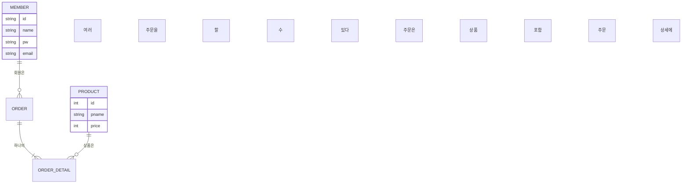
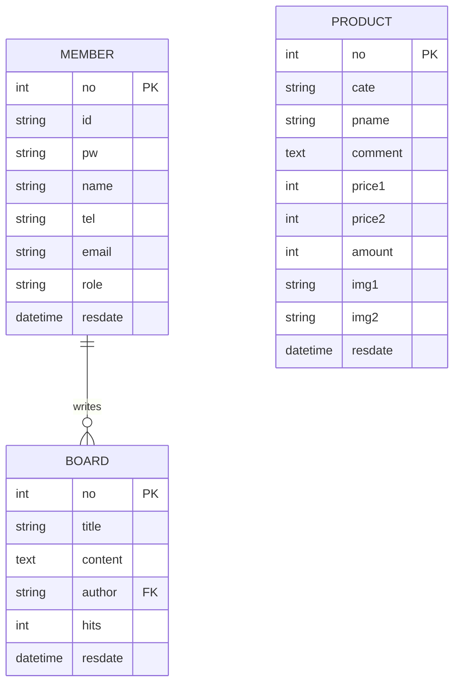
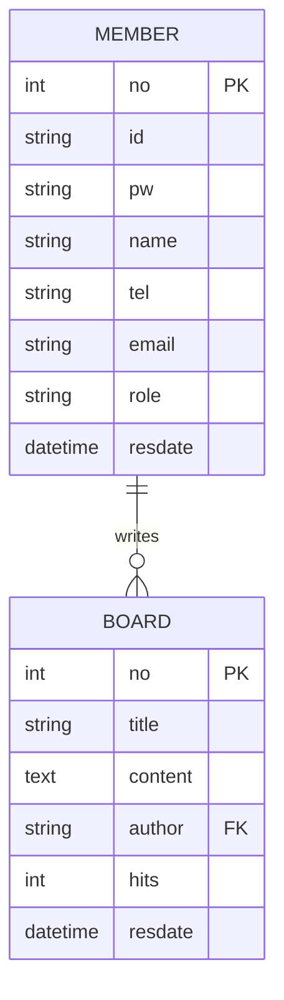

# 10_DB 설계서

**여기의 DB 설계서 예시에서는 일부 테이블에 관해서만 기술하였습니다. 실제 웹 애플리케이션에 모든 테이블을 기술해야 합니다.**

# 테이블 정의서

### 📌  `member` 테이블

| 테이블명 | 컬럼명 | 자료형 | PK | FK | NULL 허용 | 기본값 | 설명 |
| --- | --- | --- | --- | --- | --- | --- | --- |
| member | no | BIGINT | ✅ |  | ❌ | auto | 회원 고유 번호 |
| member | id | VARCHAR(50) |  |  | ❌ |  | 아이디 (유니크) |
| member | pw | VARCHAR(100) |  |  | ❌ |  | 비밀번호 (암호화) |
| member | name | VARCHAR(50) |  |  | ❌ |  | 이름 |
| member | tel | VARCHAR(20) |  |  | ✅ | null | 전화번호 |
| member | email | VARCHAR(100) |  |  | ✅ | null | 이메일 주소 |
| member | role | VARCHAR(20) |  |  | ✅ | 'USER' | 사용자 권한 |
| member | resdate | DATETIME |  |  | ❌ | now() | 가입일 |

---

### 📌  `board` 테이블

| 테이블명 | 컬럼명 | 자료형 | PK | FK | NULL 허용 | 기본값 | 설명 |
| --- | --- | --- | --- | --- | --- | --- | --- |
| board | no | BIGINT | ✅ |  | ❌ | auto | 글 번호 |
| board | title | VARCHAR(200) |  |  | ❌ |  | 제목 |
| board | content | TEXT |  |  | ❌ |  | 본문 내용 |
| board | author | VARCHAR(50) |  | member.id | ❌ |  | 작성자 ID |
| board | hits | INT |  |  | ❌ | 0 | 조회수 |
| board | resdate | DATETIME |  |  | ❌ | now() | 작성일 |

---

### 📌  `product` 테이블

| 테이블명 | 컬럼명 | 자료형 | PK | FK | NULL 허용 | 기본값 | 설명 |
| --- | --- | --- | --- | --- | --- | --- | --- |
| product | no | BIGINT | ✅ |  | ❌ | auto | 상품 번호 |
| product | cate | VARCHAR(50) |  |  | ❌ |  | 카테고리 |
| product | pname | VARCHAR(100) |  |  | ❌ |  | 상품 이름 |
| product | comment | TEXT |  |  | ✅ | null | 상품 설명 |
| product | price1 | INT |  |  | ❌ |  | 원가 |
| product | price2 | INT |  |  | ❌ |  | 판매가 |
| product | amount | INT |  |  | ❌ | 0 | 재고 수량 |
| product | img1 | VARCHAR(200) |  |  | ✅ | null | 이미지1 |
| product | img2 | VARCHAR(200) |  |  | ✅ | null | 이미지2 |
| product | resdate | DATETIME |  |  | ❌ | now() | 등록일 |

# 개체-관계도(ERD)

**머메이드차트 웹 도구([https://www.mermaidchart.com/app/projects/](https://www.mermaidchart.com/app/projects/)) 에서 쉽게 Mermaid 언어로 작성할 수 있습니다.**

