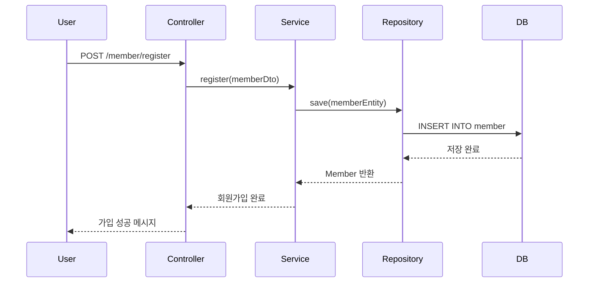
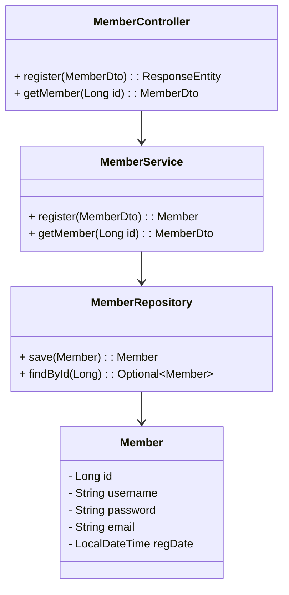
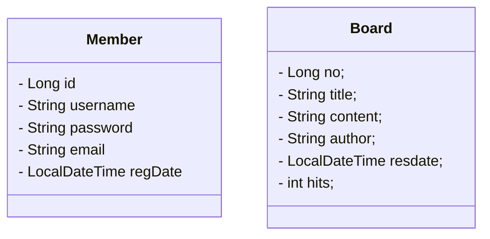
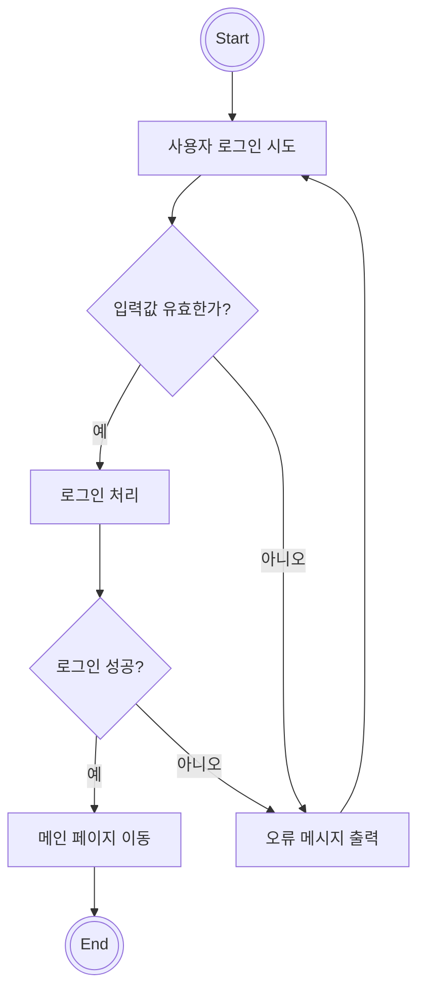

# 12_시퀀스/클래스 다이어그램

**여기의 시퀀스/클래스 다이어그램 예시에서는 일부 시퀀스와 클래스에 관해서만 제작하였습니다. 실제 웹 애플리케이션에 모든 시퀀스와 클래스 다이어그램을 제작해야 합니다.**

### 작성 팁

- UseCase별 시퀀스 다이어그램 (예: 로그인, 상품 등록, 댓글 작성 등)
- 비즈니스 레이어 흐름 (Controller → Service → DAO → DB)
- ERD와 매핑된 클래스 관계 비교

# 시퀀스 다이어그램 (Sequence Diagram)

시퀀스 다이어그램은 **사용자와 시스템 내부 객체 간의 상호작용 흐름을 시간 순으로** 표현합니다.

### ✅ 회원가입 시퀀스

```
사용자 → MemberController → MemberService → MemberRepository → DB
```

### 🔽 시퀀스 흐름 설명

1. 사용자가 `/member/register` 폼에 정보를 입력하고 제출
2. `MemberController.register()`에서 요청을 수신
3. `MemberService.register()`로 회원가입 로직 위임
4. `MemberRepository.save()`를 호출하여 DB에 저장
5. 저장된 결과를 Controller로 전달
6. 회원가입 성공 메시지를 사용자에게 반환



**머메이드차트 웹 도구([https://www.mermaidchart.com/app/projects/](https://www.mermaidchart.com/app/projects/)) 에서 쉽게 Mermaid 언어로 작성할 수 있습니다.**


# 클래스 다이어그램 (Class Diagram)

클래스 다이어그램은 **클래스 간 관계, 속성, 메서드**를 정적으로 표현합니다.

## 📦 주요 클래스들

- `MemberController`
- `MemberService`
- `MemberRepository`
- `Member`






# 액티비티 다이어그램

## 사용자 로그인1




## 사용자 로그인2

```mermaid
flowchart TD
    start([Start]) --> input[/사용자 아이디, 비밀번호 입력/]
    input --> validate{입력값 유효한가?}
    validate -- 예 --> auth[/인증 요청/]
    validate -- 아니오 --> error1[/입력 오류 메시지 출력/]
    error1 --> input
    auth --> result{인증 성공 여부}
    result -- 성공 --> load[/사용자 정보 로딩/]
    result -- 실패 --> error2[/인증 실패 메시지 출력/]
    error2 --> input
    load --> home[메인 화면으로 이동]
    home --> end([End])
```

### 다른 환경 제공

- Notion (코드 블록에 Mermaid 지원되는 플러그인 활용 시)
- Obsidian
- VSCode (Mermaid Preview 확장)
- Mermaid Live Editor ([https://mermaid.live](https://mermaid.live/))