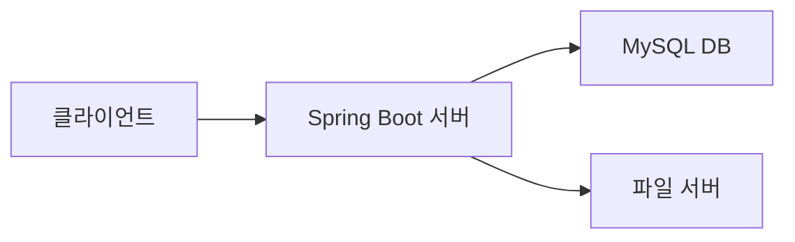

# 06_요구사항 정의서

**실제 본인이 작성할 웹 애플리케이션에 관한 모든 요구사항을 문서화하여야 합니다.**

## 📄 웹 애플리케이션 요구사항 정의서

> 프로젝트명: 쇼핑몰 웹 애플리케이션
> 
> 
> **개발환경:** Java 17, Spring Boot 3.x, Thymeleaf, MySQL, Gradle
> 
> **작성일:** 2025.04.14
> 
> **작성자:** 홍길동 (PM)
> 

### ✅ 1. 개요

| 항목 | 내용 |
| --- | --- |
| 프로젝트 명 | 쇼핑몰 웹 애플리케이션 개발 |
| 목적 | 사용자들이 온라인에서 상품을 검색, 구매, 결제할 수 있는 웹 서비스를 제공 |
| 범위 | 회원가입, 로그인, 마이페이지, 상품목록, 장바구니, 주문 및 결제, QnA, 관리자 기능 포함 |
| 주요 사용자 | 일반 사용자, 관리자 |
| 플랫폼 | 웹 브라우저(PC, 모바일) 기반 |

### ✅ 2. 시스템 구성도

**머메이드 차트 웹 도구([https://www.mermaidchart.com/app/projects/](https://www.mermaidchart.com/app/projects/))를 활용하셔도 됩니다.**

### ✅ 3. 기능 요구사항 상세

| 요구사항 ID | 기능명 | 설명 | 우선순위 | 관련 페이지 | 비고 |
| --- | --- | --- | --- | --- | --- |
| FR-001 | 회원가입 | 사용자가 아이디, 비밀번호, 이름, 연락처 등 입력 후 가입 가능 | 높음 🔴 | /member/join | 아이디 중복 체크 필요 |
| FR-002 | 로그인 | 아이디와 비밀번호로 로그인 가능, 세션 기반 인증 | 높음 🔴 | /member/login | 실패 시 에러 메시지 |
| FR-003 | 마이페이지 | 사용자의 정보 조회 및 수정 | 중간 🟠 | /member/mypage | 비밀번호 변경 포함 |
| FR-004 | 상품 목록 조회 | 등록된 상품 목록을 카테고리별로 조회 가능 | 높음 🔴 | /product/list | 페이징 처리 필요 |
| FR-005 | 상품 상세 조회 | 상품 이미지, 가격, 설명, 재고 표시 | 높음 🔴 | /product/view | 관련상품 추천 |
| FR-006 | 장바구니 담기 | 원하는 상품을 장바구니에 담을 수 있음 | 중간 🟠 | /cart | 수량 변경 가능 |
| FR-007 | 주문 및 결제 | 주문서 작성 → 결제 → 주문 완료 프로세스 | 높음 🔴 | /order | PG사 연동 필요 |
| FR-008 | Q&A 게시판 | 사용자 질문 및 답변 등록 기능 | 중간 🟠 | /qna/list | 관리자 답변 필요 |
| FR-009 | 관리자 상품 등록 | 상품 정보를 입력하고 이미지 등록 가능 | 높음 🔴 | /admin/product/add | 썸네일 필수 |
| FR-010 | 관리자 회원 관리 | 전체 회원 리스트, 수정, 탈퇴 처리 | 중간 🟠 | /admin/member/list | 검색, 필터 포함 |

### ✅ 4. 비기능 요구사항

| ID | 항목 | 내용 |
| --- | --- | --- |
| NFR-001 | 성능 | 100명 동시 접속에서도 안정적인 응답 시간 (2초 이내) |
| NFR-002 | 보안 | HTTPS, 비밀번호 암호화 저장 (BCrypt), CSRF 방어 |
| NFR-003 | 호환성 | Chrome, Edge, Safari 최신 버전 호환 보장 |
| NFR-004 | 접근성 | 웹 접근성 수준 AAA 기준 준수 (스크린리더 호환) |
| NFR-005 | 유지보수성 | Spring Boot 구조에 따른 Layered Architecture 준수 |

### ✅ 5. UI/UX 참고

- 간단한 와이어프레임 첨부 가능 (Figma 링크 또는 Notion 이미지)
- 모바일 반응형 대응 (Bootstrap 5.3 사용 기준)

### ✅ 6. 기타

- 요구사항 변경 시 반드시 변경 이력에 기록
- 기능 목록은 JIRA 또는 Notion Task 관리 DB와 연동하여 관리 가능