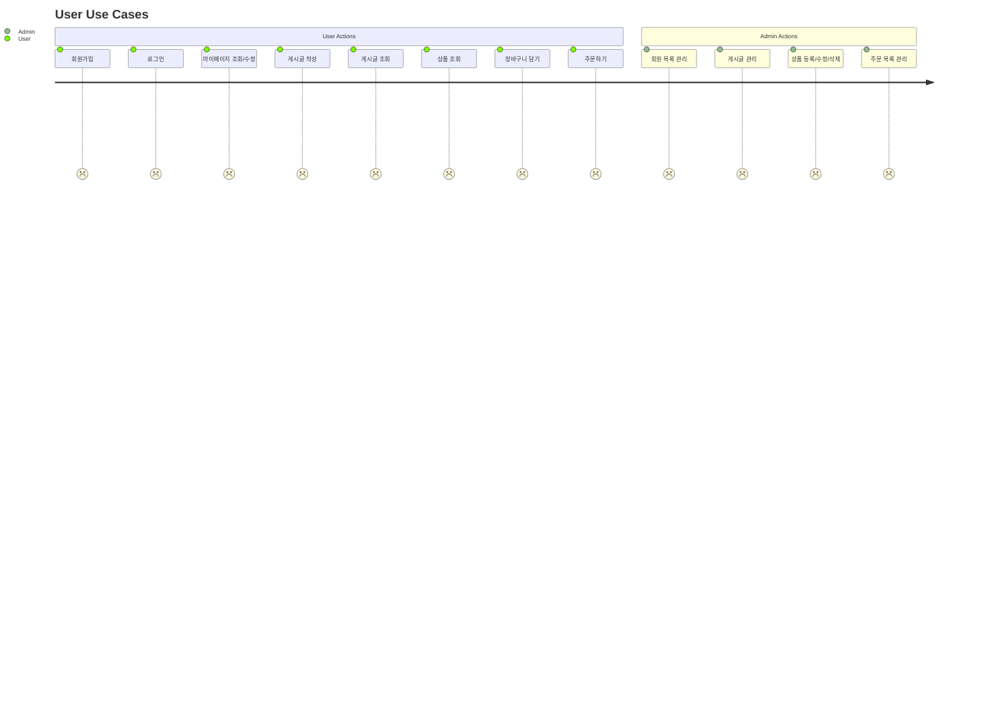

# 07_유스케이스 명세서

**실제 본인이 작성할 웹 애플리케이션에 관한 모든 유스케이스를 명세화하여야 합니다.**

## 📄 웹 애플리케이션 개발 유스케이스 명세서

[✅ Use Case 총괄표](%E2%9C%85%20Use%20Case%20%EC%B4%9D%EA%B4%84%ED%91%9C%202fd4fd4900b381c88a57ffa54c7cb562.csv)

### ✅ Use Case: UC-001 회원가입 (User Registration)

| 항목 | 내용 |
| --- | --- |
| **유스케이스 ID** | UC-001 |
| **유스케이스 명** | 회원가입 |
| **기능 설명** | 사용자가 웹 애플리케이션에 계정을 등록하고 로그인할 수 있도록 정보를 입력하여 가입한다. |
| **주요 액터(Actors)** | 사용자(User) |
| **사전 조건** | 사용자가 사이트 접속 상태이며, 로그아웃 상태여야 함 |
| **사후 조건** | DB에 사용자의 정보가 저장되며, 로그인 페이지로 이동됨 |
| **정상 흐름** | 1. 사용자가 ‘회원가입’ 버튼 클릭2. 회원가입 양식(이름, 아이디, 비밀번호, 이메일 등) 입력3. ‘가입’ 버튼 클릭4. 서버에서 입력값 검증5. 중복 확인 및 비밀번호 암호화 후 DB 저장6. 가입 완료 메시지 후 로그인 페이지로 이동 |
| **예외 흐름** | - 아이디 중복 시: 중복 경고 메시지 표시- 필수 항목 미입력 시: 오류 메시지 표시- 비밀번호 정책 미준수 시: 경고 메시지 표시 |
| **비고** | - 이메일 인증 기능은 2차 배포에서 구현 예정- 프론트엔드와 백엔드 간 REST API 연동 예정 |

### ✅ Use Case: UC-002 로그인 (User Login)

| 항목 | 내용 |
| --- | --- |
| **유스케이스 ID** | UC-002 |
| **유스케이스 명** | 로그인 |
| **기능 설명** | 기존 회원이 자신의 계정으로 로그인하여 서비스에 접근할 수 있다. |
| **주요 액터(Actors)** | 사용자(User) |
| **사전 조건** | 회원가입이 완료되어야 하며, 로그인 상태가 아니어야 함 |
| **사후 조건** | 로그인 성공 시 세션 또는 토큰 생성 및 마이페이지 또는 메인 화면으로 이동 |
| **정상 흐름** | 1. 사용자가 로그인 페이지 접속2. 아이디/비밀번호 입력3. ‘로그인’ 클릭4. 서버에서 인증 확인5. 인증 성공 시 세션 생성6. 메인 페이지로 리다이렉션 |
| **예외 흐름** | - 아이디/비밀번호 불일치: 오류 메시지 표시- 입력값 미입력: 경고 메시지 표시 |
| **비고** | - 로그인 세션은 Spring Security 또는 HttpSession으로 관리- 추후 JWT 토큰 방식 고려 |

### ✅ Use Case: UC-003 상품 상세보기 (View Product Details)

| 항목 | 내용 |
| --- | --- |
| **유스케이스 ID** | UC-003 |
| **유스케이스 명** | 상품 상세보기 |
| **기능 설명** | 사용자가 목록에서 특정 상품을 클릭하면 해당 상품의 상세 정보를 확인할 수 있다. |
| **주요 액터(Actors)** | 사용자(User) |
| **사전 조건** | 상품이 DB에 등록되어 있어야 함 |
| **사후 조건** | 조회수 증가 및 해당 상품의 상세 정보 출력 |
| **정상 흐름** | 1. 사용자가 상품 목록 페이지 접속2. 특정 상품 클릭3. 서버에서 상품 정보 조회4. 상세 정보 페이지로 이동5. 상품명, 설명, 가격, 이미지, 재고 등 표시 |
| **예외 흐름** | - 해당 상품이 존재하지 않는 경우: ‘존재하지 않는 상품입니다’ 메시지 표시 |
| **비고** | - 상품 번호(PK)로 조회, 조회수 증가 기능 포함- 이미지 로딩 지연 고려 필요 |

# 유스케이스 다이어그램

