# 유스케이스 명세서_찐 최종

[유스케이스 총괄 표](유스케이스%20총괄%20표.csv)

---

## 📋 유스케이스 목록

| ID | 유스케이스명 | 주요 액터 | 도메인 |
| --- | --- | --- | --- |
| UC-A-001 | 관리자 페이지 조회 | 관리자(ADMIN/MANAGER) | 관리자 |
| UC-A-002 | 회원 관리 (목록·상세 조회) | 관리자(ADMIN/MANAGER) | 관리자 - 회원 |
| UC-A-003 | 회원 관리 (강퇴·등급 변경) | 관리자(ADMIN) | 관리자 - 회원 |
| UC-A-004 | 관리자 카테고리 관리 | 관리자(ADMIN) | 관리자 - 카테고리 |
| UC-A-005 | 관리자 상품 관리 | 관리자(ADMIN/MANAGER) | 관리자 - 상품 |
| UC-A-006 | 관리자 주문 조회 및 상태 관리 | 관리자(ADMIN/MANAGER) | 관리자 - 주문 |
| UC-A-007 | 관리자 주문 취소 처리 | 관리자(ADMIN/MANAGER) | 관리자 - 주문 |
| UC-A-008 | 관리자 배송 관리 | 관리자(ADMIN/MANAGER) | 관리자 - 배송 |
| UC-A-009 | 공지사항 등록/수정 | 관리자(ADMIN/MANAGER) | 관리자 - 공지사항 |
| UC-A-010 | Q&A 답변 등록 | 관리자(ADMIN/MANAGER) | 관리자 - QnA |
| UC-A-011 | Q&A 비밀글 처리 | 관리자(ADMIN/MANAGER) | 관리자 - QnA |
| UC-A-012 | 관리자 리뷰 관리 | 관리자(ADMIN/MANAGER) | 관리자 - 리뷰 |
| UC-M-001 | 회원가입 | 사용자(비회원) | 회원 |
| UC-M-002 | 로그인 | 사용자(USER) | 회원 |
| UC-M-003 | 로그아웃 | 사용자(USER) | 회원 |
| UC-M-004 | 마이페이지 | 사용자(USER) | 마이페이지 |
| UC-M-005 | 회원 정보 관리 | 사용자(USER) | 마이페이지 - 회원정보 |
| UC-M-006 | 카테고리 조회 | 사용자(USER/비회원) | 상품 |
| UC-M-007 | 상품 탐색 | 사용자(USER/비회원) | 상품 |
| UC-M-008 | 상품 상세 조회 | 사용자(USER/비회원) | 상품 |
| UC-M-009 | 장바구니 관리 | 사용자(USER) | 장바구니 |
| UC-M-010 | 주문 생성 | 사용자(USER) | 주문 |
| UC-M-011 | 결제 처리 | 사용자(USER) | 결제 |
| UC-M-012 | 주문 취소 및 결제 취소 | 사용자(USER) | 주문 |
| UC-M-013 | 배송 조회 | 사용자(USER) | 배송 |
| UC-M-014 | 공지사항 조회 | 사용자(USER/비회원) | 공지사항 |
| UC-M-015 | 상품 리뷰 작성 | 사용자(USER) | 리뷰 |
| UC-M-016 | 다중 이미지 업로드 | 사용자(USER) | 리뷰 |
| UC-M-017 | 리뷰 추천/공감 | 사용자(USER) | 리뷰 |
| UC-M-018 | Q&A 비밀글 처리 | 사용자(USER) | QnA |
| UC-M-019 | Q&A 재문의 등록 | 사용자(USER) | QnA |
| UC-M-020 | Q&A 질문 등록 | 사용자(USER) | QnA |

---

## 🔐 관리자 (Admin) 유스케이스

---

### ✅ Use Case: UC-A-001 관리자 페이지 조회

| 항목 | 내용 |
| --- | --- |
| **유스케이스 ID** | UC-A-001 |
| **유스케이스 명** | 관리자 페이지 조회 |
| **기능 설명** | 관리자가 대시보드에서 미승인 주문·QnA·재고 부족 상품·매출 통계·신규 회원 현황 등 요약 정보를 한눈에 확인한다. |
| **주요 액터** | 관리자(ADMIN/MANAGER) |
| **사전 조건** | 관리자 계정으로 로그인 상태 |
| **사후 조건** | 대시보드 각 위젯에 최신 데이터가 렌더링됨 |
| **정상 흐름** | 1. 관리자가 /admin 접속 2. 신규 미승인 주문(최신 5~10건) 표시 3. 신규 QnA 질문(최신 5~10건) 표시 4. 재고 기준치(10개) 이하 상품 목록 표시 5. 매출/주문 통계 요약 표시 6. 신규 회원 현황 표시 |
| **예외 흐름** | - 관리자 권한 없는 접근: 403 Forbidden - 데이터 없는 위젯: 빈 상태 메시지 표시 |
| **비고** | 최신 5~10건 집계 / 재고 기준치 10개 이하 |

---

### ✅ Use Case: UC-A-002 회원 관리 (목록·상세 조회)

| 항목 | 내용 |
| --- | --- |
| **유스케이스 ID** | UC-A-002 |
| **유스케이스 명** | 회원 관리 (목록·상세 조회) |
| **기능 설명** | 관리자가 전체 회원 목록을 페이징·검색으로 조회하고, 특정 회원의 상세 정보 및 탈퇴 회원 목록을 확인한다. |
| **주요 액터** | 관리자(ADMIN/MANAGER) |
| **사전 조건** | 관리자 로그인 상태 |
| **사후 조건** | 회원 목록 및 상세 정보 출력 |
| **정상 흐름** | 1. 관리자가 /admin/member/list 접속 2. 전체 회원 목록 조회(최신 가입순·페이징) 3. 이름/이메일 검색 필터 적용 4. 특정 회원 클릭 시 /admin/member/detail/{id} 접속 5. 상세 정보(가입일·상태·역할·deleted_at) 출력 6. 탈퇴 회원 필터 선택 시 deleted_at 기준 탈퇴 회원 목록 별도 조회 |
| **예외 흐름** | - 검색 결과 없음: '조회된 회원이 없습니다' 메시지 - 존재하지 않는 회원 ID: 404 Not Found |
| **비고** | ILIKE 검색 / 페이지 크기 10건 기본 / soft delete 회원 포함 조회 |

---

### ✅ Use Case: UC-A-003 회원 관리 (강퇴·등급 변경)

| 항목 | 내용 |
| --- | --- |
| **유스케이스 ID** | UC-A-003 |
| **유스케이스 명** | 회원 관리 (강퇴·등급 변경) |
| **기능 설명** | ADMIN이 특정 회원을 강퇴(DEACTIVATE)하거나 회원 역할을 USER / MANAGER / ADMIN으로 변경한다. |
| **주요 액터** | 관리자(ADMIN) |
| **사전 조건** | 대상 회원이 DB에 존재 / 실행자가 ADMIN 권한 보유 |
| **사후 조건** | memberStatus = DEACTIVATE 또는 memberRole 변경 완료 |
| **정상 흐름** | 1. 관리자가 회원 상세 페이지에서 '강퇴' 또는 '역할 변경' 선택 2. 확인 모달 표시 3. 확인 시 서버에서 memberStatus 또는 memberRole 업데이트 4. 완료 메시지 표시 |
| **예외 흐름** | - ADMIN 권한 없는 접근: 403 Forbidden - 이미 DEACTIVATE 상태: '이미 강퇴된 회원입니다' 메시지 - 본인 역할 변경 시도: 경고 메시지 |
| **비고** | ADMIN 전용 기능 / memberStatus·memberRole ENUM |

---

### ✅ Use Case: UC-A-004 관리자 카테고리 관리

| 항목 | 내용 |
| --- | --- |
| **유스케이스 ID** | UC-A-004 |
| **유스케이스 명** | 관리자 카테고리 관리 |
| **기능 설명** | 관리자가 카테고리를 등록하고, 이름이나 정렬 순서를 수정하며, 활성/비활성/삭제 상태를 변경한다. |
| **주요 액터** | 관리자(ADMIN) |
| **사전 조건** | 관리자가 로그인 상태이며 카테고리 관리 권한을 보유해야 함 |
| **사후 조건** | 카테고리 정보가 신규 등록되거나 수정되고, 상태 변경 결과가 목록에 반영됨 |
| **정상 흐름** | 1. 관리자가 카테고리 관리 화면에 접속한다. 2. 신규 등록 또는 기존 카테고리 선택을 수행한다. 3. 카테고리명, 계층, 정렬 순서, 상태 정보를 입력 또는 수정한다. 4. 저장 버튼을 클릭한다. 5. 시스템이 입력값을 검증한다. 6. 시스템이 카테고리를 등록, 수정 또는 상태 변경 처리한다. 7. 변경 결과를 화면에 표시한다. |
| **예외 흐름** | - 필수값이 누락된 경우 오류 메시지를 표시한다. - 중복 카테고리명 또는 허용되지 않는 상태 변경인 경우 저장을 차단한다. |
| **비고** | 카테고리 삭제는 soft delete 방식으로 처리 |

---

### ✅ Use Case: UC-A-005 관리자 상품 관리

| 항목 | 내용 |
| --- | --- |
| **유스케이스 ID** | UC-A-005 |
| **유스케이스 명** | 관리자 상품 관리 |
| **기능 설명** | 관리자가 상품을 등록하고, 가격/재고/설명/이미지를 수정하며, 필요 시 삭제 처리한다. |
| **주요 액터** | 관리자(ADMIN/MANAGER) |
| **사전 조건** | 관리자가 로그인 상태이며 상품 관리 권한과 등록 가능한 카테고리를 보유해야 함 |
| **사후 조건** | 상품이 등록, 수정 또는 삭제 상태로 반영됨 |
| **정상 흐름** | 1. 관리자가 상품 관리 화면에 접속한다. 2. 신규 등록 또는 기존 상품 선택을 수행한다. 3. 상품명, 가격, 재고, 설명, 카테고리, 썸네일 이미지를 입력 또는 수정한다. 4. 저장 또는 삭제를 선택한다. 5. 시스템이 입력값과 파일을 검증한다. 6. 시스템이 상품을 등록, 수정 또는 soft delete 처리한다. 7. 결과를 화면에 표시한다. |
| **예외 흐름** | - 썸네일이 누락된 경우 등록을 차단한다. - 가격이나 재고 값이 유효하지 않은 경우 오류를 표시한다. - 주문과 연관된 상품이라 삭제가 제한되면 삭제를 차단한다. |
| **비고** | 이미지 파일은 파일 서버에 저장될 수 있다. |

---

### ✅ Use Case: UC-A-006 관리자 주문 조회 및 상태 관리

| 항목 | 내용 |
| --- | --- |
| **유스케이스 ID** | UC-A-006 |
| **유스케이스 명** | 관리자 주문 조회 및 상태 관리 |
| **기능 설명** | 관리자가 주문 목록과 상세 정보를 조회하고 주문 상태를 변경한다. |
| **주요 액터** | 관리자(ADMIN/MANAGER) |
| **사전 조건** | 관리자가 로그인 상태이며 주문 관리 권한을 보유해야 함 |
| **사후 조건** | 주문 목록 또는 상세 정보가 표시되고 주문 상태가 변경될 수 있음 |
| **정상 흐름** | 1. 관리자가 주문 관리 화면에 접속한다. 2. 시스템이 주문 목록을 조회해 표시한다. 3. 관리자가 특정 주문을 선택한다. 4. 시스템이 주문 상품, 결제, 배송 정보를 포함한 상세 정보를 조회한다. 5. 관리자가 주문 상태 변경을 선택한다. 6. 시스템이 상태 전이 가능 여부를 검증한 뒤 상태를 저장한다. 7. 변경 결과를 화면에 표시한다. |
| **예외 흐름** | - 조회 조건에 맞는 주문이 없는 경우 빈 목록을 표시한다. - 존재하지 않는 주문인 경우 오류 메시지를 표시한다. - 허용되지 않는 상태 전이인 경우 변경을 차단한다. |
| **비고** | 주문 상태는 PENDING, PAYED, APPROVAL, CANCELED 기준으로 관리 |

---

### ✅ Use Case: UC-A-007 관리자 주문 취소 처리

| 항목 | 내용 |
| --- | --- |
| **유스케이스 ID** | UC-A-007 |
| **유스케이스 명** | 관리자 주문 취소 처리 |
| **기능 설명** | 관리자가 주문을 강제로 취소하고 필요한 경우 결제 취소까지 연계 처리한다. |
| **주요 액터** | 관리자(ADMIN/MANAGER) |
| **사전 조건** | 관리자가 로그인 상태여야 하며 주문이 취소 가능한 상태여야 함 |
| **사후 조건** | 주문 상태가 취소로 반영되고 결제 취소 결과가 저장될 수 있음 |
| **정상 흐름** | 1. 관리자가 주문 상세 화면에서 취소 대상을 선택한다. 2. 시스템이 주문 상태와 결제 상태를 확인한다. 3. 관리자가 취소를 확정한다. 4. 시스템이 외부 결제 시스템 또는 내부 결제 모듈에 취소 요청을 전송한다. 5. 시스템이 주문 상태를 CANCELED로 변경한다. 6. 취소 결과를 화면에 표시한다. |
| **예외 흐름** | - 이미 배송이 진행된 주문인 경우 취소를 제한한다. - 결제 취소 연동에 실패한 경우 주문 취소 완료를 보류하고 오류를 표시한다. |
| **비고** | 주문 취소와 결제 취소의 정합성을 함께 관리해야 한다. |

---

### ✅ Use Case: UC-A-008 관리자 배송 관리

| 항목 | 내용 |
| --- | --- |
| **유스케이스 ID** | UC-A-008 |
| **유스케이스 명** | 관리자 배송 관리 |
| **기능 설명** | 관리자가 배송 목록을 조회하고 운송장을 등록하며 배송 상태를 변경한다. |
| **주요 액터** | 관리자(ADMIN/MANAGER) |
| **사전 조건** | 관리자가 로그인 상태이며 배송 관리 권한을 보유해야 함 |
| **사후 조건** | 배송 목록, 운송장 정보, 배송 상태가 최신 정보로 반영됨 |
| **정상 흐름** | 1. 관리자가 배송 관리 화면에 접속한다. 2. 시스템이 배송 목록을 상태별로 조회해 표시한다. 3. 관리자가 특정 배송 건을 선택한다. 4. 택배사명과 운송장 번호를 입력한다. 5. 배송 상태를 READY, SHIPPED, IN_TRANSIT, DELIVERED, FAILED 중 하나로 선택한다. 6. 시스템이 운송장과 상태 정보를 저장한다. 7. 결과를 화면에 표시한다. |
| **예외 흐름** | - 운송장 번호 형식이 잘못된 경우 저장을 차단한다. - 허용되지 않는 배송 상태 변경인 경우 변경을 제한한다. |
| **비고** | 사용자 배송 조회 화면에 연동된다. |

---

### ✅ Use Case: UC-A-009 공지사항 등록/수정

| 항목 | 내용 |
| --- | --- |
| **유스케이스 ID** | UC-A-009 |
| **유스케이스 명** | 공지사항 등록/수정 |
| **기능 설명** | 관리자가 중요 공지사항을 등록·수정·삭제하고 목록 최상단에 고정할 수 있다. |
| **주요 액터** | 관리자(ADMIN/MANAGER) |
| **사전 조건** | 관리자 로그인 상태 |
| **사후 조건** | 공지사항 등록·수정·삭제 결과가 반영되고, is_fixed = true인 게시물은 목록 최상단에 노출됨 |
| **정상 흐름** | 1. 관리자가 /admin/notice 접속 2. 공지사항 목록 조회(is_fixed 상단 고정 우선) 3. /admin/notice/insert 에서 제목, 내용 입력 후 '상단 고정(is_fixed)' 여부를 체크하여 저장 4. /admin/notice/update/{id} 에서 제목·내용·고정 여부 수정 5. 삭제 시 deleted_at 기록(soft delete) 6. 사용자가 공지사항 목록 요청 시 is_fixed = true 게시물 최상단 배치, 나머지는 작성일 역순 정렬 출력 |
| **예외 흐름** | - 제목·내용 미입력: 필수 항목 경고 - 삭제된 공지 접근: 404 Not Found |
| **비고** | is_fixed 플래그 활용 / soft delete |

---

### ✅ Use Case: UC-A-010 Q&A 답변 등록

| 항목 | 내용 |
| --- | --- |
| **유스케이스 ID** | UC-A-010 |
| **유스케이스 명** | Q&A 답변 등록 |
| **기능 설명** | 관리자가 사용자 문의에 답변을 등록하고, 기존 답변을 수정·삭제한다. |
| **주요 액터** | 관리자(ADMIN/MANAGER) |
| **사전 조건** | 관리자 로그인 상태 / 질문이 WAITING 또는 PROCESSING 상태 |
| **사후 조건** | 답변 저장(parent_id = 질문 ID, depth = 1) / qna_status = COMPLETE |
| **정상 흐름** | 1. 관리자가 /admin/qna/list 접속 2. 질문 목록 조회(qna_status 필터) 3. /admin/qna/detail/{id} 에서 질문 상세 및 기존 답변 확인 4. /admin/qna/{id}/insert 에서 답변 내용 입력 후 등록 5. 시스템이 답변 저장(parent_id = 질문 ID, depth = 1) 6. qna_status = COMPLETE로 자동 변경 7. answered_at 자동 기록 8. 답변 수정·삭제(soft delete) 가능 |
| **예외 흐름** | - 답변 내용 미입력: 필수 항목 경고 - 존재하지 않는 질문: 404 Not Found |
| **비고** | parent_id 연결 필수 / depth = 1 / answered_at 자동 기록 |

---

### ✅ Use Case: UC-A-011 Q&A 비밀글 처리 (관리자)

| 항목 | 내용 |
| --- | --- |
| **유스케이스 ID** | UC-A-011 |
| **유스케이스 명** | Q&A 비밀글 처리 (관리자) |
| **기능 설명** | 관리자가 비밀글로 설정된 Q&A를 조회하고, 답변 등록 시 답변도 자동으로 비밀글로 설정한다. |
| **주요 액터** | 관리자(ADMIN/MANAGER) |
| **사전 조건** | 관리자 로그인 상태 |
| **사후 조건** | 비밀글 접근 가능 / 답변 자동 비밀글 설정 완료 |
| **정상 흐름** | 1. 관리자가 Q&A 목록에서 비밀글 포함 전체 목록을 조회한다. 2. 비밀글(is_secret = true)인 질문을 선택한다. 3. 관리자는 작성자와 관계없이 비밀글 내용을 확인한다. 4. 답변 등록 시 시스템이 부모 글이 비밀글이면 답변도 자동으로 is_secret = true로 설정한다. |
| **예외 흐름** | - 비인가 사용자(본인 아닌 일반 회원)가 상세 조회 요청 시: '권한이 없습니다' 메시지 출력 |
| **비고** | is_secret 필드 기준 / 하위 답변 자동 상속 |

---

### ✅ Use Case: UC-A-012 관리자 리뷰 관리

| 항목 | 내용 |
| --- | --- |
| **유스케이스 ID** | UC-A-012 |
| **유스케이스 명** | 관리자 리뷰 관리 |
| **기능 설명** | 관리자가 사용자가 작성한 리뷰 전체 목록을 조회하고, 부적절하거나 정책 위반 리뷰를 soft delete 처리한다. |
| **주요 액터** | 관리자(ADMIN/MANAGER) |
| **사전 조건** | 관리자 로그인 상태 |
| **사후 조건** | 리뷰 목록이 조회되거나, 선택한 리뷰가 deleted_at 기록을 통해 soft delete 처리됨 |
| **정상 흐름** | 1. 관리자가 /admin/review/list 접속 2. 전체 리뷰 목록(상품명·작성자 포함) 페이징 조회 3. 특정 리뷰 선택 시 /admin/review/detail/{id} 에서 내용·평점·첨부 이미지 상세 확인 4. 부적절 리뷰에 대해 '삭제' 선택 5. 시스템이 deleted_at = now() 기록(soft delete) 처리 6. 목록에서 해당 리뷰 제외 |
| **예외 흐름** | - 존재하지 않는 리뷰 ID: 404 Not Found - 이미 삭제된 리뷰 접근 시: '삭제된 리뷰입니다' 메시지 표시 |
| **비고** | soft delete (deleted_at) 방식 / 관리자는 모든 회원 리뷰 접근 가능 / 연관 REQ: REQ-A-035~037 |

---

## 👤 회원 (Member) 유스케이스

---

### ✅ Use Case: UC-M-001 회원가입

| 항목 | 내용 |
| --- | --- |
| **유스케이스 ID** | UC-M-001 |
| **유스케이스 명** | 회원가입 |
| **기능 설명** | 비회원이 이메일·비밀번호·이름·전화번호·주소를 입력하여 계정을 생성한다. |
| **주요 액터** | 사용자(비회원) |
| **사전 조건** | 로그아웃 상태 / 해당 이메일 미가입 |
| **사후 조건** | member 테이블에 저장 / 로그인 페이지 이동 |
| **정상 흐름** | 1. 비회원이 /signup 접속 2. 이메일·비밀번호·이름·전화번호·주소 입력 3. 이메일 중복 체크 4. 서버에서 입력값 검증 5. 비밀번호 BCrypt 암호화 후 저장 6. 가입 완료 메시지 / 로그인 페이지 이동 |
| **예외 흐름** | - 이메일 중복: '이미 사용 중인 이메일입니다' 메시지 - 필수 항목 미입력: 항목별 오류 메시지 - 비밀번호 정책 미준수: 정책 안내 메시지 |
| **비고** | email UNIQUE / BCrypt 암호화 저장 |

---

### ✅ Use Case: UC-M-002 로그인

| 항목 | 내용 |
| --- | --- |
| **유스케이스 ID** | UC-M-002 |
| **유스케이스 명** | 로그인 |
| **기능 설명** | 회원이 이메일과 비밀번호로 로그인하여 JWT Access/Refresh Token을 발급받는다. |
| **주요 액터** | 사용자(USER) |
| **사전 조건** | 회원가입 완료 / 로그아웃 상태 / memberStatus = ACTIVATE |
| **사후 조건** | Access Token / Refresh Token 발급 / 메인 페이지 이동 |
| **정상 흐름** | 1. 사용자가 /signin 접속 2. 이메일·비밀번호 입력 3. 서버에서 BCrypt 비밀번호 검증 4. memberStatus 확인(ACTIVATE만 허용) 5. JWT Token 발급 6. 메인 페이지 리다이렉션 |
| **예외 흐름** | - 이메일/비밀번호 불일치: '이메일 또는 비밀번호가 올바르지 않습니다' 메시지 - DEACTIVATE 계정: '강퇴된 계정입니다' 메시지 - DELETE 계정: '탈퇴한 계정입니다' 메시지 |
| **비고** | Access/Refresh Token 발급 / BCrypt 검증 |

---

### ✅ Use Case: UC-M-003 로그아웃

| 항목 | 내용 |
| --- | --- |
| **유스케이스 ID** | UC-M-003 |
| **유스케이스 명** | 로그아웃 |
| **기능 설명** | 로그인 상태의 사용자가 로그아웃하여 JWT 토큰을 무효화한다. |
| **주요 액터** | 사용자(USER) |
| **사전 조건** | 로그인 상태 |
| **사후 조건** | 클라이언트 측 토큰 삭제 완료 |
| **정상 흐름** | 1. 사용자가 '로그아웃' 클릭 2. 클라이언트에서 Access/Refresh Token 삭제 3. 메인 페이지 이동 |
| **예외 흐름** | - 없음 |
| **비고** | 클라이언트 측 토큰 제거 / 서버 측 블랙리스트 처리 고려 |

---

### ✅ Use Case: UC-M-004 마이페이지

| 항목 | 내용 |
| --- | --- |
| **유스케이스 ID** | UC-M-004 |
| **유스케이스 명** | 마이페이지 |
| **기능 설명** | 회원이 마이페이지에서 주문 현황 카운트·최신 주문/배송·리뷰·QnA 요약 정보를 한눈에 확인한다. |
| **주요 액터** | 사용자(USER) |
| **사전 조건** | 로그인 상태 |
| **사후 조건** | 마이페이지 대시보드 렌더링 완료 |
| **정상 흐름** | 1. 회원이 /mypage 접속 2. 주문 상태별 현황 카운트 표시(입금 대기~배송 완료 6단계) 3. 최신 주문/배송 목록(5~10건) 표시 4. 최신 작성 리뷰 목록(5~10건) 표시 5. 최신 작성 QnA 목록 및 답변 여부 표시 |
| **예외 흐름** | - 데이터 없는 섹션: 각 영역 빈 상태 메시지 표시 |
| **비고** | 최신 5~10건 집계 / order_status + delivery_status 연계 |

---

### ✅ Use Case: UC-M-005 회원 정보 관리

| 항목 | 내용 |
| --- | --- |
| **유스케이스 ID** | UC-M-005 |
| **유스케이스 명** | 회원 정보 관리 |
| **기능 설명** | 회원이 이름·전화번호·주소를 수정하거나 비밀번호를 변경하거나 계정을 탈퇴 처리한다. |
| **주요 액터** | 사용자(USER) |
| **사전 조건** | 로그인 상태 / memberStatus = ACTIVATE |
| **사후 조건** | 정보 수정 완료 또는 탈퇴(memberStatus = DELETE / deleted_at 기록 / 즉시 로그아웃) |
| **정상 흐름** | 1. 회원이 /mypage/edit 에서 이름·전화번호·주소 수정 2. /mypage/password 에서 현재 비밀번호 확인 후 새 비밀번호 변경 3. 탈퇴 시 비밀번호 재확인 후 memberStatus = DELETE / deleted_at = now() / 즉시 로그아웃 |
| **예외 흐름** | - 현재 비밀번호 불일치: '현재 비밀번호가 올바르지 않습니다' 메시지 - 새 비밀번호 불일치: '비밀번호 확인이 맞지 않습니다' 메시지 - 필수 항목 미입력: 오류 메시지 |
| **비고** | soft delete / BCrypt 재암호화 / 탈퇴 후 즉시 로그아웃 필수 |

---

### ✅ Use Case: UC-M-006 카테고리 조회

| 항목 | 내용 |
| --- | --- |
| **유스케이스 ID** | UC-M-006 |
| **유스케이스 명** | 카테고리 조회 |
| **기능 설명** | 사용자가 상위 및 하위 카테고리 목록을 조회하여 상품 탐색 기준을 선택한다. |
| **주요 액터** | 사용자(USER/비회원) |
| **사전 조건** | 활성 상태의 카테고리가 등록되어 있어야 함 |
| **사후 조건** | 상위/하위 카테고리 목록이 화면에 표시됨 |
| **정상 흐름** | 1. 사용자가 카테고리 영역에 접속한다. 2. 시스템이 상위 카테고리 목록을 조회한다. 3. 사용자가 특정 상위 카테고리를 선택한다. 4. 시스템이 해당 하위 카테고리 목록을 조회한다. 5. 카테고리 목록을 화면에 표시한다. |
| **예외 흐름** | - 등록된 카테고리가 없는 경우 빈 목록 또는 안내 메시지를 표시한다. |
| **비고** | 상품 목록 필터링과 연계된다. |

---

### ✅ Use Case: UC-M-007 상품 탐색

| 항목 | 내용 |
| --- | --- |
| **유스케이스 ID** | UC-M-007 |
| **유스케이스 명** | 상품 탐색 |
| **기능 설명** | 사용자가 상품 목록을 조회하고 검색어 및 카테고리 필터를 사용해 원하는 상품을 찾는다. |
| **주요 액터** | 사용자(USER/비회원) |
| **사전 조건** | 노출 가능한 상품이 등록되어 있어야 함 |
| **사후 조건** | 조건에 맞는 상품 목록이 화면에 표시됨 |
| **정상 흐름** | 1. 사용자가 상품 목록 페이지에 접속한다. 2. 시스템이 기본 상품 목록을 조회해 표시한다. 3. 사용자가 검색어를 입력하거나 카테고리 필터를 선택한다. 4. 시스템이 검색 조건과 필터를 적용한다. 5. 시스템이 결과 상품 목록을 페이징하여 표시한다. |
| **예외 흐름** | - 검색 또는 필터 결과가 없는 경우 결과 없음 메시지를 표시한다. - 삭제되었거나 비활성 상품은 목록에서 제외한다. |
| **비고** | 상품 목록 조회, 상품 검색, 카테고리 필터 요구사항을 통합 반영한다. |

---

### ✅ Use Case: UC-M-008 상품 상세 조회

| 항목 | 내용 |
| --- | --- |
| **유스케이스 ID** | UC-M-008 |
| **유스케이스 명** | 상품 상세 조회 |
| **기능 설명** | 사용자가 특정 상품의 이미지, 가격, 설명, 재고 등 상세 정보를 조회한다. |
| **주요 액터** | 사용자(USER/비회원) |
| **사전 조건** | 조회 대상 상품이 존재해야 함 |
| **사후 조건** | 상품 상세 정보가 화면에 표시됨 |
| **정상 흐름** | 1. 사용자가 상품 목록에서 특정 상품을 선택한다. 2. 시스템이 상품 상세 정보를 조회한다. 3. 시스템이 이미지, 가격, 설명, 재고 정보를 화면에 표시한다. |
| **예외 흐름** | - 존재하지 않는 상품인 경우 오류 메시지를 표시하거나 목록으로 이동한다. - 품절 상품인 경우 품절 상태를 별도로 표시한다. |
| **비고** | 관련 상품 추천이나 조회수 증가는 확장 기능으로 추가할 수 있다. |

---

### ✅ Use Case: UC-M-009 장바구니 관리

| 항목 | 내용 |
| --- | --- |
| **유스케이스 ID** | UC-M-009 |
| **유스케이스 명** | 장바구니 관리 |
| **기능 설명** | 회원이 장바구니를 조회하고 상품을 담으며 수량, 선택 여부를 변경하거나 상품을 삭제한다. |
| **주요 액터** | 사용자(USER) |
| **사전 조건** | 사용자가 로그인 상태여야 함 |
| **사후 조건** | 장바구니 항목이 사용자의 선택에 맞게 갱신됨 |
| **정상 흐름** | 1. 사용자가 장바구니 화면 또는 상품 상세 화면에 접속한다. 2. 장바구니 조회 또는 상품 담기를 수행한다. 3. 시스템이 기존 장바구니 항목 여부를 확인해 신규 추가 또는 수량 증가를 처리한다. 4. 사용자가 장바구니 화면에서 수량 변경, 선택 여부 변경, 상품 삭제를 수행한다. 5. 시스템이 변경 내용을 저장하고 장바구니 목록과 합계 금액을 다시 표시한다. |
| **예외 흐름** | - 로그인하지 않은 경우 로그인 페이지로 이동한다. - 재고 초과 수량 입력 시 저장을 차단한다. - 장바구니가 비어 있으면 빈 장바구니 메시지를 표시한다. |
| **비고** | 장바구니 조회, 상품 담기, 수량 변경, 선택 여부 변경, 상품 삭제 요구사항을 통합 반영한다. |

---

### ✅ Use Case: UC-M-010 주문 생성

| 항목 | 내용 |
| --- | --- |
| **유스케이스 ID** | UC-M-010 |
| **유스케이스 명** | 주문 생성 |
| **기능 설명** | 회원이 주문 상품을 확정하고 배송 정보를 입력하면 시스템이 주문번호를 생성하고 주문, 주문상품, 배송 정보를 함께 저장한다. |
| **주요 액터** | 사용자(USER) |
| **사전 조건** | 사용자가 로그인 상태이며 주문 대상 상품이 존재해야 함 |
| **사후 조건** | 주문이 생성되고 고유 주문번호가 부여되며 주문상품과 배송 정보가 함께 저장됨 |
| **정상 흐름** | 1. 사용자가 주문 페이지로 이동한다. 2. 시스템이 선택한 장바구니 상품 정보를 조회한다. 3. 사용자가 배송지와 수령인 정보를 입력한다. 4. 시스템이 입력값을 검증한다. 5. 시스템이 고유 주문번호를 생성한다. 6. 시스템이 주문 시점의 상품 정보를 주문상품 스냅샷으로 저장한다. 7. 시스템이 가격과 수량, 할인율을 바탕으로 주문상품 금액을 계산한다. 8. 시스템이 배송 정보를 자동 생성한다. 9. 시스템이 주문 생성 결과를 화면에 표시한다. |
| **예외 흐름** | - 배송지 필수값이 누락된 경우 주문 생성을 차단한다. - 재고 부족 또는 주문상품 저장 실패 시 주문 생성을 중단한다. - 주문번호가 중복되면 재생성한다. |
| **비고** | 주문번호 생성, 주문 상품 저장, 금액 계산, 배송 생성 요구사항을 본 유스케이스 내부 시스템 처리로 반영한다. |

---

### ✅ Use Case: UC-M-011 결제 처리

| 항목 | 내용 |
| --- | --- |
| **유스케이스 ID** | UC-M-011 |
| **유스케이스 명** | 결제 처리 |
| **기능 설명** | 회원이 주문에 대해 결제를 요청하면 시스템이 결제 성공 또는 실패 결과를 반영한다. |
| **주요 액터** | 사용자(USER) |
| **사전 조건** | 결제 가능한 주문이 존재해야 함 |
| **사후 조건** | 결제 성공 시 결제 완료 상태가 저장되고, 실패 시 실패 정보가 저장됨 |
| **정상 흐름** | 1. 사용자가 결제 버튼을 클릭한다. 2. 시스템이 주문 금액과 상태를 확인한다. 3. 시스템이 외부 결제 시스템으로 결제 요청을 보낸다. 4. 사용자가 결제 수단 인증을 완료한다. 5. 외부 결제 시스템이 성공 또는 실패 결과를 반환한다. 6. 성공 시 시스템이 결제 완료 정보를 저장하고 주문 상태를 갱신한다. 7. 실패 시 시스템이 실패 사유를 저장하고 재시도 가능 상태를 유지한다. |
| **예외 흐름** | - 결제 가능한 상태가 아닌 주문인 경우 요청을 차단한다. - 승인 검증에 실패한 경우 결제 완료 처리하지 않는다. |
| **비고** | 결제 요청, 결제 완료, 결제 실패 요구사항을 하나의 결제 시나리오로 통합 반영한다. |

---

### ✅ Use Case: UC-M-012 주문 취소 및 결제 취소

| 항목 | 내용 |
| --- | --- |
| **유스케이스 ID** | UC-M-012 |
| **유스케이스 명** | 주문 취소 및 결제 취소 |
| **기능 설명** | 회원이 본인 주문에 대해 취소를 요청하면 시스템이 주문 상태를 취소로 변경하고 결제 취소를 함께 처리한다. |
| **주요 액터** | 사용자(USER) |
| **사전 조건** | 사용자가 로그인 상태이며 본인 주문이 취소 가능한 상태여야 함 |
| **사후 조건** | 주문 취소 결과와 결제 취소 결과가 저장됨 |
| **정상 흐름** | 1. 사용자가 주문 상세 화면에 접속한다. 2. 시스템이 주문 상태와 취소 가능 여부를 확인한다. 3. 사용자가 주문 취소를 요청한다. 4. 시스템이 외부 결제 시스템 또는 내부 결제 모듈에 결제 취소를 요청한다. 5. 시스템이 결제 취소 결과를 저장한다. 6. 시스템이 주문 상태를 취소로 변경한다. 7. 취소 결과를 화면에 표시한다. |
| **예외 흐름** | - 이미 배송이 시작된 주문이면 취소를 제한한다. - 결제 취소 실패 시 주문 상태 변경을 보류하고 오류를 표시한다. - 본인 주문이 아닌 경우 접근을 차단한다. |
| **비고** | 주문 취소와 결제 취소 요구사항을 하나의 취소 시나리오로 통합 반영한다. |

---

### ✅ Use Case: UC-M-013 배송 조회

| 항목 | 내용 |
| --- | --- |
| **유스케이스 ID** | UC-M-013 |
| **유스케이스 명** | 배송 조회 |
| **기능 설명** | 회원이 자신의 주문에 대한 배송 상태와 운송장 정보를 조회한다. |
| **주요 액터** | 사용자(USER) |
| **사전 조건** | 사용자가 로그인 상태이며 본인 주문에 배송 정보가 존재해야 함 |
| **사후 조건** | 배송 상태와 운송장 정보가 화면에 표시됨 |
| **정상 흐름** | 1. 사용자가 주문 상세 화면에 접속한다. 2. 시스템이 해당 주문의 배송 정보를 조회한다. 3. 시스템이 배송 상태와 운송장 번호를 화면에 표시한다. |
| **예외 흐름** | - 배송 정보가 아직 생성되지 않았으면 준비 중 메시지를 표시한다. - 본인 주문이 아닌 경우 접근을 차단한다. |
| **비고** | 관리자 배송 관리 기능과 연동된다. |

---

### ✅ Use Case: UC-M-014 공지사항 조회

| 항목 | 내용 |
| --- | --- |
| **유스케이스 ID** | UC-M-014 |
| **유스케이스 명** | 공지사항 조회 |
| **기능 설명** | 사용자 또는 비회원이 게시된 공지사항 목록을 조회한다. |
| **주요 액터** | 사용자(USER/비회원) |
| **사전 조건** | 시스템 접속 |
| **사후 조건** | 조회수(view_count) 증가 |
| **정상 흐름** | 1. 사용자가 공지사항 목록을 요청한다. 2. 시스템은 is_fixed = true인 게시물을 최상단에 배치하고, 그 외 게시물은 작성일 역순으로 정렬하여 출력한다. |
| **예외 흐름** | - 삭제된 글은 필터링하여 제외한다. |
| **비고** | 삭제된 글 제외 필터 |

---

### ✅ Use Case: UC-M-015 상품 리뷰 작성

| 항목 | 내용 |
| --- | --- |
| **유스케이스 ID** | UC-M-015 |
| **유스케이스 명** | 상품 리뷰 작성 |
| **기능 설명** | 상품 구매 완료 사용자가 평점과 텍스트를 포함한 리뷰를 작성한다. |
| **주요 액터** | 사용자(USER) |
| **사전 조건** | 해당 상품에 대한 주문 완료(구매 확정) 기록이 있어야 함 |
| **사후 조건** | 리뷰 본문이 review 테이블에 저장됨 |
| **정상 흐름** | 1. 사용자가 리뷰 작성 페이지에 접속한다. 2. 평점(1~5)과 후기 텍스트를 입력한다. 3. 저장 버튼을 클릭한다. 4. 시스템이 입력값을 검증한다. 5. 시스템이 review 테이블에 저장한다. |
| **예외 흐름** | - 구매 이력 없는 상품: 리뷰 작성 불가 메시지 - 평점 미입력: 필수 항목 경고 |
| **비고** | 평점 1~5 필수 / 구매 확정 기록 기준 |

---

### ✅ Use Case: UC-M-016 다중 이미지 업로드

| 항목 | 내용 |
| --- | --- |
| **유스케이스 ID** | UC-M-016 |
| **유스케이스 명** | 다중 이미지 업로드 |
| **기능 설명** | 사용자가 리뷰에 포함될 이미지를 다중 첨부한다. |
| **주요 액터** | 사용자(USER) |
| **사전 조건** | 리뷰 작성 중 |
| **사후 조건** | 업로드된 각 이미지가 review_image 테이블에 개별 레코드로 저장되어 원본 리뷰와 연결됨 |
| **정상 흐름** | 1. 사용자가 리뷰 작성 화면에서 이미지 파일을 선택한다. 2. 복수의 이미지 파일을 첨부한다. 3. 시스템이 각 파일을 검증한다. 4. 시스템이 각 이미지를 review_image 테이블에 개별 레코드로 저장하고 원본 리뷰와 연결한다. |
| **예외 흐름** | - 파일 형식 오류: 오류 메시지 표시 - 파일 크기 초과: 용량 제한 안내 |
| **비고** | 1:N 정규화 구조(1NF 준수) / 이미지 파일 서버 저장 |

---

### ✅ Use Case: UC-M-017 리뷰 추천/공감

| 항목 | 내용 |
| --- | --- |
| **유스케이스 ID** | UC-M-017 |
| **유스케이스 명** | 리뷰 추천/공감 |
| **기능 설명** | 로그인한 사용자가 타 사용자의 리뷰에 좋아요를 표시한다. |
| **주요 액터** | 사용자(USER) |
| **사전 조건** | 로그인 상태 |
| **사후 조건** | like_count 증가 |
| **정상 흐름** | 1. 사용자가 리뷰 목록 또는 상세 화면에서 '좋아요' 버튼을 클릭한다. 2. 시스템이 중복 추천 여부를 확인한다. 3. 중복이 없으면 like_count를 증가시키고 저장한다. |
| **예외 흐름** | - 이미 추천한 리뷰: '이미 추천한 리뷰입니다' 메시지 - 본인 리뷰 추천 시도: 추천 불가 |
| **비고** | 중복 추천 방지 로직 |

---

### ✅ Use Case: UC-M-018 Q&A 비밀글 처리 (사용자)

| 항목 | 내용 |
| --- | --- |
| **유스케이스 ID** | UC-M-018 |
| **유스케이스 명** | Q&A 비밀글 처리 (사용자) |
| **기능 설명** | 사용자가 문의 작성 시 비밀글 여부를 설정하고, 본인과 관리자만 내용을 확인할 수 있다. |
| **주요 액터** | 사용자(USER) |
| **사전 조건** | 로그인 상태 |
| **사후 조건** | is_secret = true로 저장 / 본인과 관리자만 조회 가능 |
| **정상 흐름** | 1. 사용자가 Q&A 문의 작성 화면에 접속한다. 2. '비밀글' 여부를 체크한다. 3. 시스템이 is_secret = true로 저장한다. 4. 목록 조회 시 작성자 본인과 관리자에게만 제목과 내용이 노출된다. |
| **예외 흐름** | - 비인가 사용자가 상세 조회를 요청할 경우: '권한이 없습니다' 메시지 출력 |
| **비고** | is_secret 필드 기준 / 하위 답변 자동 비밀글 상속 |

---

### ✅ Use Case: UC-M-019 Q&A 재문의 등록

| 항목 | 내용 |
| --- | --- |
| **유스케이스 ID** | UC-M-019 |
| **유스케이스 명** | Q&A 재문의 등록 |
| **기능 설명** | 답변이 완료된 문의에 대해 사용자가 추가 질의를 등록한다. |
| **주요 액터** | 사용자(USER) |
| **사전 조건** | 로그인 상태 / 해당 Q&A가 COMPLETE 상태(답변 완료) |
| **사후 조건** | 재문의 저장(parent_id = 관리자 답변 ID, depth = 2) / 새로운 계층 생성 |
| **정상 흐름** | 1. 사용자가 답변이 완료된 Q&A 상세 화면에 접속한다. 2. 재문의 내용을 입력한다. 3. 시스템이 관리자 답변의 ID를 parent_id로 하여 depth = 2의 새 글을 저장한다. |
| **예외 흐름** | - 답변 미완료 상태: 재문의 작성 불가 메시지 - 내용 미입력: 필수 항목 경고 |
| **비고** | depth 2 이상 생성 가능 / 계층형 구조 |

---

### ✅ Use Case: UC-M-020 Q&A 질문 등록

| 항목 | 내용 |
| --- | --- |
| **유스케이스 ID** | UC-M-020 |
| **유스케이스 명** | Q&A 질문 등록 |
| **기능 설명** | 사용자가 상품 관련 1:1 문의를 등록한다. |
| **주요 액터** | 사용자(USER) |
| **사전 조건** | 로그인 상태 |
| **사후 조건** | 질문 저장 완료(depth = 0, qna_status = WAITING) |
| **정상 흐름** | 1. 사용자가 Q&A 문의 작성 화면에 접속한다. 2. 카테고리, 제목, 내용을 입력한다. 3. 비밀글 여부를 선택한다. 4. '등록' 클릭 시 시스템이 입력값을 검증한다. 5. 시스템이 질문을 저장한다(depth = 0, qna_status = WAITING). |
| **예외 흐름** | - 필수 항목 미입력: 오류 메시지 - 로그인 미상태: 로그인 페이지 이동 |
| **비고** | depth = 0으로 저장 / qna_status = WAITING 초기값 |

---

## 유스케이스 다이어그램

```mermaid
graph TB
    subgraph Actors["액터"]
        Guest["👤 비회원"]
        User["👤 사용자(USER)"]
        Manager["👤 MANAGER"]
        Admin["👤 ADMIN"]
        ExtPay["🏦 외부 결제 시스템"]
    end

    subgraph AdminUC["🔐 관리자 유스케이스"]
        A001["UC-A-001\n관리자 페이지 조회"]
        A002["UC-A-002\n회원 목록·상세 조회"]
        A003["UC-A-003\n회원 강퇴·등급 변경"]
        A004["UC-A-004\n카테고리 관리"]
        A005["UC-A-005\n상품 관리"]
        A006["UC-A-006\n주문 조회·상태 관리"]
        A007["UC-A-007\n주문 취소 처리"]
        A008["UC-A-008\n배송 관리"]
        A009["UC-A-009\n공지사항 등록/수정"]
        A010["UC-A-010\nQ&A 답변 등록"]
        A011["UC-A-011\nQ&A 비밀글 처리"]
    end

    subgraph MemberUC["👤 회원 유스케이스"]
        M001["UC-M-001\n회원가입"]
        M002["UC-M-002\n로그인"]
        M003["UC-M-003\n로그아웃"]
        M004["UC-M-004\n마이페이지"]
        M005["UC-M-005\n회원 정보 관리"]
    end

    subgraph ShopUC["🛍️ 쇼핑 유스케이스"]
        M006["UC-M-006\n카테고리 조회"]
        M007["UC-M-007\n상품 탐색"]
        M008["UC-M-008\n상품 상세 조회"]
        M009["UC-M-009\n장바구니 관리"]
        M010["UC-M-010\n주문 생성"]
        M011["UC-M-011\n결제 처리"]
        M012["UC-M-012\n주문 취소·결제 취소"]
        M013["UC-M-013\n배송 조회"]
        M014["UC-M-014\n공지사항 조회"]
    end

    subgraph ReviewQnaUC["⭐ 리뷰·QnA 유스케이스"]
        M015["UC-M-015\n상품 리뷰 작성"]
        M016["UC-M-016\n다중 이미지 업로드"]
        M017["UC-M-017\n리뷰 추천/공감"]
        M018["UC-M-018\nQ&A 비밀글 처리"]
        M019["UC-M-019\nQ&A 재문의 등록"]
        M020["UC-M-020\nQ&A 질문 등록"]
    end

    %% 비회원 연결
    Guest --> M001
    Guest --> M006
    Guest --> M007
    Guest --> M008
    Guest --> M014

    %% 사용자 연결
    User --> M002
    User --> M003
    User --> M004
    User --> M005
    User --> M006
    User --> M007
    User --> M008
    User --> M009
    User --> M010
    User --> M011
    User --> M012
    User --> M013
    User --> M014
    User --> M015
    User --> M016
    User --> M017
    User --> M018
    User --> M019
    User --> M020

    %% MANAGER 연결
    Manager --> A001
    Manager --> A002
    Manager --> A005
    Manager --> A006
    Manager --> A007
    Manager --> A008
    Manager --> A009
    Manager --> A010
    Manager --> A011

    %% ADMIN 연결
    Admin --> A001
    Admin --> A002
    Admin --> A003
    Admin --> A004
    Admin --> A005
    Admin --> A006
    Admin --> A007
    Admin --> A008
    Admin --> A009
    Admin --> A010
    Admin --> A011

    %% 외부 결제 시스템 연결
    ExtPay --> M011
    ExtPay --> M012
```

