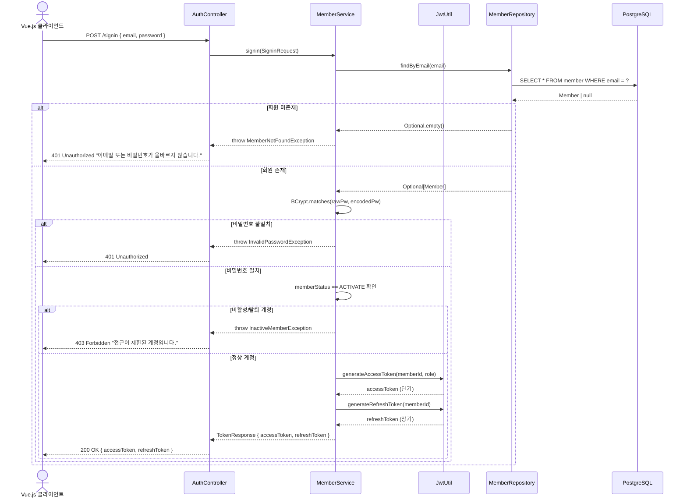
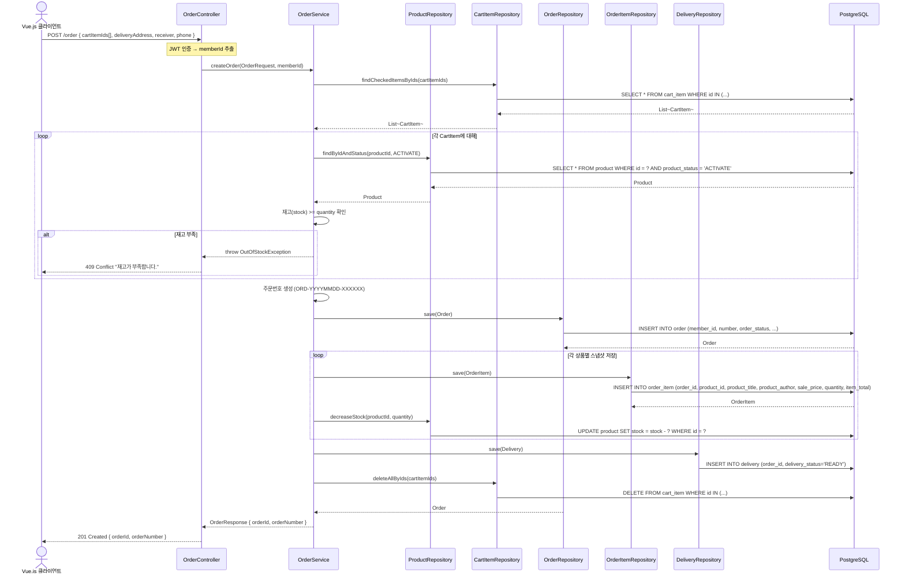
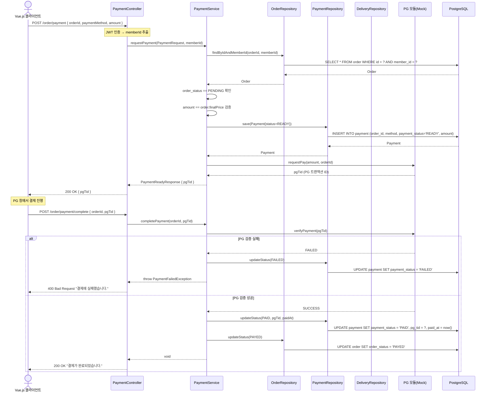
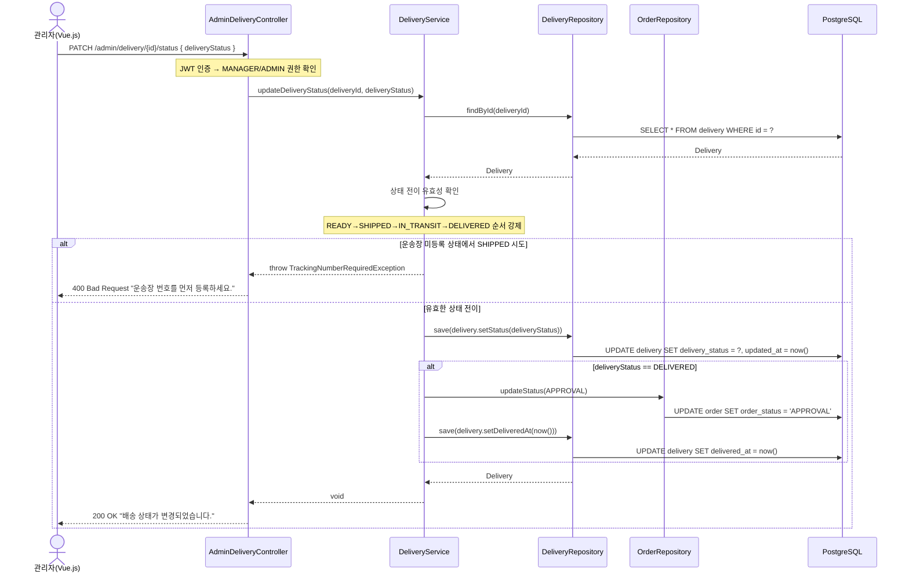
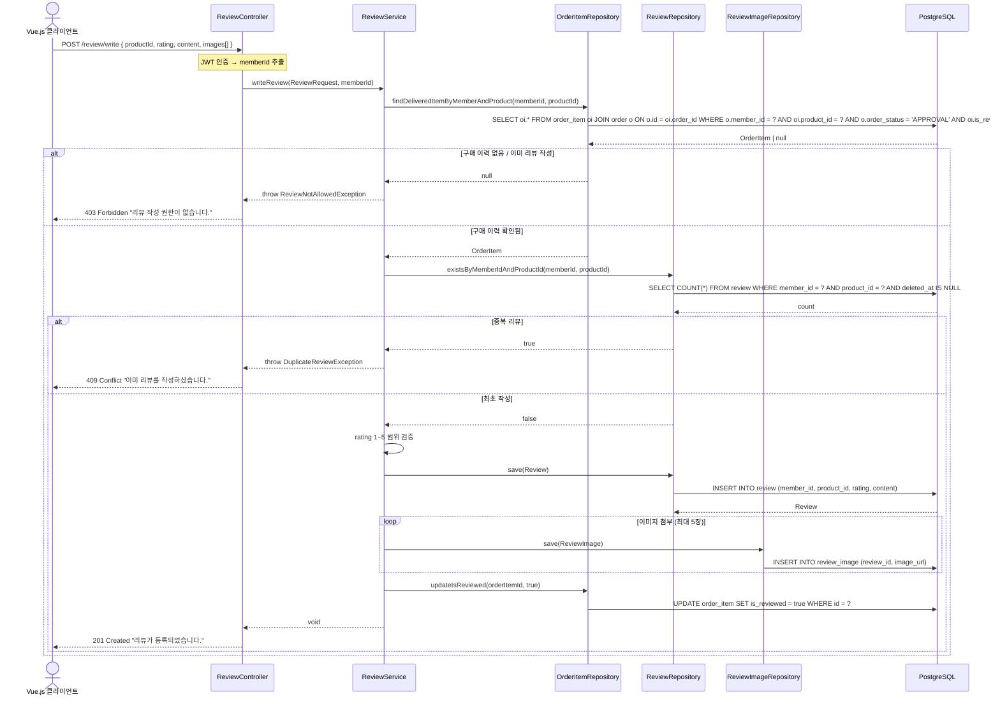
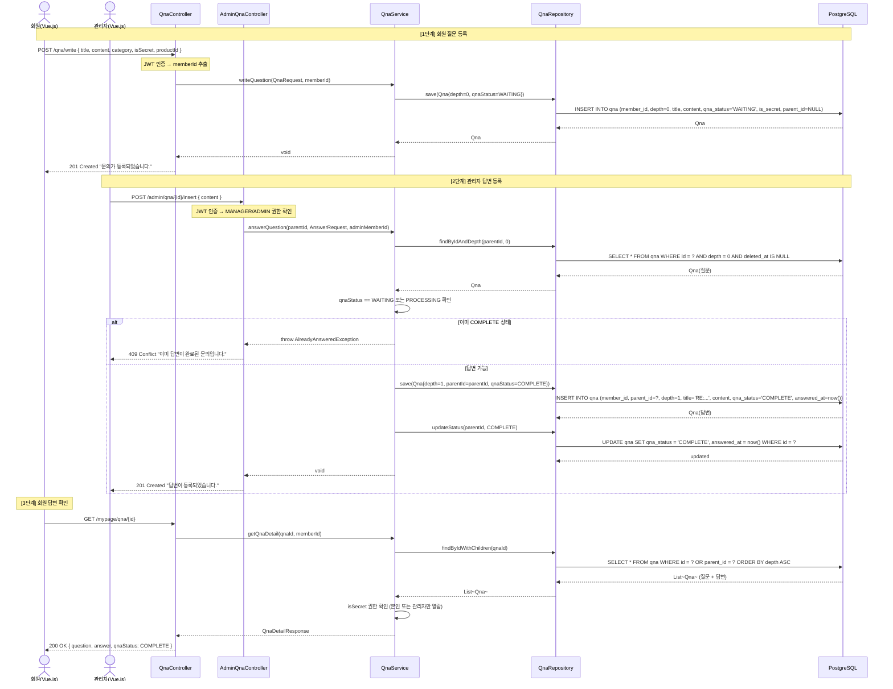
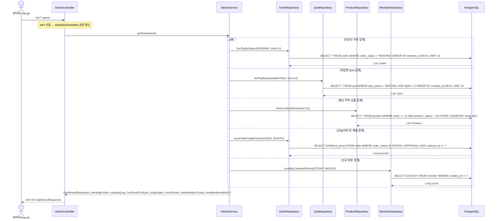

# 클래스 & 시퀀스 다이어그램 최종

| 항목 | 내용 |
| --- | --- |
| 프로젝트명 | 교보문고 쇼핑몰 시스템 (README) |
| 개발 환경 | Java 21 / Spring Boot 3.5 / PostgreSQL / Vue.js 3 |
| 작성일 | 2026-03-24 |
| 연관 문서 | DB설계서 최종.md / 유스케이스 명세서 최종.md / 기능명세서 최종.md |

---

## 📐 1. 클래스 다이어그램

### 1-1. Entity 전체 구조 (핵심 관계)

```mermaid
classDiagram
    direction TB

    class BaseEntity {
        <<abstract>>
        +Long id
        +LocalDateTime createdAt
        +LocalDateTime updatedAt
    }

    class Member {
        +String email
        +String password
        +String name
        +String phone
        +String address
        +MemberRole memberRole
        +MemberStatus memberStatus
        +LocalDateTime deletedAt
    }

    class CategoryTop {
        +String name
        +Integer sortOrder
        +CategoryTopStatus categoryTopStatus
    }

    class CategorySub {
        +String name
        +Integer sortOrder
        +CategorySubStatus categorySubStatus
    }

    class Product {
        +String title
        +String author
        +String description
        +Integer price
        +BigDecimal discountRate
        +Integer salePrice
        +Integer stock
        +String thumbnail
        +Integer viewCount
        +Integer salesCount
        +ProductStatus productStatus
        +LocalDateTime deletedAt
    }

    class ProductImage {
        +String imageUrl
        +String type
        +Integer sortOrder
    }

    class Cart {
    }

    class CartItem {
        +Integer quantity
        +Boolean isChecked
    }

    class Order {
        +String number
        +OrderStatus orderStatus
        +Integer totalPrice
        +Integer discountAmount
        +Integer finalPrice
        +String receiverName
        +String receiverPhone
        +String deliveryAddress
        +String deliveryMemo
        +LocalDateTime orderedAt
        +LocalDateTime cancelledAt
    }

    class OrderItem {
        +String productTitle
        +String productAuthor
        +Integer salePrice
        +Integer quantity
        +Integer itemTotal
        +Boolean isReviewed
    }

    class Payment {
        +String method
        +PaymentStatus paymentStatus
        +Integer amount
        +String pgTid
        +LocalDateTime paidAt
        +String cancelReason
        +LocalDateTime cancelledAt
    }

    class Delivery {
        +String courier
        +String trackingNumber
        +DeliveryStatus deliveryStatus
        +LocalDateTime shippedAt
        +LocalDateTime deliveredAt
    }

    class Notice {
        +String title
        +String content
        +Boolean isFixed
        +Integer viewCount
        +LocalDateTime deletedAt
    }

    class Qna {
        +Integer depth
        +String category
        +String title
        +String content
        +Integer viewCount
        +QnaStatus qnaStatus
        +Boolean isSecret
        +LocalDateTime answeredAt
        +LocalDateTime deletedAt
    }

    class Review {
        +Integer rating
        +String content
        +Integer hits
        +LocalDateTime deletedAt
    }

    class ReviewImage {
        +String imageUrl
    }

    class ReviewReaction {
        +String reactionType
    }

    %% ENUM 클래스
    class MemberRole {
        <<enumeration>>
        USER
        MANAGER
        ADMIN
    }

    class MemberStatus {
        <<enumeration>>
        ACTIVATE
        DEACTIVATE
        DELETE
    }

    class CategoryTopStatus {
        <<enumeration>>
        ACTIVATE
        DEACTIVATE
        DELETE
    }

    class CategorySubStatus {
        <<enumeration>>
        ACTIVATE
        DEACTIVATE
        DELETE
    }

    class ProductStatus {
        <<enumeration>>
        ACTIVATE
        DEACTIVATE
        DELETE
    }

    class OrderStatus {
        <<enumeration>>
        PENDING
        PAYED
        APPROVAL
        CANCELED
    }

    class PaymentStatus {
        <<enumeration>>
        READY
        PAID
        CANCELLED
        FAILED
    }

    class DeliveryStatus {
        <<enumeration>>
        READY
        SHIPPED
        IN_TRANSIT
        DELIVERED
        FAILED
    }

    class QnaStatus {
        <<enumeration>>
        WAITING
        PROCESSING
        COMPLETE
    }

    %% BaseEntity 상속
    BaseEntity <|-- Member
    BaseEntity <|-- CategoryTop
    BaseEntity <|-- CategorySub
    BaseEntity <|-- Product
    BaseEntity <|-- Cart
    BaseEntity <|-- CartItem
    BaseEntity <|-- Order
    BaseEntity <|-- OrderItem
    BaseEntity <|-- Payment
    BaseEntity <|-- Delivery
    BaseEntity <|-- Notice
    BaseEntity <|-- Qna
    BaseEntity <|-- Review
    BaseEntity <|-- ReviewImage
    BaseEntity <|-- ReviewReaction

    %% 연관 관계
    Member "1" --> "1" Cart : has
    Member "1" --> "0..*" Order : places
    Member "1" --> "0..*" Notice : writes
    Member "1" --> "0..*" Qna : asks
    Member "1" --> "0..*" Review : writes
    Member "1" --> "0..*" ReviewReaction : reacts

    CategoryTop "1" --> "0..*" CategorySub : contains
    CategoryTop "1" --> "0..*" Product : classifies
    CategorySub "1" --> "0..*" Product : classifies

    Product "1" --> "0..*" ProductImage : has
    Product "1" --> "0..*" CartItem : in cart
    Product "1" --> "0..*" OrderItem : ordered
    Product "1" --> "0..*" Review : reviewed

    Cart "1" --> "0..*" CartItem : contains
    Order "1" --> "0..*" OrderItem : contains
    Order "1" --> "1" Payment : paid by
    Order "1" --> "1" Delivery : shipped by

    Qna "0..1" --> "0..*" Qna : replies
    Review "1" --> "0..*" ReviewImage : has
    Review "1" --> "0..*" ReviewReaction : receives

    Member ..> MemberRole : uses
    Member ..> MemberStatus : uses
    CategoryTop ..> CategoryTopStatus : uses
    CategorySub ..> CategorySubStatus : uses
    Product ..> ProductStatus : uses
    Order ..> OrderStatus : uses
    Payment ..> PaymentStatus : uses
    Delivery ..> DeliveryStatus : uses
    Qna ..> QnaStatus : uses
```

---

### 1-2. 레이어 아키텍처 클래스 구조

```mermaid
classDiagram
    direction LR

    class AuthController {
        +signup(SignupRequest) ResponseEntity
        +signin(SigninRequest) ResponseEntity
        +signout(HttpServletRequest) ResponseEntity
    }

    class MemberController {
        +getMyPage(Member) ResponseEntity
        +updateInfo(UpdateRequest, Member) ResponseEntity
        +updatePassword(PasswordRequest, Member) ResponseEntity
        +withdraw(Member) ResponseEntity
    }

    class ProductController {
        +getProductList(Pageable, keyword) ResponseEntity
        +getProductDetail(Long) ResponseEntity
        +searchProducts(keyword, Pageable) ResponseEntity
    }

    class CartController {
        +getCart(Member) ResponseEntity
        +addItem(CartItemRequest, Member) ResponseEntity
        +updateQuantity(CartUpdateRequest, Member) ResponseEntity
        +removeItem(Long, Member) ResponseEntity
    }

    class OrderController {
        +createOrder(OrderRequest, Member) ResponseEntity
        +getOrderList(Member, Pageable) ResponseEntity
        +getOrderDetail(Long, Member) ResponseEntity
        +cancelOrder(Long, Member) ResponseEntity
    }

    class PaymentController {
        +requestPayment(PaymentRequest, Member) ResponseEntity
        +completePayment(PaymentCompleteRequest) ResponseEntity
        +cancelPayment(Long, Member) ResponseEntity
    }

    class DeliveryController {
        +getDeliveryStatus(Long, Member) ResponseEntity
    }

    class ReviewController {
        +writeReview(ReviewRequest, Member) ResponseEntity
        +updateReview(Long, ReviewRequest, Member) ResponseEntity
        +deleteReview(Long, Member) ResponseEntity
        +addReaction(Long, ReactionRequest, Member) ResponseEntity
    }

    class QnaController {
        +getQnaList(Pageable) ResponseEntity
        +writeQuestion(QnaRequest, Member) ResponseEntity
        +getQnaDetail(Long, Member) ResponseEntity
        +updateQuestion(Long, QnaRequest, Member) ResponseEntity
        +deleteQuestion(Long, Member) ResponseEntity
    }

    class NoticeController {
        +getNoticeList(Pageable) ResponseEntity
        +getNoticeDetail(Long) ResponseEntity
    }

    class AdminController {
        +getDashboard() ResponseEntity
        +getMembers(Pageable, keyword) ResponseEntity
        +changeMemberStatus(Long, StatusRequest) ResponseEntity
        +changeMemberRole(Long, RoleRequest) ResponseEntity
    }

    class AdminProductController {
        +getProductList(Pageable, keyword) ResponseEntity
        +getProductDetail(Long) ResponseEntity
        +createProduct(ProductRequest) ResponseEntity
        +updateProduct(Long, ProductRequest) ResponseEntity
        +deleteProduct(Long) ResponseEntity
    }

    class AdminOrderController {
        +getOrderList(Pageable, keyword) ResponseEntity
        +getOrderDetail(Long) ResponseEntity
        +updateOrderStatus(Long, StatusRequest) ResponseEntity
        +cancelOrder(Long, CancelRequest) ResponseEntity
    }

    class AdminPaymentController {
        +getPaymentList(Pageable) ResponseEntity
        +getPaymentDetail(Long) ResponseEntity
    }

    class AdminDeliveryController {
        +getDeliveryList(Pageable, status) ResponseEntity
        +getDeliveryDetail(Long) ResponseEntity
        +registerTracking(Long, TrackingRequest) ResponseEntity
        +updateDeliveryStatus(Long, DeliveryRequest) ResponseEntity
    }

    class AdminReviewController {
        +getReviewList(Pageable) ResponseEntity
        +getReviewDetail(Long) ResponseEntity
        +deleteReview(Long) ResponseEntity
    }

    class AdminQnaController {
        +getQnaList(Pageable, status) ResponseEntity
        +getQnaDetail(Long) ResponseEntity
        +answerQna(Long, AnswerRequest) ResponseEntity
        +updateAnswer(Long, AnswerRequest) ResponseEntity
        +deleteQna(Long) ResponseEntity
    }

    class AdminNoticeController {
        +getNoticeList(Pageable) ResponseEntity
        +getNoticeDetail(Long) ResponseEntity
        +createNotice(NoticeRequest) ResponseEntity
        +updateNotice(Long, NoticeRequest) ResponseEntity
        +deleteNotice(Long) ResponseEntity
    }

    class AdminCategoryController {
        +getCategoryList() ResponseEntity
        +getCategoryDetail(Long) ResponseEntity
        +createCategory(CategoryRequest) ResponseEntity
        +updateCategory(Long, CategoryRequest) ResponseEntity
        +deleteCategory(Long) ResponseEntity
    }

    class MemberService {
        +signup(SignupRequest) void
        +signin(SigninRequest) TokenResponse
        +signout(String) void
        +updateInfo(Long, UpdateRequest) void
        +updatePassword(Long, PasswordRequest) void
        +withdraw(Long) void
        +validateEmail(String) void
        +loadUserByEmail(String) Member
    }

    class ProductService {
        +getProductList(Pageable, keyword) Page
        +getProductDetail(Long) ProductResponse
        +searchProducts(keyword, Pageable) Page
        +increaseViewCount(Long) void
        +createProduct(ProductRequest) void
        +updateProduct(Long, ProductRequest) void
        +deleteProduct(Long) void
    }

    class CartService {
        +getCart(Long) CartResponse
        +addItem(CartItemRequest, Long) void
        +updateQuantity(CartUpdateRequest, Long) void
        +removeItem(Long, Long) void
    }

    class OrderService {
        +createOrder(OrderRequest, Long) OrderResponse
        +cancelOrder(Long, Long) void
        +getOrderList(Long, Pageable) Page
        +getOrderDetail(Long, Long) OrderDetailResponse
        +validateOwnership(Long, Long) void
    }

    class PaymentService {
        +requestPayment(PaymentRequest) PaymentResponse
        +completePayment(String, String) void
        +cancelPayment(Long) void
    }

    class DeliveryService {
        +getDeliveryStatus(Long, Long) DeliveryResponse
        +updateDeliveryStatus(Long, DeliveryStatus) void
        +registerTracking(Long, TrackingRequest) void
    }

    class ReviewService {
        +writeReview(ReviewRequest, Long) void
        +updateReview(Long, ReviewRequest, Long) void
        +deleteReview(Long, Long) void
        +addReaction(Long, String, Long) void
        +validatePurchaser(Long, Long) void
    }

    class QnaService {
        +writeQuestion(QnaRequest, Long) void
        +answerQuestion(Long, AnswerRequest, Long) void
        +updateQuestion(Long, QnaRequest, Long) void
        +deleteQuestion(Long, Long) void
    }

    class NoticeService {
        +getNoticeList(Pageable) Page
        +getNoticeDetail(Long) NoticeResponse
        +createNotice(NoticeRequest, Long) void
        +updateNotice(Long, NoticeRequest) void
        +deleteNotice(Long) void
    }

    class CategoryService {
        +getCategoryList() List
        +getCategoryDetail(Long) CategoryResponse
        +createCategory(CategoryRequest) void
        +updateCategory(Long, CategoryRequest) void
        +deleteCategory(Long) void
    }

    class AdminService {
        +getDashboard() DashboardResponse
    }

    class JwtUtil {
        +generateAccessToken(Long, String) String
        +generateRefreshToken(Long) String
        +validateToken(String) boolean
        +getMemberId(String) Long
    }

    class MemberRepository {
        <<interface>>
        +findByEmail(String) Optional~Member~
        +existsByEmail(String) boolean
    }

    class ProductRepository {
        <<interface>>
        +findAllByStatusAndKeyword(Pageable, String) Page
        +findByIdAndStatus(Long, ProductStatus) Optional
    }

    class CartRepository {
        <<interface>>
        +findByMemberId(Long) Optional~Cart~
    }

    class OrderRepository {
        <<interface>>
        +findByMemberId(Long, Pageable) Page
        +findByIdAndMemberId(Long, Long) Optional
    }

    class PaymentRepository {
        <<interface>>
        +findByOrderId(Long) Optional~Payment~
    }

    class DeliveryRepository {
        <<interface>>
        +findByOrderId(Long) Optional~Delivery~
        +findAllByStatus(DeliveryStatus, Pageable) Page
    }

    class ReviewRepository {
        <<interface>>
        +findByMemberId(Long, Pageable) Page
        +existsByMemberIdAndProductId(Long, Long) boolean
    }

    class QnaRepository {
        <<interface>>
        +findByMemberIdAndDepth(Long, Integer, Pageable) Page
        +findByIdAndDepth(Long, Integer) Optional
    }

    class NoticeRepository {
        <<interface>>
        +findAllByOrderByIsFixedDescCreatedAtDesc(Pageable) Page
        +findByIdAndDeletedAtIsNull(Long) Optional
    }

    class CategoryTopRepository {
        <<interface>>
        +findAllByStatusNot(CategoryTopStatus) List
        +findByIdAndStatusNot(Long, CategoryTopStatus) Optional
    }

    class CategorySubRepository {
        <<interface>>
        +findAllByCategoryTopId(Long) List
        +findByIdAndStatusNot(Long, CategorySubStatus) Optional
    }

    class CartItemRepository {
        <<interface>>
        +findByCartId(Long) List
        +findAllById(List) List
        +deleteAllByIdIn(List) void
    }

    class OrderItemRepository {
        <<interface>>
        +findByOrderId(Long) List
        +findDeliveredItemByMemberAndProduct(Long, Long) Optional
        +updateIsReviewed(Long, Boolean) void
    }

    class ProductImageRepository {
        <<interface>>
        +findByProductId(Long) List
        +deleteByProductId(Long) void
    }

    class ReviewImageRepository {
        <<interface>>
        +findByReviewId(Long) List
        +deleteByReviewId(Long) void
    }

    class ReviewReactionRepository {
        <<interface>>
        +findByReviewIdAndMemberId(Long, Long) Optional
        +existsByReviewIdAndMemberId(Long, Long) boolean
    }

    %% 일반 회원 Controller → Service
    AuthController --> MemberService
    MemberController --> MemberService
    ProductController --> ProductService
    CartController --> CartService
    OrderController --> OrderService
    PaymentController --> PaymentService
    DeliveryController --> DeliveryService
    ReviewController --> ReviewService
    QnaController --> QnaService
    NoticeController --> NoticeService

    %% 관리자 Controller → Service
    AdminController --> AdminService
    AdminController --> MemberService
    AdminProductController --> ProductService
    AdminCategoryController --> CategoryService
    AdminOrderController --> OrderService
    AdminPaymentController --> PaymentService
    AdminDeliveryController --> DeliveryService
    AdminReviewController --> ReviewService
    AdminQnaController --> QnaService
    AdminNoticeController --> NoticeService

    %% Service → Repository
    MemberService --> MemberRepository
    MemberService --> JwtUtil
    ProductService --> ProductRepository
    ProductService --> ProductImageRepository
    CartService --> CartRepository
    CartService --> CartItemRepository
    OrderService --> OrderRepository
    OrderService --> OrderItemRepository
    OrderService --> ProductRepository
    PaymentService --> PaymentRepository
    PaymentService --> OrderRepository
    DeliveryService --> DeliveryRepository
    DeliveryService --> OrderRepository
    ReviewService --> ReviewRepository
    ReviewService --> ReviewImageRepository
    ReviewService --> ReviewReactionRepository
    ReviewService --> OrderItemRepository
    QnaService --> QnaRepository
    NoticeService --> NoticeRepository
    CategoryService --> CategoryTopRepository
    CategoryService --> CategorySubRepository
    AdminService --> OrderRepository
    AdminService --> QnaRepository
    AdminService --> ProductRepository
    AdminService --> MemberRepository
```

---

## 🔄 2. 시퀀스 다이어그램

---

### 2-1. 회원가입 (UC-M-001 / FM-001)

```mermaid
sequenceDiagram
    actor Client as Vue.js 클라이언트
    participant AC as AuthController
    participant MS as MemberService
    participant MR as MemberRepository
    participant DB as PostgreSQL

    Client->>AC: POST /signup { email, password, name, phone, address }
    AC->>MS: signup(SignupRequest)
    MS->>MR: existsByEmail(email)
    MR->>DB: SELECT * FROM member WHERE email = ?
    DB-->>MR: result
    alt 이메일 중복
        MR-->>MS: true
        MS-->>AC: throw DuplicateEmailException
        AC-->>Client: 409 Conflict "이미 사용 중인 이메일입니다."
    else 사용 가능
        MR-->>MS: false
        MS->>MS: BCrypt.encode(password)
        MS->>MR: save(Member)
        MR->>DB: INSERT INTO member (email, password, name, phone, address, member_role, member_status)
        DB-->>MR: saved Member
        MR-->>MS: Member
        MS-->>AC: void
        AC-->>Client: 201 Created "회원가입이 완료되었습니다."
    end
```

---

### 2-2. 로그인 & JWT 발급 (UC-M-002 / FM-002)

---

### 2-3. 주문 생성 (UC-M-010 / FO-001)

---

### 2-4. 결제 요청 & 완료 처리 (UC-M-011 / FPAY-001~002)

---

### 2-5. 관리자 배송 상태 변경 (UC-A-008 / FA-014)

---

### 2-6. 리뷰 작성 (UC-M-015 / FR-002)

---

### 2-7. QnA 질문 등록 & 관리자 답변 (UC-M-020 / UC-A-010)

---

### 2-8. 관리자 대시보드 조회 (UC-A-001 / FA-001)

