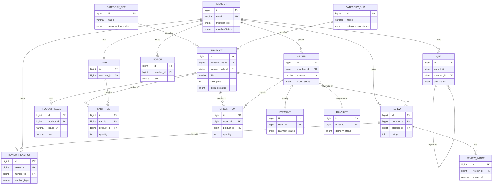

# 10_DB 설계서

## 📄 문서 개요

| 항목 | 내용 |
| --- | --- |
| 프로젝트명 | 온라인 도서 판매 쇼핑몰 |
| 데이터베이스 | PostgreSQL |
| 작성일 | 2026.03.18 |
| 버전 | v1.1 |
| 작성자 |  |

---

## 📋 변경 이력

| 버전 | 변경일 | 변경자 | 변경 내용 |
| --- | --- | --- | --- |
| v1.0 | 2026.03.17 | 유환희 | 최초 작성 |
| v1.1 | 2026.03.18 | 유환희 | 최종 완료 |

---

## 📑 테이블 목록

| No | 테이블명 | 설명 | 도메인 |
| --- | --- | --- | --- |
| 1 | member | 회원 정보 | 회원 |
| 2 | category_top | 도서 대분류 (국내/해외/일본) | 상품 |
| 3 | category_sub | 도서 소분류 (장르) | 상품 |
| 4 | product | 도서 상품 정보 | 상품 |
| 5 | product_image | 도서 이미지 | 상품 |
| 6 | cart | 장바구니 | 주문 |
| 7 | cart_item | 장바구니 항목 | 주문 |
| 8 | order | 주문 | 주문 |
| 9 | order_item | 주문 항목 | 주문 |
| 10 | payment | 결제 | 주문 |
| 11 | delivery | 배송 | 주문 |
| 12 | notice | 공지사항 | 게시판 |
| 13 | qna | 1:1 문의 | 게시판 |
| 14 | review | 상품 리뷰 | 게시판 |
| 15 | review_image | 리뷰 이미지 | 게시판 |
| 16 | review_reaction | 리뷰 반응 (좋아요/싫어요) | 게시판 |

---

## 테이블 정의서

---

### 📌 `member` 테이블

| 테이블명 | 컬럼명 | 자료형 | PK | FK | UNIQUE | NULL 허용 | 기본값 | 설명 |
| --- | --- | --- | --- | --- | --- | --- | --- | --- |
| member | id | BIGSERIAL | ✅ |  |  | ❌ | 자동 증가 | 회원 고유 식별자 |
| member | email | VARCHAR(100) |  |  | ✅ | ❌ |  | 이메일 주소 |
| member | password | VARCHAR(255) |  |  |  | ❌ |  | 비밀번호 (BCrypt 암호화) |
| member | name | VARCHAR(50) |  |  |  | ❌ |  | 이름 |
| member | phone | VARCHAR(20) |  |  |  | ❌ |  | 전화번호 |
| member | address | VARCHAR(100) |  |  |  | ❌ |  | 주소 |
| member | memberRole | MemberRole |  |  |  | ❌ | 'USER' | USER, MANAGER, ADMIN |
| member | memberStatus | MemberStatus |  |  |  | ❌ | 'ACTIVATE' | ACTIVATE, DEACTIVATE, DELETE |
| member | created_at | TIMESTAMP |  |  |  | ❌ | now() | 가입일 |
| member | updated_at | TIMESTAMP |  |  |  | ✅ | NULL | 수정일 |
| member | deleted_at | TIMESTAMP |  |  |  | ✅ | NULL | 탈퇴 처리일 |

---

### 📌 `category_top` 테이블

| 테이블명 | 컬럼명 | 자료형 | PK | FK | NULL 허용 | 기본값 | 설명 |
| --- | --- | --- | --- | --- | --- | --- | --- |
| category_top | id | BIGSERIAL | ✅ | | ❌ | auto | 도서 종류 고유 ID |
| category_top | name | VARCHAR(50) | | | ❌ | | 도서 종류명 (국내도서, 해외도서, 일본도서) |
| category_top | sort_order | INT | | | ❌ | 0 | 화면 정렬 순서 |
| category_top | category_top_status | ENUM | | | ❌ | 'ACTIVATE' | ACTIVATE, DEACTIVATE, DELETE |
| category_top | created_at | TIMESTAMP | | | ❌ | now() | 생성 시간 |
| category_top | updated_at | TIMESTAMP | | | ✅ | null | 수정 시간 |

---

### 📌 `category_sub` 테이블

| 테이블명 | 컬럼명 | 자료형 | PK | FK | NULL 허용 | 기본값 | 설명 |
| --- | --- | --- | --- | --- | --- | --- | --- |
| category_sub | id | BIGSERIAL | ✅ | | ❌ | auto | 장르 고유 ID |
| category_sub | name | VARCHAR(50) | | | ❌ | | 장르명 (컴퓨터/IT, 외국어, 소설 등) |
| category_sub | sort_order | INT | | | ❌ | 0 | 화면 정렬 순서 |
| category_sub | category_sub_status | ENUM | | | ❌ | 'ACTIVATE' | ACTIVATE, DEACTIVATE, DELETE |
| category_sub | created_at | TIMESTAMP | | | ❌ | now() | 생성 시간 |
| category_sub | updated_at | TIMESTAMP | | | ✅ | null | 수정 시간 |

---

### 📌 `product` 테이블

| 테이블명 | 컬럼명 | 자료형 | PK | FK | NULL 허용 | 기본값 | 설명 |
| --- | --- | --- | --- | --- | --- | --- | --- |
| product | id | BIGSERIAL | ✅ |  | ❌ | auto | 도서 고유 ID |
| product | category_top_id | BIGINT | | category_top.id | ❌ | | 도서 종류 (국내/해외/일본) |
| product | category_sub_id | BIGINT | | category_sub.id | ❌ | | 장르 |
| product | title | VARCHAR(300) |  |  | ❌ |  | 도서명 |
| product | author | VARCHAR(200) |  |  | ❌ |  | 저자 |
| product | description | TEXT |  |  | ✅ | null | 도서 설명 |
| product | price | INT |  |  | ❌ | 0 | 정가 |
| product | discount_rate | NUMERIC(5,2) |  |  | ❌ | 0 | 할인율 (%) |
| product | sale_price | INT |  |  | ❌ | 0 | 판매가 (앱에서 계산 후 저장) |
| product | stock | INT |  |  | ❌ | 0 | 재고 수량 |
| product | thumbnail | VARCHAR(500) |  |  | ✅ | null | 대표 이미지 경로 |
| product | view_count | INT |  |  | ❌ | 0 | 조회수 |
| product | sales_count | INT |  |  | ❌ | 0 | 판매량 |
| product | product_status | enum |  |  | ❌ | 'ACTIVATE' | ACTIVATE, DEACTIVATE, DELETE |
| product | created_at | TIMESTAMP |  |  | ❌ | now() | 등록 시간 |
| product | updated_at | TIMESTAMP |  |  | ✅ | null | 수정 시간 |
| product | deleted_at | TIMESTAMP |  |  |  | ✅ | NULL | 탈퇴 처리일 |

---

### 📌 `product_image` 테이블

| 테이블명 | 컬럼명 | 자료형 | PK | FK | NULL 허용 | 기본값 | 설명 |
| --- | --- | --- | --- | --- | --- | --- | --- |
| product_image | id | BIGSERIAL | ✅ |  | ❌ | auto | 이미지 고유 ID |
| product_image | product_id | BIGINT |  | product.id | ❌ |  | 도서 ID (CASCADE 삭제) |
| product_image | image_url | VARCHAR(500) |  |  | ❌ |  | 이미지 경로 또는 URL |
| product_image | type | VARCHAR(20) |  |  | ❌ | 'SUB' | MAIN(대표) / SUB(추가) |
| product_image | sort_order | INT |  |  | ❌ | 0 | 이미지 정렬 순서 |
| product_image | created_at | TIMESTAMP |  |  | ❌ | now() | 등록 시간 |

---

### 📌 `cart` 테이블

| 테이블명 | 컬럼명 | 자료형 | PK | FK | NULL 허용 | 기본값 | 설명 |
| --- | --- | --- | --- | --- | --- | --- | --- |
| cart | id | BIGSERIAL | ✅ |  | ❌ | auto | 장바구니 고유 ID |
| cart | member_id | BIGINT |  | member.id | ❌ |  | 회원 ID (UNIQUE, 1:1) |
| cart | created_at | TIMESTAMP |  |  | ❌ | now() | 생성 시간 |
| cart | updated_at | TIMESTAMP |  |  | ✅ | null | 수정 시간 |

---

### 📌 `cart_item` 테이블

| 테이블명 | 컬럼명 | 자료형 | PK | FK | NULL 허용 | 기본값 | 설명 |
| --- | --- | --- | --- | --- | --- | --- | --- |
| cart_item | id | BIGSERIAL | ✅ |  | ❌ | auto | 장바구니 항목 ID |
| cart_item | cart_id | BIGINT |  | cart.id | ❌ |  | 장바구니 ID (CASCADE 삭제) |
| cart_item | product_id | BIGINT |  | product.id | ❌ |  | 도서 ID |
| cart_item | quantity | INT |  |  | ❌ | 1 | 수량 (1 이상) |
| cart_item | is_checked | BOOLEAN |  |  | ❌ | true | 주문 시 체크 여부 |
| cart_item | created_at | TIMESTAMP |  |  | ❌ | now() | 생성 시간 |
| cart_item | updated_at | TIMESTAMP |  |  | ✅ | null | 수정 시간 |

---

### 📌 `order` 테이블

| 테이블명 | 컬럼명 | 자료형 | PK | FK | NULL 허용 | 기본값 | 설명 |
| --- | --- | --- | --- | --- | --- | --- | --- |
| order | id | BIGSERIAL | ✅ |  | ❌ | auto | 주문 고유 ID |
| order | member_id | BIGINT |  | member.id | ❌ |  | 회원 ID |
| order | number | VARCHAR(30) |  |  | ❌ |  | 주문번호 UNIQUE (예: ORD-20260315-000001) |
| order | order_status | enum |  |  | ❌ | 'PENDING' | PENDING / PAYED / APPROVAL / CANCELED |
| order | total_price | INT |  |  | ❌ | 0 | 총 상품금액 |
| order | discount_amount | INT |  |  | ❌ | 0 | 할인금액 |
| order | final_price | INT |  |  | ❌ | 0 | 최종 결제금액 |
| order | receiver_name | VARCHAR(50) |  |  | ❌ |  | 수령인 이름 |
| order | receiver_phone | VARCHAR(20) |  |  | ❌ |  | 수령인 연락처 |
| order | delivery_address | VARCHAR(255) |  |  | ❌ |  | 배송지 주소 |
| order | delivery_address_detail | VARCHAR(255) |  |  | ✅ | null | 배송지 상세 주소 |
| order | delivery_zip_code | VARCHAR(10) |  |  | ❌ |  | 우편번호 |
| order | delivery_memo | VARCHAR(300) |  |  | ✅ | null | 배송 메모 |
| order | ordered_at | TIMESTAMP |  |  | ❌ | now() | 주문 시간 |
| order | created_at | TIMESTAMP |  |  | ❌ | now() | 생성 시간 |
| order | updated_at | TIMESTAMP |  |  | ✅ | null | 수정 시간 |
| order | cancelled_at | TIMESTAMP |  |  | ✅ | null | 취소 시각 |

---

### 📌 `order_item` 테이블

| 테이블명 | 컬럼명 | 자료형 | PK | FK | NULL 허용 | 기본값 | 설명 |
| --- | --- | --- | --- | --- | --- | --- | --- |
| order_item | id | BIGSERIAL | ✅ |  | ❌ | auto | 주문 항목 ID |
| order_item | order_id | BIGINT |  | order.id | ❌ |  | 주문 ID (CASCADE 삭제) |
| order_item | product_id | BIGINT |  | product.id | ❌ |  | 도서 ID |
| order_item | product_title | VARCHAR(300) |  |  | ❌ |  | 도서명 스냅샷 |
| order_item | product_author | VARCHAR(200) |  |  | ❌ |  | 저자 스냅샷 |
| order_item | sale_price | INT |  |  | ❌ | 0 | 주문 당시 판매가 스냅샷 |
| order_item | quantity | INT |  |  | ❌ | 1 | 주문 수량 |
| order_item | item_total | INT |  |  | ❌ | 0 | 소계 (sale_price × quantity) |
| order_item | is_reviewed | BOOLEAN |  |  | ❌ | false | 리뷰 작성 여부 |
| order_item | created_at | TIMESTAMP |  |  | ❌ | now() | 생성 시간 |

---

### 📌 `payment` 테이블

| 테이블명 | 컬럼명 | 자료형 | PK | FK | NULL 허용 | 기본값 | 설명 |
| --- | --- | --- | --- | --- | --- | --- | --- |
| payment | id | BIGSERIAL | ✅ |  | ❌ | auto | 결제 고유 ID |
| payment | order_id | BIGINT |  | order.id | ❌ |  | 주문 ID |
| payment | method | VARCHAR(30) |  |  | ❌ |  | 결제 수단 |
| payment | payment_status | VARCHAR(20) |  |  | ❌ | 'READY' | READY / PAID / CANCELLED / FAILED |
| payment | amount | INT |  |  | ❌ | 0 | 결제 금액 |
| payment | pg_tid | VARCHAR(100) |  |  | ✅ | null | PG 트랜잭션 ID (Mock: UUID) |
| payment | paid_at | TIMESTAMP |  |  | ✅ | null | 결제 완료 시각 |
| payment | cancel_reason | VARCHAR(300) |  |  | ✅ | null | 취소 사유 |
| payment | created_at | TIMESTAMP |  |  | ❌ | now() | 생성 시간 |
| payment | updated_at | TIMESTAMP |  |  | ✅ | null | 수정 시간 |
| payment | cancelled_at | TIMESTAMP |  |  | ✅ | null | 취소 시각 |

---

### 📌 `delivery` 테이블

| 테이블명 | 컬럼명 | 자료형 | PK | FK | NULL 허용 | 기본값 | 설명 |
| --- | --- | --- | --- | --- | --- | --- | --- |
| delivery | id | BIGSERIAL | ✅ |  | ❌ | auto | 배송 고유 ID |
| delivery | order_id | BIGINT |  | order.id | ❌ |  | 주문 ID (UNIQUE, 1:1) |
| delivery | courier | VARCHAR(50) |  |  | ✅ | null | 택배사명 |
| delivery | tracking_number | VARCHAR(100) |  |  | ✅ | null | 운송장 번호 |
| delivery | delivery_status | VARCHAR(30) |  |  | ❌ | 'READY' | READY / SHIPPED / IN_TRANSIT / DELIVERED / FAILED |
| delivery | created_at | TIMESTAMP |  |  | ❌ | now() | 생성 시간 |
| delivery | updated_at | TIMESTAMP |  |  | ✅ | null | 수정 시간 |
| delivery | shipped_at | TIMESTAMP |  |  | ✅ | null | 발송 시각 |
| delivery | delivered_at | TIMESTAMP |  |  | ✅ | null | 배송 완료 시각 |

---

### 📌 `notice` 테이블

| 테이블명 | 컬럼명 | 자료형 | PK | FK | NULL | 기본값 | 설명 |
| :--- | :--- | :--- | :---: | :---: | :---: | :--- | :--- |
| notice | id | BIGSERIAL | ✅ |  | ❌ | | 공지사항 고유 식별자 |
| notice | member_id | BIGINT |  | ✅ | ❌ | | 작성 관리자 ID |
| notice | title | VARCHAR(255) |  |  | ❌ | | 공지사항 제목 |
| notice | content | TEXT |  |  | ❌ | | 공지사항 본문 |
| notice | is_fixed | BOOLEAN |  |  | ❌ | false | 상단 고정 여부 |
| notice | view_count | INTEGER |  |  | ❌ | 0 | 조회수 |
| notice | created_at | TIMESTAMP |  |  | ❌ | now() | 등록일 |
| notice | updated_at | TIMESTAMP |  |  | ✅ |  | 수정일 |
| notice | deleted_at | TIMESTAMP |  |  | ✅ | NULL | 삭제일 (소프트 삭제용) |

---

### 📌 `qna` 테이블

| 테이블명 | 컬럼명 | 자료형 | PK | FK | NULL | 기본값 | 설명 |
| --- | --- | --- | --- | --- | --- | --- | --- |
| qna | id | BIGSERIAL | ✅ | | ❌ | | 고유 식별자 |
| qna | parent_id | BIGINT | | | ✅ | | 부모 ID (0 또는 NULL이면 질문) |
| qna | depth | INT | | | ❌ | 0 | 0: 질문, 1: 답변, 2: 재문의 등 4까지 규정 |
| qna | member_id | BIGINT | | ✅ | ❌ | | 작성자 ID (members 참조) |
| qna | category | VARCHAR(50) | | | ❌ | | 문의 유형 (배송, 환불 등) |
| qna | title | VARCHAR(255) | | | ❌ | | 제목 (답변 시 'RE:' 등 자동생성 가능) |
| qna | content | TEXT | | | ❌ | | 내용 |
| qna | view_count | INTEGER | | | ❌ | 0 | 조회수 |
| qna | qna_status | enum | | | ❌ | 'WAITING' | WAITING, PROCESSING, COMPLETE |
| qna | is_secret | BOOLEAN | | | ❌ | false | 비밀글 여부 |
| qna | answered_at | TIMESTAMP | | | ✅ | | 답변 완료 시각 |
| qna | created_at | TIMESTAMP | | | ❌ | now() | 등록 일시 |
| qna | deleted_at | TIMESTAMP | | | ✅ | | 삭제 일시 (Soft Delete) |

---

### 📌 `review` 테이블

| 테이블명 | 컬럼명 | 자료형 | PK | FK | NULL | 기본값 | 설명 |
| :--- | :--- | :--- | :---: | :---: | :---: | :--- | :--- |
| review | id | BIGSERIAL | ✅ |  | ❌ | | 리뷰 고유 식별자 |
| review | member_id | BIGINT |  | ✅ | ❌ | | 작성자 ID (members.id 참조) |
| review | product_id | BIGINT |  | ✅ | ❌ | | 상품 ID (products.id 참조) |
| review | rating | INTEGER |  |  | ❌ | | 평점 (1~5) |
| review | content | TEXT |  |  | ❌ | | 리뷰 상세 내용 |
| review | hits | INTEGER |  |  | ❌ | 0 | 조회수 |
| review | created_at | TIMESTAMP |  |  | ❌ | now() | 작성일 |
| review | updated_at | TIMESTAMP |  |  | ✅ | | 수정일 |
| review | deleted_at | TIMESTAMP |  |  | ✅ | NULL | 삭제일 |

---

### 📌 `review_image` 테이블

| 테이블명 | 컬럼명 | 자료형 | PK | FK | NULL | 기본값 | 설명 |
| :--- | :--- | :--- | :---: | :---: | :---: | :--- | :--- |
| review_image | id | BIGSERIAL | ✅ |  | ❌ | | 이미지 고유 식별자 |
| review_image | review_id | BIGINT |  | ✅ | ❌ | | 해당 리뷰 ID (reviews.id 참조) |
| review_image | image_url | VARCHAR(512) |  |  | ❌ | | 이미지 경로/URL |
| review_image | created_at | TIMESTAMP |  |  | ❌ | now() | 등록일 |

---

### 📌 `review_reaction` 테이블

| 테이블명 | 컬럼명 | 자료형 | PK | FK | NULL | 기본값 | 설명 |
| --- | --- | --- | --- | --- | --- | --- | --- |
| review_reaction | id | BIGSERIAL | ✅ |  | ❌ | | 반응 고유 식별자 |
| review_reaction | review_id | BIGINT |  | ✅ | ❌ | | 해당 리뷰 ID (reviews.id 참조) |
| review_reaction | member_id | BIGINT |  | ✅ | ❌ | | 반응한 회원 ID (members.id 참조) |
| review_reaction | reaction_type | VARCHAR(10) |  |  | ❌ | | LIKE (좋아요) / DISLIKE (싫어요) |
| review_reaction | created_at | TIMESTAMP |  |  | ❌ | now() | 반응 일시 |

---

## 📌 ENUM 타입 정의

| ENUM명 | 적용 테이블 | 컬럼명 | 허용값 | 설명 |
| --- | --- | --- | --- | --- |
| MemberRole | member | memberRole | USER, MANAGER, ADMIN | 회원 권한 (USER: 일반회원, MANAGER: 운영자, ADMIN: 관리자) |
| MemberStatus | member | memberStatus | ACTIVATE, DEACTIVATE, DELETE | 회원 상태 (ACTIVATE: 활성, DEACTIVATE: 강퇴, DELETE: 탈퇴) |
| CategoryTopStatus | category_top | category_top_status | ACTIVATE, DEACTIVATE, DELETE | 대분류 상태 |
| CategorySubStatus | category_sub | category_sub_status | ACTIVATE, DEACTIVATE, DELETE | 소분류 상태 |
| ProductStatus | product | product_status | ACTIVATE, DEACTIVATE, DELETE | 상품 상태 (ACTIVATE: 판매중, DEACTIVATE: 판매중지, DELETE: 삭제) |
| OrderStatus | order | order_status | PENDING, PAYED, APPROVAL, CANCELED | 주문 상태 (PENDING: 결제대기, PAYED: 결제완료, APPROVAL: 승인완료, CANCELED: 취소) |
| QnaStatus | qna | qna_status | WAITING, PROCESSING, COMPLETE | 문의 답변 상태 (WAITING: 대기, PROCESSING: 처리중, COMPLETE: 완료) |

---

## 📊 개체-관계도 (ERD)

---

## 📊 전체 컬럼 ERD

```mermaid
erDiagram
    MEMBER ||--|| CART : "has"
    MEMBER ||--o{ ORDER : "places"
    MEMBER ||--o{ NOTICE : "writes"
    MEMBER ||--o{ QNA : "asks"
    MEMBER ||--o{ REVIEW : "writes"

    CATEGORY_TOP ||--o{ PRODUCT : "classifies"
    CATEGORY_SUB ||--o{ PRODUCT : "classifies"

    PRODUCT ||--o{ PRODUCT_IMAGE : "has"
    PRODUCT ||--o{ CART_ITEM : "added to"
    PRODUCT ||--o{ ORDER_ITEM : "ordered in"
    PRODUCT ||--o{ REVIEW : "reviewed by"

    CART ||--o{ CART_ITEM : "contains"

    ORDER ||--o{ ORDER_ITEM : "contains"
    ORDER ||--|| PAYMENT : "paid by"
    ORDER ||--|| DELIVERY : "delivered by"

    QNA ||--o{ QNA : "replies to"

    REVIEW ||--o{ REVIEW_IMAGE : "has"
    REVIEW ||--o{ REVIEW_REACTION : "receives"
    MEMBER ||--o{ REVIEW_REACTION : "reacts"

    MEMBER {
        bigint id PK
        string email UK
        string password
        string name
        string phone
        string address
        enum memberRole "USER | MANAGER | ADMIN"
        enum memberStatus "ACTIVATE | DEACTIVATE | DELETE"
        datetime created_at
        datetime updated_at
        datetime deleted_at
    }

    CATEGORY_TOP {
        bigint id PK
        string name
        int sort_order
        enum category_top_status "ACTIVATE | DEACTIVATE | DELETE"
        datetime created_at
        datetime updated_at
    }

    CATEGORY_SUB {
        bigint id PK
        string name
        int sort_order
        enum category_sub_status "ACTIVATE | DEACTIVATE | DELETE"
        datetime created_at
        datetime updated_at
    }

    PRODUCT {
        bigint id PK
        bigint category_top_id FK
        bigint category_sub_id FK
        string title
        string author
        string description
        int price
        decimal discount_rate
        int sale_price
        int stock
        string thumbnail
        int view_count
        int sales_count
        enum product_status "ACTIVATE | DEACTIVATE | DELETE"
        datetime created_at
        datetime updated_at
        datetime deleted_at
    }

    PRODUCT_IMAGE {
        bigint id PK
        bigint product_id FK
        string image_url
        string type "MAIN | SUB"
        int sort_order
        datetime created_at
    }

    CART {
        bigint id PK
        bigint member_id FK
        datetime created_at
        datetime updated_at
    }

    CART_ITEM {
        bigint id PK
        bigint cart_id FK
        bigint product_id FK
        int quantity
        boolean is_checked
        datetime created_at
        datetime updated_at
    }

    ORDER {
        bigint id PK
        bigint member_id FK
        string number UK
        enum order_status "PENDING | PAYED | APPROVAL | CANCELED"
        int total_price
        int discount_amount
        int final_price
        string receiver_name
        string receiver_phone
        string delivery_address
        string delivery_address_detail
        string delivery_zip_code
        string delivery_memo
        datetime ordered_at
        datetime created_at
        datetime updated_at
        datetime cancelled_at
    }

    ORDER_ITEM {
        bigint id PK
        bigint order_id FK
        bigint product_id FK
        string product_title
        string product_author
        int sale_price
        int quantity
        int item_total
        boolean is_reviewed
        datetime created_at
    }

    PAYMENT {
        bigint id PK
        bigint order_id FK
        string method
        enum payment_status "READY | PAID | CANCELLED | FAILED"
        int amount
        string pg_tid
        datetime paid_at
        string cancel_reason
        datetime created_at
        datetime updated_at
        datetime cancelled_at
    }

    DELIVERY {
        bigint id PK
        bigint order_id FK
        string courier
        string tracking_number
        enum delivery_status "READY | SHIPPED | IN_TRANSIT | DELIVERED | FAILED"
        datetime created_at
        datetime updated_at
        datetime shipped_at
        datetime delivered_at
    }

    NOTICE {
        bigint id PK
        bigint member_id FK
        string title
        string content
        boolean is_fixed
        int view_count
        datetime created_at
        datetime updated_at
        datetime deleted_at
    }

    QNA {
        bigint id PK
        bigint parent_id
        int depth
        bigint member_id FK
        string category
        string title
        string content
        int view_count
        enum qna_status "WAITING | PROCESSING | COMPLETE"
        boolean is_secret
        datetime answered_at
        datetime created_at
        datetime deleted_at
    }

    REVIEW {
        bigint id PK
        bigint member_id FK
        bigint product_id FK
        int rating
        string content
        int hits
        datetime created_at
        datetime updated_at
        datetime deleted_at
    }

    REVIEW_IMAGE {
        bigint id PK
        bigint review_id FK
        string image_url
        datetime created_at
    }

    REVIEW_REACTION {
        bigint id PK
        bigint review_id FK
        bigint member_id FK
        string reaction_type "LIKE | DISLIKE"
        datetime created_at
    }
```

