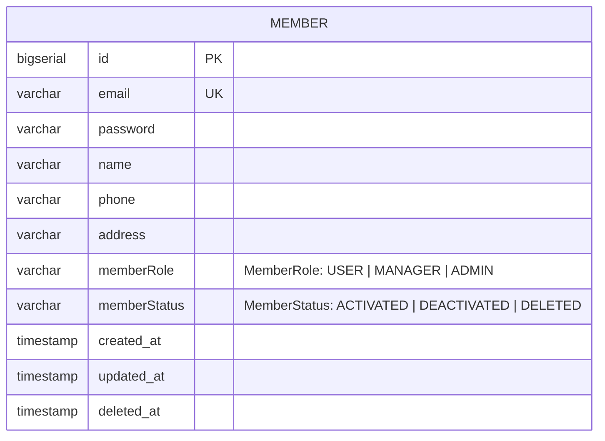

# 10_DB 설계서

## 테이블 정의서

### 📌 `member` 테이블

| 테이블명 | 컬럼명 | 자료형 | PK | FK | UNIQUE | NULL 허용 | 기본값 | 설명 |
| --- | --- | --- | --- | --- | --- | --- | --- | --- |
| member | id | BIGSERIAL | ✅ |  |  | ❌ | 자동 증가 | 회원 고유 식별자 |
| member | email | VARCHAR(100) |  |  | ✅ | ❌ |  | 이메일 주소 |
| member | password | VARCHAR(255) |  |  |  | ❌ |  | 비밀번호 (BCrypt 암호화) |
| member | name | VARCHAR(50) |  |  |  | ❌ |  | 이름 |
| member | phone | VARCHAR(20) |  |  |  | ❌ |  | 전화번호 |
| member | address | VARCHAR(100) |  |  |  | ❌ |  | 주소 |
| member | memberRole | MemberRole |  |  |  | ❌ | 'USER' | 사용자 권한 |
| member | memberStatus | MemberStatus |  |  |  | ❌ | 'ACTIVATED' | 계정 상태 |
| member | created_at | TIMESTAMP |  |  |  | ❌ | now() | 가입일 |
| member | updated_at | TIMESTAMP |  |  |  | ❌ | now() | 수정일 |
| member | deleted_at | TIMESTAMP |  |  |  | ✅ | NULL | 탈퇴 처리일 |

---

### 📌 ENUM 타입 정의

| ENUM명 | 허용값 | 설명 |
| --- | --- | --- |
| MemberRole | USER, MANAGER, ADMIN | 사용자 권한 (USER: 일반회원, MANAGER: 운영자, ADMIN: 관리자) |
| MemberStatus | ACTIVATED, DEACTIVATED, DELETED | 계정 상태 (ACTIVATED: 활성, DEACTIVATED: 비활성, DELETED: 탈퇴) |

---

## 개체-관계도 (ERD)

