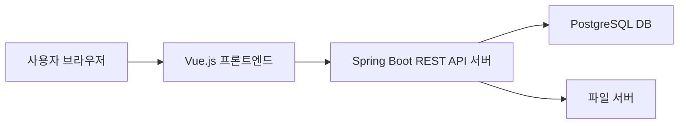

# 10_요구사항 정의서

## 📄 웹 애플리케이션 요구사항 정의서

> **프로젝트명:** 온라인 도서 판매 쇼핑몰
>
> **개발환경:** Java 17, Spring Boot 3.x, Vue.js 3, PostgreSQL, Gradle
>
> **작성일:** 2026.03.16
>
> **작성자:** 유환희

---

### ✅ 1. 개요

| 항목 | 내용 |
| --- | --- |
| 프로젝트 명 | 온라인 도서 판매 쇼핑몰 |
| 목적 | 사용자가 온라인에서 도서를 검색, 구매, 결제할 수 있는 웹 서비스를 제공하고, 관리자가 회원 및 주문을 효율적으로 관리할 수 있는 환경 구축 |
| 범위 | 회원 도메인 — 로그인, 회원가입, 마이페이지(개인정보·주문·장바구니·리뷰·QnA), 관리자 회원 관리 |
| 주요 사용자 | 일반 회원 (USER), 운영자 (MANAGER), 관리자 (ADMIN) |
| 플랫폼 | 웹 브라우저(PC, 모바일) 기반 |

---

### ✅ 2. 시스템 구성도

---

### ✅ 3. 기능 요구사항 상세

#### 👤 Actor : 일반 회원 (USER)

| 요구사항 ID | 기능명 | 설명 | 우선순위 | 관련 페이지 (Vue Route) | 비고 |
| --- | --- | --- | --- | --- | --- |
| FR-M-001 | 로그인 | 이메일과 비밀번호로 로그인. JWT 토큰 발급 후 로컬 상태 관리 | 높음 🔴 | /login | 로그인 실패 시 에러 메시지 노출. 이메일 미존재 / 비밀번호 불일치 구분 메시지 |
| FR-M-002 | 회원가입 | 이메일, 비밀번호, 이름, 주소, 전화번호 입력 후 가입 | 높음 🔴 | /signup | 이메일 중복 체크 필요 (실시간 API 호출). 비밀번호 확인 입력 포함 |
| FR-M-003 | 개인정보 조회 | 마이페이지에서 이메일, 이름, 전화번호, 주소 조회 | 중간 🟠 | /mypage/profile | 로그인한 회원 본인만 접근 가능 |
| FR-M-004 | 개인정보 수정 | 이름, 전화번호, 주소, 비밀번호 변경 가능 | 중간 🟠 | /mypage/profile | 비밀번호 변경 시 현재 비밀번호 재확인 필요 |
| FR-M-005 | 회원 탈퇴 | 계정 탈퇴 처리. memberStatus → DELETED 로 변경 | 중간 🟠 | /mypage/profile | 탈퇴 전 비밀번호 재확인. 탈퇴 시 deleted_at 기록 |
| FR-M-006 | 주문 내역 조회 | 마이페이지에서 최근 주문 내역 5건을 내림차순으로 노출 | 중간 🟠 | /mypage/orders | 주문 상태 표시: 결제완료 / 주문승인 / 배송중 / 배송완료 |
| FR-M-007 | 장바구니 목록 조회 | 마이페이지에서 현재 장바구니에 담긴 상품 목록 조회 | 중간 🟠 | /mypage/cart | 수량 및 총 금액 표시. 장바구니 페이지로 이동 버튼 포함 |
| FR-M-008 | 리뷰 목록 / 수정 / 삭제 | 구매 완료된 상품에 작성한 리뷰 목록 조회, 수정, 삭제 | 낮음 🟢 | /mypage/reviews | 배송완료 상태의 주문 상품에 한해 리뷰 작성 가능. 본인 리뷰만 수정·삭제 가능 |
| FR-M-009 | QnA 목록 / 수정 / 삭제 | 등록한 QnA 목록 조회, 미답변 건에 한해 질문 수정·삭제 가능 | 낮음 🟢 | /mypage/qna | 답변 여부 상태 표시 (답변완료 / 답변대기). 답변 완료된 질문은 수정·삭제 불가 |

---

#### 🛠️ Actor : 관리자 (MANAGER / ADMIN)

| 요구사항 ID | 기능명 | 설명 | 우선순위 | 관련 페이지 (Vue Route) | 비고 |
| --- | --- | --- | --- | --- | --- |
| FR-A-001 | 관리자 대시보드 | 신규 가입 회원 수, 신규 주문 수, 미승인 주문 수 등 주요 지표 요약 노출 | 중간 🟠 | /admin/dashboard | MANAGER, ADMIN 권한만 접근 가능 |
| FR-A-002 | 회원 목록 조회 | 전체 회원 목록을 최근 가입 순(created_at 내림차순)으로 조회. 페이징 처리 | 높음 🔴 | /admin/members | 이메일, 이름, 가입일, 권한, 상태 컬럼 표시 |
| FR-A-003 | 회원 검색 | 전체 / 이메일 / 이름 기준으로 회원 검색 후 목록 조회 | 높음 🔴 | /admin/members | 검색 조건 선택(셀렉트박스) + 키워드 입력. 검색 결과도 페이징 처리 |
| FR-A-004 | 회원 상세 정보 조회 | 특정 회원의 주문 내역, 리뷰 목록, QnA 목록 조회 | 중간 🟠 | /admin/members/:id | 각 항목별 탭(Tab) 구성 권장 |
| FR-A-005 | 회원 강퇴 | 특정 회원의 memberStatus → DEACTIVATED 처리 | 높음 🔴 | /admin/members/:id | 강퇴 전 확인 모달 필수. 강퇴된 회원은 로그인 불가 처리 |
| FR-A-006 | 신규 주문 승인 | 결제 완료 후 미승인 상태인 주문 목록 조회 및 승인 여부 결정 | 높음 🔴 | /admin/orders/pending | 승인 시 주문 상태 → 주문승인 변경. 거절 시 사유 입력 후 환불 처리 연동 |
| FR-A-007 | 회원 등급 변경 | 특정 회원의 memberRole 변경 (USER → MANAGER → ADMIN) | 중간 🟠 | /admin/members/:id | ADMIN 권한만 등급 변경 가능. 본인 등급 변경 불가 |

---

### ✅ 4. 비기능 요구사항

| ID | 항목 | 내용 |
| --- | --- | --- |
| NFR-001 | 성능 | 100명 동시 접속 기준 주요 API 응답 시간 2초 이내 |
| NFR-002 | 보안 | HTTPS 적용, 비밀번호 BCrypt 암호화, JWT 기반 인증 (Access Token + Refresh Token), 관리자 페이지 권한 검증 |
| NFR-003 | 호환성 | Chrome, Edge, Safari 최신 버전 호환 보장 |
| NFR-004 | 접근성 | 웹 접근성 AA 기준 준수 |
| NFR-005 | 유지보수성 | Spring Boot Layered Architecture (Controller - Service - Repository) 준수. Vue.js Composition API 기반 컴포넌트 구조 유지 |
| NFR-006 | API 문서화 | Talend 사용하여 REST API 명세 자동화 |

---

### ✅ 5. UI/UX 참고

- 마이페이지는 사이드 메뉴 또는 탭(Tab) 형태로 각 섹션(개인정보 / 주문 / 장바구니 / 리뷰 / QnA) 이동 구성 권장
- 관리자 회원 상세 페이지는 주문·리뷰·QnA를 탭으로 분리 구성 권장
- 모바일 반응형 대응 (Vue.js + TailwindCSS 또는 Bootstrap 5.x 사용 기준)
- 와이어프레임 첨부 가능 (Figma 링크 또는 이미지)

---

### ✅ 6. 변경 이력

| 버전 | 변경일 | 변경자 | 변경 내용 |
| --- | --- | --- | --- |
| v1.0 | 2026.03.16 | (작성자명) | 최초 작성 |

---

### ✅ 7. 기타

- 요구사항 변경 시 반드시 변경 이력에 기록
- 기능 목록은 JIRA 또는 Notion Task 관리 DB와 연동하여 관리 가능
- FR-M-008(리뷰), FR-M-009(QnA), FR-A-006(주문 승인)은 각각 리뷰·QnA·주문 도메인 담당자와 API 인터페이스 사전 협의 필요
