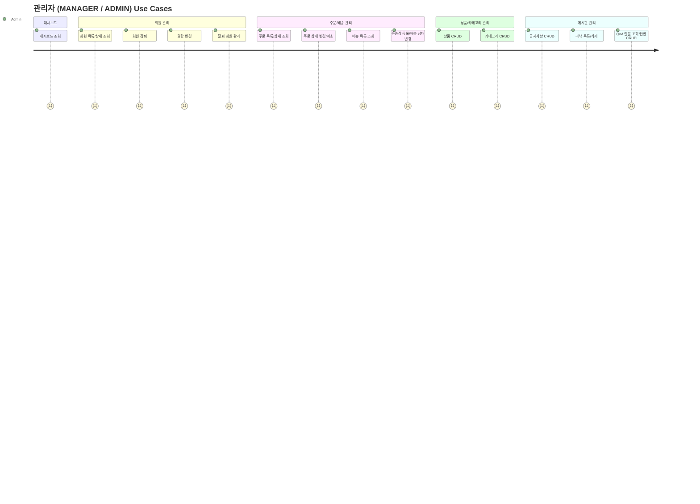
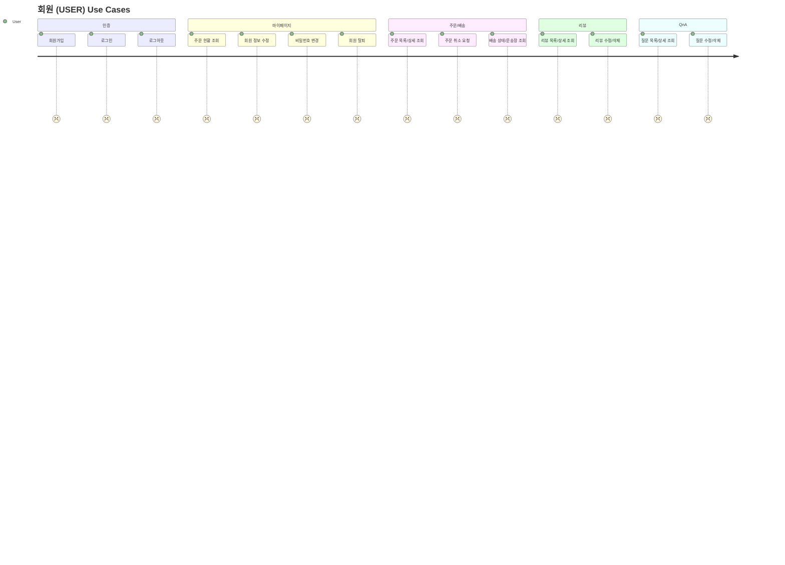

# 07_유스케이스 명세서

## 📄 웹 애플리케이션 개발 유스케이스 명세서

> **프로젝트명:** 교보문고 온라인 쇼핑몰 (README 팀)
> **개발환경:** Java 21, Spring Boot 3.x, PostgreSQL, Vue.js 3, Docker
> **작성일:** 2026.03.22
> **작성자:** 유환희
> **기준 문서:** 요구사항정의서 Member.md

---

## 📋 유스케이스 목록

| ID | 유스케이스명 | 액터 | 도메인 |
| --- | --- | --- | --- |
| UC-A-001 | 관리자 대시보드 조회 | MANAGER/ADMIN | 관리자 |
| UC-A-002 | 회원 목록 조회 | MANAGER/ADMIN | 관리자 - 회원 |
| UC-A-003 | 회원 상세 조회 | MANAGER/ADMIN | 관리자 - 회원 |
| UC-A-004 | 회원 강퇴 | ADMIN | 관리자 - 회원 |
| UC-A-005 | 관리자 권한 변경 | ADMIN | 관리자 - 회원 |
| UC-A-006 | 탈퇴 회원 관리 | MANAGER/ADMIN | 관리자 - 회원 |
| UC-A-007 | 주문 목록 조회 | MANAGER/ADMIN | 관리자 - 주문 |
| UC-A-008 | 주문 상세 조회 | MANAGER/ADMIN | 관리자 - 주문 |
| UC-A-009 | 주문 상태 변경 | MANAGER/ADMIN | 관리자 - 주문 |
| UC-A-010 | 주문 취소 처리 | MANAGER/ADMIN | 관리자 - 주문 |
| UC-A-011 | 배송 목록 조회 | MANAGER/ADMIN | 관리자 - 배송 |
| UC-A-012 | 운송장 등록 | MANAGER/ADMIN | 관리자 - 배송 |
| UC-A-013 | 배송 상태 변경 | MANAGER/ADMIN | 관리자 - 배송 |
| UC-A-014 | 상품 목록 조회 | MANAGER/ADMIN | 관리자 - 상품 |
| UC-A-015 | 상품 등록 | MANAGER/ADMIN | 관리자 - 상품 |
| UC-A-016 | 상품 수정 | MANAGER/ADMIN | 관리자 - 상품 |
| UC-A-017 | 상품 삭제 | ADMIN | 관리자 - 상품 |
| UC-A-018 | 카테고리 등록 | MANAGER/ADMIN | 관리자 - 카테고리 |
| UC-A-019 | 카테고리 수정 | MANAGER/ADMIN | 관리자 - 카테고리 |
| UC-A-020 | 카테고리 삭제 | ADMIN | 관리자 - 카테고리 |
| UC-A-021 | 공지사항 목록 조회 | MANAGER/ADMIN | 관리자 - 공지사항 |
| UC-A-022 | 공지사항 등록 | MANAGER/ADMIN | 관리자 - 공지사항 |
| UC-A-023 | 공지사항 수정 | MANAGER/ADMIN | 관리자 - 공지사항 |
| UC-A-024 | 공지사항 삭제 | MANAGER/ADMIN | 관리자 - 공지사항 |
| UC-A-025 | 리뷰 목록 조회 | MANAGER/ADMIN | 관리자 - 리뷰 |
| UC-A-026 | 리뷰 삭제 | MANAGER/ADMIN | 관리자 - 리뷰 |
| UC-A-027 | 질문 목록 조회 | MANAGER/ADMIN | 관리자 - QnA |
| UC-A-028 | 질문 상세 조회 | MANAGER/ADMIN | 관리자 - QnA |
| UC-A-029 | 답변 등록 | MANAGER/ADMIN | 관리자 - QnA |
| UC-A-030 | 답변 수정 | MANAGER/ADMIN | 관리자 - QnA |
| UC-A-031 | 답변 삭제 | MANAGER/ADMIN | 관리자 - QnA |
| UC-M-001 | 회원가입 | 비회원 | 회원 |
| UC-M-002 | 로그인 | USER | 회원 |
| UC-M-003 | 로그아웃 | USER | 회원 |
| UC-M-004 | 마이페이지 주문 현황 조회 | USER | 마이페이지 |
| UC-M-005 | 마이페이지 주문/배송 조회 | USER | 마이페이지 |
| UC-M-006 | 마이페이지 리뷰 조회 | USER | 마이페이지 |
| UC-M-007 | 마이페이지 QnA 조회 | USER | 마이페이지 |
| UC-M-008 | 회원 정보 수정 | USER | 마이페이지 - 회원정보 |
| UC-M-009 | 비밀번호 변경 | USER | 마이페이지 - 회원정보 |
| UC-M-010 | 회원 탈퇴 | USER | 마이페이지 - 회원정보 |
| UC-M-011 | 주문 목록 조회 | USER | 마이페이지 - 주문/배송 |
| UC-M-012 | 주문 상세 조회 | USER | 마이페이지 - 주문/배송 |
| UC-M-013 | 주문 취소 요청 | USER | 마이페이지 - 주문/배송 |
| UC-M-014 | 배송 상태 조회 | USER | 마이페이지 - 주문/배송 |
| UC-M-015 | 운송장 번호 조회 | USER | 마이페이지 - 주문/배송 |
| UC-M-016 | 작성 리뷰 목록 조회 | USER | 마이페이지 - 리뷰 |
| UC-M-017 | 작성 리뷰 상세 조회 | USER | 마이페이지 - 리뷰 |
| UC-M-018 | 리뷰 수정 | USER | 마이페이지 - 리뷰 |
| UC-M-019 | 리뷰 삭제 | USER | 마이페이지 - 리뷰 |
| UC-M-020 | 작성한 질문 목록 조회 | USER | 마이페이지 - QnA |
| UC-M-021 | 작성한 질문 상세 조회 | USER | 마이페이지 - QnA |
| UC-M-022 | 질문 수정 | USER | 마이페이지 - QnA |
| UC-M-023 | 질문 삭제 | USER | 마이페이지 - QnA |

---

## 🔐 관리자 (Admin) 유스케이스

---

### ✅ Use Case: UC-A-001 관리자 대시보드 조회

| 항목 | 내용 |
| --- | --- |
| **유스케이스 ID** | UC-A-001 |
| **유스케이스 명** | 관리자 대시보드 조회 |
| **기능 설명** | 관리자가 로그인 후 대시보드에서 미승인 주문·QnA·재고 부족 상품·매출 통계·신규 회원 현황 등의 요약 정보를 한눈에 확인한다. |
| **주요 액터** | 관리자(MANAGER / ADMIN) |
| **사전 조건** | 관리자 계정으로 로그인 상태여야 함 |
| **사후 조건** | 대시보드 각 위젯에 최신 데이터가 렌더링됨 |
| **정상 흐름** | 1. 관리자가 /admin 접속 2. 서버에서 각 위젯 데이터 집계 쿼리 실행 3. 신규 미승인 주문(최신 5~10건) 표시 4. 신규 QnA 질문(최신 5~10건) 표시 5. 재고 기준치 이하 상품 목록 표시 6. 최근 주문 목록 표시 7. 배송 대기(READY) 현황 표시 8. 매출/주문 통계 요약 표시 9. 신규 회원 현황 표시 |
| **예외 흐름** | - 관리자 권한 없는 사용자 접근 시: 403 Forbidden 응답 - 데이터 없는 위젯: 빈 상태 메시지 표시 |
| **비고** | 재고 기준치는 10개 이하로 설정 / 집계 쿼리 기반 |

---

### ✅ Use Case: UC-A-002 회원 목록 조회

| 항목 | 내용 |
| --- | --- |
| **유스케이스 ID** | UC-A-002 |
| **유스케이스 명** | 회원 목록 조회 |
| **기능 설명** | 관리자가 전체 회원 목록을 페이징 및 이름/이메일 검색으로 조회한다. |
| **주요 액터** | 관리자(MANAGER / ADMIN) |
| **사전 조건** | 관리자 로그인 상태 |
| **사후 조건** | 회원 목록이 최신 가입순으로 출력됨 |
| **정상 흐름** | 1. 관리자가 /admin/member/list 접속 2. 전체 회원 목록 조회(최신 가입순, 페이징) 3. 이름 또는 이메일 검색어 입력 시 필터링 4. 검색 결과 목록 출력 |
| **예외 흐름** | - 검색 결과 없음: '조회된 회원이 없습니다' 메시지 표시 |
| **비고** | ILIKE 검색(대소문자 무시) / 페이지 크기 10건 기본 |

---

### ✅ Use Case: UC-A-003 회원 상세 조회

| 항목 | 내용 |
| --- | --- |
| **유스케이스 ID** | UC-A-003 |
| **유스케이스 명** | 회원 상세 조회 |
| **기능 설명** | 관리자가 특정 회원의 이메일·이름·전화번호·주소·가입일·상태·역할 등 상세 정보를 조회한다. |
| **주요 액터** | 관리자(MANAGER / ADMIN) |
| **사전 조건** | 조회 대상 회원이 DB에 존재 |
| **사후 조건** | 해당 회원의 상세 정보가 출력됨 |
| **정상 흐름** | 1. 관리자가 회원 목록에서 특정 회원 클릭 2. /admin/member/{id} 접속 3. 서버에서 회원 정보 조회 4. 상세 정보(가입일, 상태, 역할 포함) 출력 |
| **예외 흐름** | - 존재하지 않는 회원 ID 접근 시: 404 Not Found |
| **비고** | deleted_at 포함 전체 정보 조회 |

---

### ✅ Use Case: UC-A-004 회원 강퇴

| 항목 | 내용 |
| --- | --- |
| **유스케이스 ID** | UC-A-004 |
| **유스케이스 명** | 회원 강퇴 |
| **기능 설명** | 관리자가 특정 회원의 상태를 DEACTIVATE로 변경하여 로그인을 차단한다. |
| **주요 액터** | 관리자(ADMIN) |
| **사전 조건** | 대상 회원이 ACTIVATE 상태 |
| **사후 조건** | memberStatus = DEACTIVATE 처리 / 해당 회원 로그인 불가 |
| **정상 흐름** | 1. 관리자가 회원 상세 페이지에서 '강퇴' 클릭 2. 강퇴 확인 모달 표시 3. 확인 시 서버에서 memberStatus = DEACTIVATE 업데이트 4. 완료 메시지 표시 |
| **예외 흐름** | - 이미 DEACTIVATE 상태인 회원: '이미 강퇴된 회원입니다' 메시지 - ADMIN 권한 없는 경우: 403 Forbidden |
| **비고** | memberStatus ENUM / ADMIN 권한만 실행 가능 |

---

### ✅ Use Case: UC-A-005 관리자 권한 변경

| 항목 | 내용 |
| --- | --- |
| **유스케이스 ID** | UC-A-005 |
| **유스케이스 명** | 관리자 권한 변경 |
| **기능 설명** | ADMIN이 특정 회원의 역할을 USER / MANAGER / ADMIN으로 변경한다. |
| **주요 액터** | 관리자(ADMIN) |
| **사전 조건** | 대상 회원이 DB에 존재 / 실행자가 ADMIN 권한 보유 |
| **사후 조건** | memberRole 변경 완료 |
| **정상 흐름** | 1. 관리자가 회원 상세 페이지에서 역할 변경 선택 2. 변경할 역할 선택(USER / MANAGER / ADMIN) 3. 확인 후 서버에서 memberRole 업데이트 4. 완료 메시지 표시 |
| **예외 흐름** | - ADMIN 권한 없는 접근: 403 Forbidden - 본인 역할 변경 시도: 경고 메시지 표시 |
| **비고** | ADMIN만 실행 가능 |

---

### ✅ Use Case: UC-A-006 탈퇴 회원 관리

| 항목 | 내용 |
| --- | --- |
| **유스케이스 ID** | UC-A-006 |
| **유스케이스 명** | 탈퇴 회원 관리 |
| **기능 설명** | 관리자가 soft delete 처리된 탈퇴 회원 목록을 조회한다. |
| **주요 액터** | 관리자(MANAGER / ADMIN) |
| **사전 조건** | 관리자 로그인 상태 |
| **사후 조건** | 탈퇴 회원(deleted_at IS NOT NULL) 목록 출력 |
| **정상 흐름** | 1. 관리자가 /admin/member/list 에서 탈퇴 회원 필터 선택 2. deleted_at 기준 탈퇴 회원 목록 조회 3. 결과 출력 |
| **예외 흐름** | - 탈퇴 회원 없음: '탈퇴 회원이 없습니다' 메시지 |
| **비고** | soft delete 기준(memberStatus = DELETE) |

---

### ✅ Use Case: UC-A-007 주문 목록 조회

| 항목 | 내용 |
| --- | --- |
| **유스케이스 ID** | UC-A-007 |
| **유스케이스 명** | 주문 목록 조회 |
| **기능 설명** | 관리자가 전체 주문 목록을 페이징 및 주문번호/회원 검색으로 조회한다. |
| **주요 액터** | 관리자(MANAGER / ADMIN) |
| **사전 조건** | 관리자 로그인 상태 |
| **사후 조건** | 주문 목록이 최신 주문순으로 출력됨 |
| **정상 흐름** | 1. 관리자가 /admin/order 접속 2. 전체 주문 목록 조회(최신순, 페이징) 3. 주문번호 또는 회원 검색 시 필터링 4. 결과 목록 출력 |
| **예외 흐름** | - 검색 결과 없음: '조회된 주문이 없습니다' 메시지 |
| **비고** | |

---

### ✅ Use Case: UC-A-008 주문 상세 조회

| 항목 | 내용 |
| --- | --- |
| **유스케이스 ID** | UC-A-008 |
| **유스케이스 명** | 주문 상세 조회 |
| **기능 설명** | 관리자가 특정 주문의 주문 상품·결제 정보·배송 정보를 상세 조회한다. |
| **주요 액터** | 관리자(MANAGER / ADMIN) |
| **사전 조건** | 주문이 DB에 존재 |
| **사후 조건** | 주문 상세(주문 상품, 결제, 배송) 출력 |
| **정상 흐름** | 1. 관리자가 주문 목록에서 특정 주문 클릭 2. /admin/order/{id} 접속 3. 주문 상품·결제 금액·배송지·배송 상태 조회 4. 상세 정보 출력 |
| **예외 흐름** | - 존재하지 않는 주문 ID: 404 Not Found |
| **비고** | order_item / payment / delivery JOIN 조회 |

---

### ✅ Use Case: UC-A-009 주문 상태 변경

| 항목 | 내용 |
| --- | --- |
| **유스케이스 ID** | UC-A-009 |
| **유스케이스 명** | 주문 상태 변경 |
| **기능 설명** | 관리자가 주문 상태를 PENDING / PAYED / APPROVAL / CANCELED로 변경한다. |
| **주요 액터** | 관리자(MANAGER / ADMIN) |
| **사전 조건** | 주문이 DB에 존재 |
| **사후 조건** | order_status 변경 완료 |
| **정상 흐름** | 1. 관리자가 주문 상세 페이지에서 상태 변경 선택 2. 변경할 상태 선택 3. 서버에서 order_status 업데이트 4. 완료 메시지 표시 |
| **예외 흐름** | - 이미 CANCELED 상태: '이미 취소된 주문입니다' 메시지 - 역방향 상태 변경 시도: 경고 메시지 |
| **비고** | 상태 ENUM / 결제 상태와 연동 |

---

### ✅ Use Case: UC-A-010 주문 취소 처리

| 항목 | 내용 |
| --- | --- |
| **유스케이스 ID** | UC-A-010 |
| **유스케이스 명** | 주문 취소 처리 |
| **기능 설명** | 관리자가 특정 주문을 강제 취소 처리한다. |
| **주요 액터** | 관리자(MANAGER / ADMIN) |
| **사전 조건** | 주문이 PAYED 이하 상태 |
| **사후 조건** | order_status = CANCELED / payment_status = CANCELLED 처리 |
| **정상 흐름** | 1. 관리자가 주문 상세에서 '취소 처리' 클릭 2. 취소 확인 모달 표시 3. 확인 시 order_status = CANCELED 업데이트 4. 결제 취소 처리 연동 5. cancelled_at 기록 |
| **예외 흐름** | - 이미 APPROVAL 또는 배송 시작 후: '취소 불가 상태입니다' 메시지 |
| **비고** | 결제 상태 연동 필수 |

---

### ✅ Use Case: UC-A-011 배송 목록 조회

| 항목 | 내용 |
| --- | --- |
| **유스케이스 ID** | UC-A-011 |
| **유스케이스 명** | 배송 목록 조회 |
| **기능 설명** | 관리자가 전체 배송 목록을 상태별 필터로 조회한다. |
| **주요 액터** | 관리자(MANAGER / ADMIN) |
| **사전 조건** | 관리자 로그인 상태 |
| **사후 조건** | 배송 목록 출력 |
| **정상 흐름** | 1. 관리자가 /admin/delivery 접속 2. 전체 배송 목록 조회 3. 상태별 필터(READY / SHIPPED / IN_TRANSIT / DELIVERED / FAILED) 선택 4. 결과 출력 |
| **예외 흐름** | - 해당 상태 배송 없음: '배송 건이 없습니다' 메시지 |
| **비고** | delivery_status 기준 필터 |

---

### ✅ Use Case: UC-A-012 운송장 등록

| 항목 | 내용 |
| --- | --- |
| **유스케이스 ID** | UC-A-012 |
| **유스케이스 명** | 운송장 등록 |
| **기능 설명** | 관리자가 배송 건에 택배사명과 운송장 번호를 입력하여 등록한다. |
| **주요 액터** | 관리자(MANAGER / ADMIN) |
| **사전 조건** | 배송 상태가 READY |
| **사후 조건** | courier / tracking_number 저장 / delivery_status = SHIPPED 변경 |
| **정상 흐름** | 1. 관리자가 /admin/delivery/{id} 접속 2. 택배사명 및 운송장 번호 입력 3. '등록' 클릭 4. 서버에서 courier, tracking_number 저장 5. delivery_status = SHIPPED 자동 변경 |
| **예외 흐름** | - 운송장 번호 미입력: 필수 항목 경고 메시지 |
| **비고** | 관리자 직접 입력 / shipped_at 자동 기록 |

---

### ✅ Use Case: UC-A-013 배송 상태 변경

| 항목 | 내용 |
| --- | --- |
| **유스케이스 ID** | UC-A-013 |
| **유스케이스 명** | 배송 상태 변경 |
| **기능 설명** | 관리자가 배송 상태를 단계별로 변경한다. |
| **주요 액터** | 관리자(MANAGER / ADMIN) |
| **사전 조건** | 배송이 DB에 존재 |
| **사후 조건** | delivery_status 변경 완료 |
| **정상 흐름** | 1. 관리자가 배송 상세에서 상태 변경 선택 2. 변경할 상태 선택 3. 서버에서 delivery_status 업데이트 4. 완료 메시지 표시 |
| **예외 흐름** | - 역방향 상태 변경 시도: 경고 메시지 표시 |
| **비고** | READY → SHIPPED → IN_TRANSIT → DELIVERED / FAILED |

---

### ✅ Use Case: UC-A-014 상품 목록 조회

| 항목 | 내용 |
| --- | --- |
| **유스케이스 ID** | UC-A-014 |
| **유스케이스 명** | 상품 목록 조회 |
| **기능 설명** | 관리자가 전체 상품 목록을 썸네일 포함하여 조회한다. |
| **주요 액터** | 관리자(MANAGER / ADMIN) |
| **사전 조건** | 관리자 로그인 상태 |
| **사후 조건** | 상품 목록(카테고리, 가격, 재고, 상태 포함) 출력 |
| **정상 흐름** | 1. 관리자가 /admin/product/list 접속 2. 전체 상품 목록 조회(최신 등록순, 페이징) 3. 카테고리/상태 필터 적용 가능 4. 결과 출력 |
| **예외 흐름** | - 상품 없음: '등록된 상품이 없습니다' 메시지 |
| **비고** | 썸네일 이미지 포함 |

---

### ✅ Use Case: UC-A-015 상품 등록

| 항목 | 내용 |
| --- | --- |
| **유스케이스 ID** | UC-A-015 |
| **유스케이스 명** | 상품 등록 |
| **기능 설명** | 관리자가 도서 정보(제목·저자·가격·카테고리·재고)와 썸네일 이미지를 업로드하여 상품을 등록한다. |
| **주요 액터** | 관리자(MANAGER / ADMIN) |
| **사전 조건** | 관리자 로그인 상태 / 카테고리가 존재 |
| **사후 조건** | product 테이블에 저장 / 이미지 파일 서버에 업로드 |
| **정상 흐름** | 1. 관리자가 /admin/product/insert 접속 2. 도서 정보 입력(제목, 저자, 설명, 가격, 할인율, 재고) 3. 카테고리 선택(대분류·소분류) 4. 썸네일 이미지 업로드 5. '등록' 클릭 6. 서버에서 product 저장 / sale_price 자동 계산 |
| **예외 흐름** | - 썸네일 미첨부: '썸네일은 필수입니다' 경고 - 필수 입력 누락: 항목별 오류 메시지 |
| **비고** | sale_price = price × (1 - discount_rate/100) 계산 후 저장 |

---

### ✅ Use Case: UC-A-016 상품 수정

| 항목 | 내용 |
| --- | --- |
| **유스케이스 ID** | UC-A-016 |
| **유스케이스 명** | 상품 수정 |
| **기능 설명** | 관리자가 등록된 상품 정보(재고·가격·설명 등)를 수정한다. |
| **주요 액터** | 관리자(MANAGER / ADMIN) |
| **사전 조건** | 상품이 DB에 존재 / product_status ≠ DELETE |
| **사후 조건** | product 정보 수정 / updated_at 갱신 |
| **정상 흐름** | 1. 관리자가 /admin/product/{id} 접속 2. 수정할 항목 변경 3. '수정' 클릭 4. 서버에서 product 업데이트 5. updated_at 자동 갱신 |
| **예외 흐름** | - 삭제된 상품 수정 시도: 404 Not Found |
| **비고** | 재고/가격 변경 시 sale_price 재계산 |

---

### ✅ Use Case: UC-A-017 상품 삭제

| 항목 | 내용 |
| --- | --- |
| **유스케이스 ID** | UC-A-017 |
| **유스케이스 명** | 상품 삭제 |
| **기능 설명** | 관리자가 상품을 soft delete 처리하여 판매 목록에서 숨긴다. |
| **주요 액터** | 관리자(ADMIN) |
| **사전 조건** | 상품이 ACTIVATE 상태 |
| **사후 조건** | product_status = DELETE / deleted_at 기록 |
| **정상 흐름** | 1. 관리자가 상품 목록 또는 상세에서 '삭제' 클릭 2. 삭제 확인 모달 표시 3. 확인 시 product_status = DELETE 업데이트 4. deleted_at 기록 |
| **예외 흐름** | - ADMIN 권한 없는 접근: 403 Forbidden |
| **비고** | 물리 삭제 아님 / soft delete(deleted_at 기록) |

---

### ✅ Use Case: UC-A-018 카테고리 등록

| 항목 | 내용 |
| --- | --- |
| **유스케이스 ID** | UC-A-018 |
| **유스케이스 명** | 카테고리 등록 |
| **기능 설명** | 관리자가 상위(대분류) 또는 하위(소분류) 카테고리를 등록한다. |
| **주요 액터** | 관리자(MANAGER / ADMIN) |
| **사전 조건** | 관리자 로그인 상태 / 소분류 등록 시 대분류 존재 |
| **사후 조건** | category_top 또는 category_sub 테이블에 저장 |
| **정상 흐름** | 1. 관리자가 /admin/category 접속 2. 카테고리명·정렬 순서 입력 3. 대분류/소분류 구분 선택 4. '등록' 클릭 5. 서버에서 저장 |
| **예외 흐름** | - 카테고리명 중복: '이미 존재하는 카테고리명입니다' 메시지 |
| **비고** | |

---

### ✅ Use Case: UC-A-019 카테고리 수정

| 항목 | 내용 |
| --- | --- |
| **유스케이스 ID** | UC-A-019 |
| **유스케이스 명** | 카테고리 수정 |
| **기능 설명** | 관리자가 카테고리 이름 및 정렬 순서를 수정한다. |
| **주요 액터** | 관리자(MANAGER / ADMIN) |
| **사전 조건** | 카테고리가 DB에 존재 |
| **사후 조건** | 카테고리 정보 수정 / updated_at 갱신 |
| **정상 흐름** | 1. 관리자가 /admin/category/{id} 접속 2. 이름 또는 정렬 순서 수정 3. '수정' 클릭 4. 서버에서 업데이트 |
| **예외 흐름** | - 존재하지 않는 카테고리: 404 Not Found |
| **비고** | 정렬 순서 포함 |

---

### ✅ Use Case: UC-A-020 카테고리 삭제

| 항목 | 내용 |
| --- | --- |
| **유스케이스 ID** | UC-A-020 |
| **유스케이스 명** | 카테고리 삭제 |
| **기능 설명** | 관리자가 카테고리 상태를 DEACTIVATE 또는 DELETE로 변경한다. |
| **주요 액터** | 관리자(ADMIN) |
| **사전 조건** | 카테고리가 DB에 존재 |
| **사후 조건** | 카테고리 상태 변경 완료 |
| **정상 흐름** | 1. 관리자가 카테고리 목록에서 삭제 클릭 2. 확인 모달 표시 3. 확인 시 상태 변경 |
| **예외 흐름** | - 해당 카테고리에 상품이 존재하는 경우: '상품이 등록된 카테고리는 삭제할 수 없습니다' 경고 |
| **비고** | soft delete 개념 |

---

### ✅ Use Case: UC-A-021 공지사항 목록 조회

| 항목 | 내용 |
| --- | --- |
| **유스케이스 ID** | UC-A-021 |
| **유스케이스 명** | 공지사항 목록 조회 |
| **기능 설명** | 관리자가 공지사항 목록을 상단 고정 우선·최신순으로 조회한다. |
| **주요 액터** | 관리자(MANAGER / ADMIN) |
| **사전 조건** | 관리자 로그인 상태 |
| **사후 조건** | 공지사항 목록(is_fixed 우선 정렬) 출력 |
| **정상 흐름** | 1. 관리자가 /admin/notice/list 접속 2. 공지사항 목록 조회(상단 고정 우선, 최신순) 3. 결과 출력 |
| **예외 흐름** | - 공지사항 없음: '등록된 공지사항이 없습니다' 메시지 |
| **비고** | is_fixed = true 인 항목 상단 고정 |

---

### ✅ Use Case: UC-A-022 공지사항 등록

| 항목 | 내용 |
| --- | --- |
| **유스케이스 ID** | UC-A-022 |
| **유스케이스 명** | 공지사항 등록 |
| **기능 설명** | 관리자가 신규 공지사항을 작성하여 등록한다. |
| **주요 액터** | 관리자(MANAGER / ADMIN) |
| **사전 조건** | 관리자 로그인 상태 |
| **사후 조건** | notice 테이블에 저장 완료 |
| **정상 흐름** | 1. 관리자가 /admin/notice/insert 접속 2. 제목·내용 입력 / 상단 고정 여부 선택 3. '등록' 클릭 4. 서버에서 notice 저장 |
| **예외 흐름** | - 제목·내용 미입력: 필수 항목 경고 메시지 |
| **비고** | |

---

### ✅ Use Case: UC-A-023 공지사항 수정

| 항목 | 내용 |
| --- | --- |
| **유스케이스 ID** | UC-A-023 |
| **유스케이스 명** | 공지사항 수정 |
| **기능 설명** | 관리자가 등록된 공지사항의 제목과 내용을 수정한다. |
| **주요 액터** | 관리자(MANAGER / ADMIN) |
| **사전 조건** | 공지사항이 DB에 존재 / deleted_at IS NULL |
| **사후 조건** | 공지사항 수정 / updated_at 갱신 |
| **정상 흐름** | 1. 관리자가 /admin/notice/{id} 접속 2. 제목·내용 수정 3. '수정' 클릭 4. 서버에서 업데이트 |
| **예외 흐름** | - 삭제된 공지사항 접근: 404 Not Found |
| **비고** | |

---

### ✅ Use Case: UC-A-024 공지사항 삭제

| 항목 | 내용 |
| --- | --- |
| **유스케이스 ID** | UC-A-024 |
| **유스케이스 명** | 공지사항 삭제 |
| **기능 설명** | 관리자가 공지사항을 soft delete 처리한다. |
| **주요 액터** | 관리자(MANAGER / ADMIN) |
| **사전 조건** | 공지사항이 DB에 존재 |
| **사후 조건** | deleted_at 기록 완료 |
| **정상 흐름** | 1. 관리자가 공지사항 목록 또는 상세에서 '삭제' 클릭 2. 삭제 확인 후 deleted_at 업데이트 |
| **예외 흐름** | - 이미 삭제된 공지사항: 404 Not Found |
| **비고** | soft delete (deleted_at 사용) |

---

### ✅ Use Case: UC-A-025 리뷰 목록 조회

| 항목 | 내용 |
| --- | --- |
| **유스케이스 ID** | UC-A-025 |
| **유스케이스 명** | 리뷰 목록 조회 |
| **기능 설명** | 관리자가 전체 리뷰 및 해당 리뷰의 상품 정보를 목록으로 조회한다. |
| **주요 액터** | 관리자(MANAGER / ADMIN) |
| **사전 조건** | 관리자 로그인 상태 |
| **사후 조건** | 리뷰 목록(상품명 포함) 출력 |
| **정상 흐름** | 1. 관리자가 /admin/review/list 접속 2. 전체 리뷰 목록 조회(상품명 포함) 3. 결과 출력 |
| **예외 흐름** | - 리뷰 없음: '등록된 리뷰가 없습니다' 메시지 |
| **비고** | product JOIN 조회 |

---

### ✅ Use Case: UC-A-026 리뷰 삭제

| 항목 | 내용 |
| --- | --- |
| **유스케이스 ID** | UC-A-026 |
| **유스케이스 명** | 리뷰 삭제 |
| **기능 설명** | 관리자가 부적절한 리뷰를 soft delete 처리한다. |
| **주요 액터** | 관리자(MANAGER / ADMIN) |
| **사전 조건** | 리뷰가 DB에 존재 / deleted_at IS NULL |
| **사후 조건** | deleted_at 기록 완료 |
| **정상 흐름** | 1. 관리자가 리뷰 목록에서 삭제 클릭 2. 삭제 확인 후 deleted_at 업데이트 |
| **예외 흐름** | - 이미 삭제된 리뷰: 404 Not Found |
| **비고** | soft delete (deleted_at 사용) |

---

### ✅ Use Case: UC-A-027 질문 목록 조회

| 항목 | 내용 |
| --- | --- |
| **유스케이스 ID** | UC-A-027 |
| **유스케이스 명** | 질문 목록 조회 |
| **기능 설명** | 관리자가 전체 QnA 질문 목록을 조회한다. |
| **주요 액터** | 관리자(MANAGER / ADMIN) |
| **사전 조건** | 관리자 로그인 상태 |
| **사후 조건** | QnA 질문 목록 출력 |
| **정상 흐름** | 1. 관리자가 /admin/qna/list 접속 2. 질문 목록 조회(qna_status 필터 가능) 3. 결과 출력 |
| **예외 흐름** | - 질문 없음: '등록된 질문이 없습니다' 메시지 |
| **비고** | qna_status 기준 필터(WAITING / PROCESSING / COMPLETE) |

---

### ✅ Use Case: UC-A-028 질문 상세 조회

| 항목 | 내용 |
| --- | --- |
| **유스케이스 ID** | UC-A-028 |
| **유스케이스 명** | 질문 상세 조회 |
| **기능 설명** | 관리자가 특정 QnA 질문의 내용 및 기존 답변을 상세 조회한다. |
| **주요 액터** | 관리자(MANAGER / ADMIN) |
| **사전 조건** | 질문이 DB에 존재 |
| **사후 조건** | 질문 내용 및 답변(있는 경우) 출력 |
| **정상 흐름** | 1. 관리자가 /admin/qna/{id} 접속 2. 질문 내용 및 하위 답변 조회(parent_id 기준) 3. 상세 정보 출력 |
| **예외 흐름** | - 존재하지 않는 질문: 404 Not Found |
| **비고** | 자기참조(parent_id) 계층 구조 |

---

### ✅ Use Case: UC-A-029 답변 등록

| 항목 | 내용 |
| --- | --- |
| **유스케이스 ID** | UC-A-029 |
| **유스케이스 명** | 답변 등록 |
| **기능 설명** | 관리자가 특정 QnA 질문에 답변을 등록한다. |
| **주요 액터** | 관리자(MANAGER / ADMIN) |
| **사전 조건** | 질문이 WAITING 또는 PROCESSING 상태 |
| **사후 조건** | 답변 저장(parent_id = 질문ID, depth = 1) / qna_status = COMPLETE |
| **정상 흐름** | 1. 관리자가 /admin/qna/{id}/insert 접속 2. 답변 내용 입력 3. '등록' 클릭 4. 서버에서 답변 저장(parent_id 설정) 5. qna_status = COMPLETE 업데이트 6. answered_at 기록 |
| **예외 흐름** | - 답변 내용 미입력: 필수 항목 경고 |
| **비고** | depth = 1 / answered_at 자동 기록 |

---

### ✅ Use Case: UC-A-030 답변 수정

| 항목 | 내용 |
| --- | --- |
| **유스케이스 ID** | UC-A-030 |
| **유스케이스 명** | 답변 수정 |
| **기능 설명** | 관리자가 등록한 답변 내용을 수정한다. |
| **주요 액터** | 관리자(MANAGER / ADMIN) |
| **사전 조건** | 답변이 DB에 존재 |
| **사후 조건** | 답변 내용 수정 완료 |
| **정상 흐름** | 1. 관리자가 /admin/qna/{id} 에서 답변 수정 클릭 2. 내용 수정 3. '수정' 클릭 4. 서버에서 업데이트 |
| **예외 흐름** | - 존재하지 않는 답변: 404 Not Found |
| **비고** | |

---

### ✅ Use Case: UC-A-031 답변 삭제

| 항목 | 내용 |
| --- | --- |
| **유스케이스 ID** | UC-A-031 |
| **유스케이스 명** | 답변 삭제 |
| **기능 설명** | 관리자가 등록한 답변을 soft delete 처리한다. |
| **주요 액터** | 관리자(MANAGER / ADMIN) |
| **사전 조건** | 답변이 DB에 존재 |
| **사후 조건** | deleted_at 기록 완료 |
| **정상 흐름** | 1. 관리자가 답변 삭제 클릭 2. 확인 후 deleted_at 업데이트 |
| **예외 흐름** | - 이미 삭제된 답변: 404 Not Found |
| **비고** | soft delete (deleted_at 사용) |

---

## 👤 회원 (Member) 유스케이스

---

### ✅ Use Case: UC-M-001 회원가입

| 항목 | 내용 |
| --- | --- |
| **유스케이스 ID** | UC-M-001 |
| **유스케이스 명** | 회원가입 |
| **기능 설명** | 비회원이 이메일·비밀번호·이름·전화번호·주소를 입력하여 계정을 생성한다. |
| **주요 액터** | 비회원 |
| **사전 조건** | 로그아웃 상태 / 해당 이메일로 가입된 계정이 없어야 함 |
| **사후 조건** | member 테이블에 저장 / 로그인 페이지로 이동 |
| **정상 흐름** | 1. 비회원이 /signup 접속 2. 이메일·비밀번호·이름·전화번호·주소 입력 3. 이메일 중복 체크 4. '가입' 클릭 5. 서버에서 입력값 검증 6. 비밀번호 BCrypt 암호화 후 저장 7. 가입 완료 메시지 / 로그인 페이지 이동 |
| **예외 흐름** | - 이메일 중복: '이미 사용 중인 이메일입니다' 메시지 - 필수 항목 미입력: 항목별 오류 메시지 - 비밀번호 형식 불일치: 비밀번호 정책 안내 메시지 |
| **비고** | email UNIQUE 체크 / BCrypt 암호화 저장 |

---

### ✅ Use Case: UC-M-002 로그인

| 항목 | 내용 |
| --- | --- |
| **유스케이스 ID** | UC-M-002 |
| **유스케이스 명** | 로그인 |
| **기능 설명** | 회원이 이메일과 비밀번호로 로그인하여 JWT Access/Refresh Token을 발급받는다. |
| **주요 액터** | 사용자(USER / MANAGER / ADMIN) |
| **사전 조건** | 회원가입 완료 / 로그아웃 상태 / memberStatus = ACTIVATE |
| **사후 조건** | Access Token / Refresh Token 발급 / 메인 페이지 이동 |
| **정상 흐름** | 1. 사용자가 /signin 접속 2. 이메일·비밀번호 입력 3. '로그인' 클릭 4. 서버에서 이메일 조회 후 BCrypt 비밀번호 검증 5. memberStatus 확인(ACTIVATE만 허용) 6. JWT Token 발급 7. 메인 페이지 리다이렉션 |
| **예외 흐름** | - 이메일/비밀번호 불일치: '이메일 또는 비밀번호가 올바르지 않습니다' 메시지 - DEACTIVATE 상태 계정: '강퇴된 계정입니다' 메시지 - DELETE 상태 계정: '탈퇴한 계정입니다' 메시지 |
| **비고** | Access/Refresh Token 발급 / BCrypt 검증 |

---

### ✅ Use Case: UC-M-003 로그아웃

| 항목 | 내용 |
| --- | --- |
| **유스케이스 ID** | UC-M-003 |
| **유스케이스 명** | 로그아웃 |
| **기능 설명** | 로그인 상태의 사용자가 로그아웃하여 JWT 토큰을 무효화한다. |
| **주요 액터** | 사용자(USER / MANAGER / ADMIN) |
| **사전 조건** | 로그인 상태 |
| **사후 조건** | 클라이언트 측 토큰 삭제 / 로그인 페이지 또는 메인으로 이동 |
| **정상 흐름** | 1. 사용자가 '로그아웃' 클릭 2. 클라이언트에서 Access/Refresh Token 삭제 3. 메인 페이지 이동 |
| **예외 흐름** | - 없음 |
| **비고** | 클라이언트 측 토큰 제거 / 서버 측 블랙리스트 처리 고려 |

---

### ✅ Use Case: UC-M-004 마이페이지 주문 현황 조회

| 항목 | 내용 |
| --- | --- |
| **유스케이스 ID** | UC-M-004 |
| **유스케이스 명** | 마이페이지 주문 현황 조회 |
| **기능 설명** | 회원이 마이페이지에서 본인 주문의 단계별 현황(입금 대기~배송 완료)을 카운트로 확인한다. |
| **주요 액터** | 사용자(USER) |
| **사전 조건** | 로그인 상태 |
| **사후 조건** | 주문 상태별 현황 카운트 출력 |
| **정상 흐름** | 1. 회원이 /mypage 접속 2. 서버에서 본인 주문 상태별 집계 3. 입금 대기 / 승인 대기 / 출고 대기 / 배송 대기 / 배송 중 / 배송 완료 카운트 표시 |
| **예외 흐름** | - 주문 없음: 전체 카운트 0 표시 |
| **비고** | order_status + delivery_status 연계 집계 |

---

### ✅ Use Case: UC-M-005 마이페이지 주문/배송 조회

| 항목 | 내용 |
| --- | --- |
| **유스케이스 ID** | UC-M-005 |
| **유스케이스 명** | 마이페이지 주문/배송 조회 |
| **기능 설명** | 회원이 마이페이지에서 최신 주문 및 배송 목록을 요약 조회한다. |
| **주요 액터** | 사용자(USER) |
| **사전 조건** | 로그인 상태 |
| **사후 조건** | 최신 주문/배송 목록(최신 5~10건) 출력 |
| **정상 흐름** | 1. 회원이 /mypage 접속 2. 최신 주문 목록 조회(5~10건) 3. 각 주문의 배송 상태 포함 출력 |
| **예외 흐름** | - 주문 없음: '주문 내역이 없습니다' 메시지 |
| **비고** | 최신 5~10건 |

---

### ✅ Use Case: UC-M-006 마이페이지 리뷰 조회

| 항목 | 내용 |
| --- | --- |
| **유스케이스 ID** | UC-M-006 |
| **유스케이스 명** | 마이페이지 리뷰 조회 |
| **기능 설명** | 회원이 마이페이지에서 본인이 작성한 최신 리뷰 목록을 조회한다. |
| **주요 액터** | 사용자(USER) |
| **사전 조건** | 로그인 상태 |
| **사후 조건** | 작성 리뷰 목록(최신 5~10건) 출력 |
| **정상 흐름** | 1. 회원이 /mypage 접속 2. 본인 작성 리뷰 최신 5~10건 조회 3. 목록 출력 |
| **예외 흐름** | - 리뷰 없음: '작성한 리뷰가 없습니다' 메시지 |
| **비고** | 최신 5~10건 |

---

### ✅ Use Case: UC-M-007 마이페이지 QnA 조회

| 항목 | 내용 |
| --- | --- |
| **유스케이스 ID** | UC-M-007 |
| **유스케이스 명** | 마이페이지 QnA 조회 |
| **기능 설명** | 회원이 마이페이지에서 본인이 작성한 QnA 질문 목록과 답변 여부를 조회한다. |
| **주요 액터** | 사용자(USER) |
| **사전 조건** | 로그인 상태 |
| **사후 조건** | 작성 QnA 목록 및 답변 여부 출력 |
| **정상 흐름** | 1. 회원이 /mypage 접속 2. 본인 작성 질문 목록 조회 3. qna_status(답변 여부) 포함 출력 |
| **예외 흐름** | - 질문 없음: '작성한 문의가 없습니다' 메시지 |
| **비고** | |

---

### ✅ Use Case: UC-M-008 회원 정보 수정

| 항목 | 내용 |
| --- | --- |
| **유스케이스 ID** | UC-M-008 |
| **유스케이스 명** | 회원 정보 수정 |
| **기능 설명** | 회원이 마이페이지에서 이름·전화번호·주소를 수정한다. |
| **주요 액터** | 사용자(USER) |
| **사전 조건** | 로그인 상태 / memberStatus = ACTIVATE |
| **사후 조건** | member 정보 수정 / updated_at 갱신 |
| **정상 흐름** | 1. 회원이 /mypage/edit 접속 2. 이름·전화번호·주소 수정 3. '수정' 클릭 4. 서버에서 업데이트 / updated_at 갱신 |
| **예외 흐름** | - 필수 항목 미입력: 오류 메시지 |
| **비고** | updated_at 자동 갱신 |

---

### ✅ Use Case: UC-M-009 비밀번호 변경

| 항목 | 내용 |
| --- | --- |
| **유스케이스 ID** | UC-M-009 |
| **유스케이스 명** | 비밀번호 변경 |
| **기능 설명** | 회원이 현재 비밀번호를 확인한 후 새 비밀번호로 변경한다. |
| **주요 액터** | 사용자(USER) |
| **사전 조건** | 로그인 상태 / memberStatus = ACTIVATE |
| **사후 조건** | 새 비밀번호 BCrypt 암호화 후 저장 / updated_at 갱신 |
| **정상 흐름** | 1. 회원이 /mypage/password 접속 2. 현재 비밀번호 입력 후 검증 3. 새 비밀번호 / 새 비밀번호 확인 입력 4. '변경' 클릭 5. 서버에서 BCrypt 재암호화 후 저장 |
| **예외 흐름** | - 현재 비밀번호 불일치: '현재 비밀번호가 올바르지 않습니다' 메시지 - 새 비밀번호 불일치: '비밀번호 확인이 맞지 않습니다' 메시지 - 비밀번호 정책 미준수: 정책 안내 메시지 |
| **비고** | BCrypt 재암호화 필수 |

---

### ✅ Use Case: UC-M-010 회원 탈퇴

| 항목 | 내용 |
| --- | --- |
| **유스케이스 ID** | UC-M-010 |
| **유스케이스 명** | 회원 탈퇴 |
| **기능 설명** | 회원이 계정을 탈퇴 처리하고 즉시 로그아웃된다. |
| **주요 액터** | 사용자(USER) |
| **사전 조건** | 로그인 상태 / memberStatus = ACTIVATE |
| **사후 조건** | memberStatus = DELETE / deleted_at 기록 / 즉시 로그아웃 |
| **정상 흐름** | 1. 회원이 탈퇴 버튼 클릭 2. 탈퇴 확인 모달 표시(비밀번호 재입력) 3. 비밀번호 검증 4. 확인 시 memberStatus = DELETE / deleted_at = now() 5. 토큰 무효화 / 로그인 페이지 이동 |
| **예외 흐름** | - 비밀번호 불일치: '비밀번호가 올바르지 않습니다' 메시지 - 이미 탈퇴된 계정: 처리 불가 |
| **비고** | soft delete / 즉시 로그아웃 처리 필수 |

---

### ✅ Use Case: UC-M-011 주문 목록 조회

| 항목 | 내용 |
| --- | --- |
| **유스케이스 ID** | UC-M-011 |
| **유스케이스 명** | 주문 목록 조회 |
| **기능 설명** | 회원이 본인의 전체 주문 목록을 최신순으로 조회한다. |
| **주요 액터** | 사용자(USER) |
| **사전 조건** | 로그인 상태 |
| **사후 조건** | 본인 주문 목록 최신순 출력 |
| **정상 흐름** | 1. 회원이 /mypage/order/list 접속 2. 본인 주문 목록 조회(최신순, 페이징) 3. 상태별 필터 적용 가능 4. 결과 출력 |
| **예외 흐름** | - 주문 없음: '주문 내역이 없습니다' 메시지 |
| **비고** | 상태별 필터 / 최신순 정렬 |

---

### ✅ Use Case: UC-M-012 주문 상세 조회

| 항목 | 내용 |
| --- | --- |
| **유스케이스 ID** | UC-M-012 |
| **유스케이스 명** | 주문 상세 조회 |
| **기능 설명** | 회원이 특정 주문의 상품·결제 금액·배송지 정보를 상세 조회한다. |
| **주요 액터** | 사용자(USER) |
| **사전 조건** | 주문이 본인 소유 |
| **사후 조건** | 주문 상세 정보(주문 상품 목록 포함) 출력 |
| **정상 흐름** | 1. 회원이 /mypage/order/{id} 접속 2. 서버에서 본인 주문 여부 확인 3. 주문 상품·결제 금액·배송지·배송 상태 조회 4. 상세 정보 출력 |
| **예외 흐름** | - 타인 주문 접근 시: 403 Forbidden - 존재하지 않는 주문: 404 Not Found |
| **비고** | order_item / payment / delivery JOIN |

---

### ✅ Use Case: UC-M-013 주문 취소 요청

| 항목 | 내용 |
| --- | --- |
| **유스케이스 ID** | UC-M-013 |
| **유스케이스 명** | 주문 취소 요청 |
| **기능 설명** | 회원이 결제 전 또는 결제 후 주문을 취소 요청한다. |
| **주요 액터** | 사용자(USER) |
| **사전 조건** | 주문이 PENDING 상태 / 본인 주문 |
| **사후 조건** | order_status = CANCELED / cancelled_at 기록 |
| **정상 흐름** | 1. 회원이 주문 상세에서 '취소' 클릭 2. 취소 확인 모달 표시 3. 확인 시 order_status = CANCELED 4. 결제 상태 연동 처리 5. cancelled_at 기록 |
| **예외 흐름** | - PAYED 이후 상태: '결제 완료 후 취소는 고객센터 문의' 안내 - 타인 주문 취소 시도: 403 Forbidden |
| **비고** | PENDING 상태만 즉시 취소 가능 / 결제 상태 연동 |

---

### ✅ Use Case: UC-M-014 배송 상태 조회

| 항목 | 내용 |
| --- | --- |
| **유스케이스 ID** | UC-M-014 |
| **유스케이스 명** | 배송 상태 조회 |
| **기능 설명** | 회원이 주문 상세 페이지에서 현재 배송 단계를 확인한다. |
| **주요 액터** | 사용자(USER) |
| **사전 조건** | 주문이 본인 소유 / 배송 정보 존재 |
| **사후 조건** | 배송 상태(READY~DELIVERED) 단계 출력 |
| **정상 흐름** | 1. 회원이 /mypage/order/{id} 접속 2. delivery 테이블에서 배송 상태 조회 3. 단계별 배송 현황 시각화 출력 |
| **예외 흐름** | - 배송 정보 없음(PENDING 상태): '배송 준비 중' 표시 |
| **비고** | READY / SHIPPED / IN_TRANSIT / DELIVERED / FAILED |

---

### ✅ Use Case: UC-M-015 운송장 번호 조회

| 항목 | 내용 |
| --- | --- |
| **유스케이스 ID** | UC-M-015 |
| **유스케이스 명** | 운송장 번호 조회 |
| **기능 설명** | 회원이 주문 상세에서 택배사명과 운송장 번호를 확인한다. |
| **주요 액터** | 사용자(USER) |
| **사전 조건** | 배송 상태가 SHIPPED 이상 / 운송장 번호 등록된 상태 |
| **사후 조건** | courier / tracking_number 출력 |
| **정상 흐름** | 1. 회원이 /mypage/order/{id} 접속 2. delivery 테이블에서 courier / tracking_number 조회 3. 운송장 정보 출력 |
| **예외 흐름** | - 운송장 미등록 상태: '운송장 번호가 등록되지 않았습니다' 메시지 |
| **비고** | |

---

### ✅ Use Case: UC-M-016 작성 리뷰 목록 조회

| 항목 | 내용 |
| --- | --- |
| **유스케이스 ID** | UC-M-016 |
| **유스케이스 명** | 작성 리뷰 목록 조회 |
| **기능 설명** | 회원이 본인이 작성한 리뷰 전체 목록을 최신순으로 조회한다. |
| **주요 액터** | 사용자(USER) |
| **사전 조건** | 로그인 상태 |
| **사후 조건** | 작성 리뷰 목록 최신순 출력 |
| **정상 흐름** | 1. 회원이 /mypage/review/list 접속 2. 본인 작성 리뷰 전체 조회(최신순) 3. 결과 출력 |
| **예외 흐름** | - 리뷰 없음: '작성한 리뷰가 없습니다' 메시지 |
| **비고** | |

---

### ✅ Use Case: UC-M-017 작성 리뷰 상세 조회

| 항목 | 내용 |
| --- | --- |
| **유스케이스 ID** | UC-M-017 |
| **유스케이스 명** | 작성 리뷰 상세 조회 |
| **기능 설명** | 회원이 특정 리뷰의 내용·평점·이미지를 상세 확인한다. |
| **주요 액터** | 사용자(USER) |
| **사전 조건** | 리뷰가 본인 소유 |
| **사후 조건** | 리뷰 상세(내용, 평점, 이미지, 작성 상품 링크) 출력 |
| **정상 흐름** | 1. 회원이 /mypage/review/{id} 접속 2. 리뷰 내용·평점·이미지 조회 3. 작성 상품 링크 포함 출력 |
| **예외 흐름** | - 타인 리뷰 접근: 403 Forbidden - 삭제된 리뷰: 404 Not Found |
| **비고** | review_image JOIN / 작성 상품 링크 포함 |

---

### ✅ Use Case: UC-M-018 리뷰 수정

| 항목 | 내용 |
| --- | --- |
| **유스케이스 ID** | UC-M-018 |
| **유스케이스 명** | 리뷰 수정 |
| **기능 설명** | 회원이 작성한 리뷰의 내용과 평점을 수정한다. |
| **주요 액터** | 사용자(USER) |
| **사전 조건** | 리뷰가 본인 소유 / deleted_at IS NULL |
| **사후 조건** | 리뷰 내용·평점 수정 / updated_at 갱신 |
| **정상 흐름** | 1. 회원이 /mypage/review/{id} 에서 '수정' 클릭 2. 내용·평점 수정 3. '저장' 클릭 4. 서버에서 업데이트 / updated_at 갱신 |
| **예외 흐름** | - 내용 미입력: 필수 항목 경고 - 평점 범위 초과(1~5): 경고 메시지 |
| **비고** | updated_at 자동 갱신 |

---

### ✅ Use Case: UC-M-019 리뷰 삭제

| 항목 | 내용 |
| --- | --- |
| **유스케이스 ID** | UC-M-019 |
| **유스케이스 명** | 리뷰 삭제 |
| **기능 설명** | 회원이 작성한 리뷰를 soft delete 처리한다. |
| **주요 액터** | 사용자(USER) |
| **사전 조건** | 리뷰가 본인 소유 / deleted_at IS NULL |
| **사후 조건** | deleted_at 기록 완료 |
| **정상 흐름** | 1. 회원이 리뷰 상세에서 '삭제' 클릭 2. 삭제 확인 모달 3. 확인 시 deleted_at 업데이트 |
| **예외 흐름** | - 타인 리뷰 삭제 시도: 403 Forbidden |
| **비고** | soft delete (deleted_at 기록) |

---

### ✅ Use Case: UC-M-020 작성한 질문 목록 조회

| 항목 | 내용 |
| --- | --- |
| **유스케이스 ID** | UC-M-020 |
| **유스케이스 명** | 작성한 질문 목록 조회 |
| **기능 설명** | 회원이 본인이 작성한 QnA 질문 전체 목록을 최신순으로 조회한다. |
| **주요 액터** | 사용자(USER) |
| **사전 조건** | 로그인 상태 |
| **사후 조건** | 작성 질문 목록 최신순 출력 |
| **정상 흐름** | 1. 회원이 /mypage/qna/list 접속 2. 본인 작성 질문 전체 조회(최신순) 3. qna_status(답변 여부) 포함 출력 |
| **예외 흐름** | - 질문 없음: '작성한 문의가 없습니다' 메시지 |
| **비고** | |

---

### ✅ Use Case: UC-M-021 작성한 질문 상세 조회

| 항목 | 내용 |
| --- | --- |
| **유스케이스 ID** | UC-M-021 |
| **유스케이스 명** | 작성한 질문 상세 조회 |
| **기능 설명** | 회원이 특정 QnA 질문의 내용과 답변 여부를 상세 확인한다. |
| **주요 액터** | 사용자(USER) |
| **사전 조건** | 질문이 본인 소유 |
| **사후 조건** | 질문 내용 및 답변(있는 경우) 출력 |
| **정상 흐름** | 1. 회원이 /mypage/qna/{id} 접속 2. 질문 내용·카테고리·답변 조회 3. 답변이 있는 경우 답변 내용 포함 출력 |
| **예외 흐름** | - 타인 질문 접근: 403 Forbidden - 삭제된 질문: 404 Not Found - 비밀글은 본인만 조회 가능 |
| **비고** | is_secret = true 인 경우 본인만 조회 가능 |

---

### ✅ Use Case: UC-M-022 질문 수정

| 항목 | 내용 |
| --- | --- |
| **유스케이스 ID** | UC-M-022 |
| **유스케이스 명** | 질문 수정 |
| **기능 설명** | 회원이 답변 전 상태의 질문 내용을 수정한다. |
| **주요 액터** | 사용자(USER) |
| **사전 조건** | 질문이 본인 소유 / qna_status = WAITING |
| **사후 조건** | 질문 내용 수정 완료 |
| **정상 흐름** | 1. 회원이 /mypage/qna/{id} 에서 '수정' 클릭 2. 내용 수정 3. '저장' 클릭 4. 서버에서 업데이트 |
| **예외 흐름** | - 이미 답변 완료(COMPLETE): '답변이 완료된 질문은 수정할 수 없습니다' 메시지 - 타인 질문 수정 시도: 403 Forbidden |
| **비고** | 답변 전(WAITING 상태)에만 수정 가능 |

---

### ✅ Use Case: UC-M-023 질문 삭제

| 항목 | 내용 |
| --- | --- |
| **유스케이스 ID** | UC-M-023 |
| **유스케이스 명** | 질문 삭제 |
| **기능 설명** | 회원이 작성한 QnA 질문을 soft delete 처리한다. |
| **주요 액터** | 사용자(USER) |
| **사전 조건** | 질문이 본인 소유 / deleted_at IS NULL |
| **사후 조건** | deleted_at 기록 완료 |
| **정상 흐름** | 1. 회원이 질문 상세에서 '삭제' 클릭 2. 삭제 확인 모달 3. 확인 시 deleted_at 업데이트 |
| **예외 흐름** | - 타인 질문 삭제 시도: 403 Forbidden |
| **비고** | soft delete (deleted_at 기록) |

---

## 📊 유스케이스 다이어그램

