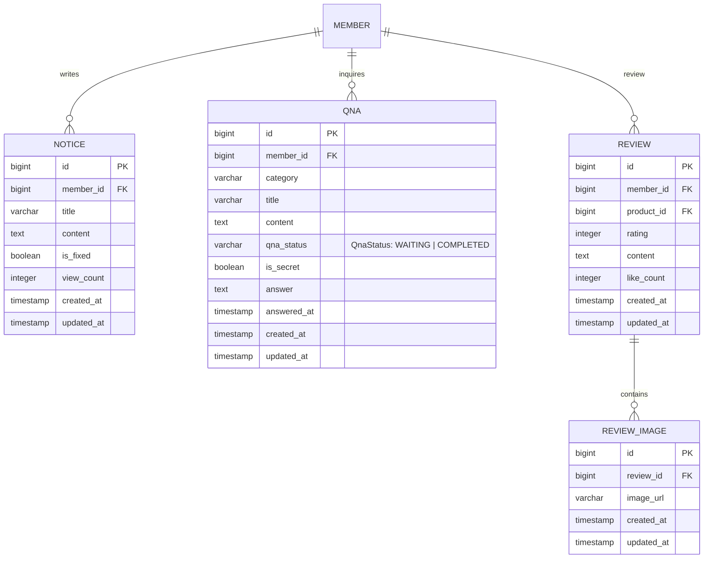

# 10_DB 설계서

## 테이블 정의서

### 📌 `notice` 테이블

| 테이블명 | 컬럼명 | 자료형 | PK | FK | UNIQUE | NULL 허용 | 기본값 | 설명 |
| --- | --- | --- | --- | --- | --- | --- | --- | --- |
| notice | id | BIGSERIAL | ✅ | | | ❌ | 자동 증가 | 공지사항 고유 식별자 |
| notice | member_id | BIGINT | | ✅ | | ❌ | | 작성 관리자 ID (member.id 참조) |
| notice | title | VARCHAR(255) | | | | ❌ | | 공지사항 제목 |
| notice | content | TEXT | | | | ❌ | | 공지사항 본문 |
| notice | is_fixed | BOOLEAN | | | | ❌ | false | 상단 고정 여부 |
| notice | view_count | INTEGER | | | | ❌ | 0 | 조회수 |
| notice | created_at | TIMESTAMP | | | | ❌ | now() | 등록일 |
| notice | updated_at | TIMESTAMP | | | | ❌ | now() | 수정일 |

---

### 📌 `qna` 테이블

| 테이블명 | 컬럼명 | 자료형 | PK | FK | UNIQUE | NULL 허용 | 기본값 | 설명 |
| --- | --- | --- | --- | --- | --- | --- | --- | --- |
| qna | id | BIGSERIAL | ✅ | | | ❌ | 자동 증가 | Q&A 고유 식별자 |
| qna | member_id | BIGINT | | ✅ | | ❌ | | 작성자 ID (member.id 참조) |
| qna | category | VARCHAR(50) | | | | ❌ | | 문의 유형 |
| qna | title | VARCHAR(255) | | | | ❌ | | 문의 제목 |
| qna | content | TEXT | | | | ❌ | | 문의 내용 |
| qna | qna_status | QnaStatus | | | | ❌ | 'WAITING' | 답변 상태 |
| qna | is_secret | BOOLEAN | | | | ❌ | false | 비밀글 여부 |
| qna | answer | TEXT | | | | ✅ | NULL | 관리자 답변 내용 |
| qna | answered_at | TIMESTAMP | | | | ✅ | NULL | 답변 등록일 |
| qna | created_at | TIMESTAMP | | | | ❌ | now() | 질문 등록일 |
| qna | updated_at | TIMESTAMP | | | | ❌ | now() | 수정일 |

---

### 📌 `review` 테이블

| 테이블명 | 컬럼명 | 자료형 | PK | FK | UNIQUE | NULL 허용 | 기본값 | 설명 |
| --- | --- | --- | --- | --- | --- | --- | --- | --- |
| review | id | BIGSERIAL | ✅ | | | ❌ | 자동 증가 | 리뷰 고유 식별자 |
| review | member_id | BIGINT | | ✅ | | ❌ | | 작성자 ID (member.id 참조) |
| review | product_id | BIGINT | | ✅ | | ❌ | | 대상 상품 ID (product.id 참조) |
| review | rating | INTEGER | | | | ❌ | | 평점 (1~5 정수) |
| review | content | TEXT | | | | ❌ | | 리뷰 상세 내용 |
| review | like_count | INTEGER | | | | ❌ | 0 | 추천수 |
| review | created_at | TIMESTAMP | | | | ❌ | now() | 작성일 |
| review | updated_at | TIMESTAMP | | | | ❌ | now() | 수정일 |

---

### 📌 `review_image` 테이블

| 테이블명 | 컬럼명 | 자료형 | PK | FK | UNIQUE | NULL 허용 | 기본값 | 설명 |
| --- | --- | --- | --- | --- | --- | --- | --- | --- |
| review_image | id | BIGSERIAL | ✅ | | | ❌ | 자동 증가 | 이미지 고유 식별자 |
| review_image | review_id | BIGINT | | ✅ | | ❌ | | 해당 리뷰 ID (review.id 참조) |
| review_image | image_url | VARCHAR(512) | | | | ❌ | | 이미지 경로/URL |
| review_image | created_at | TIMESTAMP | | | | ❌ | now() | 등록일 |
| review_image | updated_at | TIMESTAMP | | | | ❌ | now() | 수정일 |

---

### 📌 ENUM 타입 정의

| ENUM명 | 허용값 | 설명 |
| --- | --- | --- |
| QnaStatus | WAITING, COMPLETED | 답변 상태 (WAITING: 답변 대기, COMPLETED: 답변 완료) |

---

## 개체-관계도 (ERD)

