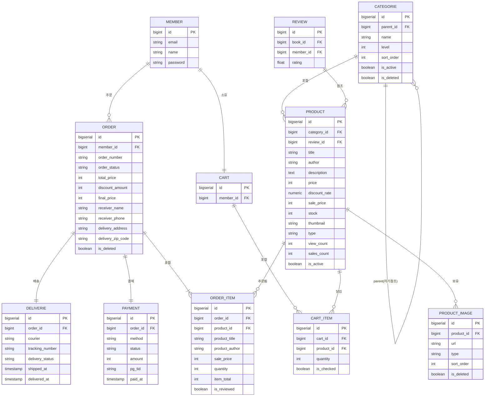

# DB 설계서

> `member` 테이블은 팀원(회원 담당) 소관이며, FK 참조만 한다.
`review` 테이블은 팀원(리뷰 담당) 소관이며, FK 참조만 한다.
> 

---

# 테이블 정의서

### 📌 `category` 테이블

| 테이블명 | 컬럼명 | 자료형 | PK | FK | NULL 허용 | 기본값 | 설명 |
| --- | --- | --- | --- | --- | --- | --- | --- |
| category | id | BIGSERIAL | ✅ |  | ❌ | auto | 카테고리 고유 ID |
| category | parent_id | BIGINT |  | category.id | ✅ | null | 부모 카테고리 ID (대분류는 NULL) |
| category | name | VARCHAR(50) |  |  | ❌ |  | 카테고리명 |
| category | level | INT |  |  | ❌ |  | 1=대분류, 2=중분류 |
| category | sort_order | INT |  |  | ❌ | 0 | 화면 정렬 순서 |
| category | created_at | TIMESTAMP |  |  | ❌ | now() | 생성 시간 |
| category | updated_at | TIMESTAMP |  |  | ✅ | null | 수정 시간 |

---

### 📌 `product` 테이블

| 테이블명 | 컬럼명 | 자료형 | PK | FK | NULL 허용 | 기본값 | 설명 |
| --- | --- | --- | --- | --- | --- | --- | --- |
| product | id | BIGSERIAL | ✅ |  | ❌ | auto | 도서 고유 ID |
| product | category_id | BIGINT |  | category.id | ❌ |  | 카테고리 |
| product | review_id | BIGINT |  | review.id | ❌ |  | 리뷰 참조 |
| product | title | VARCHAR(300) |  |  | ❌ |  | 도서명 |
| product | author | VARCHAR(200) |  |  | ❌ |  | 저자 |
| product | description | TEXT |  |  | ✅ | null | 도서 설명 |
| product | price | INT |  |  | ❌ | 0 | 정가 |
| product | discount_rate | NUMERIC(5,2) |  |  | ❌ | 0 | 할인율 (%) |
| product | sale_price | INT |  |  | ❌ | 0 | 판매가 (앱에서 계산 후 저장) |
| product | stock | INT |  |  | ❌ | 0 | 재고 수량 |
| product | thumbnail | VARCHAR(500) |  |  | ✅ | null | 대표 이미지 경로 |
| product | type | VARCHAR(20) |  |  | ❌ | ‘DOMESTIC’ | DOMESTIC / FOREIGN / JAPAN |
| product | view_count | INT |  |  | ❌ | 0 | 조회수 |
| product | sales_count | INT |  |  | ❌ | 0 | 판매량 |
| product | is_active | BOOLEAN |  |  | ❌ | true | 판매 가능 여부 |
| product | created_at | TIMESTAMP |  |  | ❌ | now() | 등록 시간 |
| product | updated_at | TIMESTAMP |  |  | ✅ | null | 수정 시간 |

---

### 📌 `product_image` 테이블

| 테이블명 | 컬럼명 | 자료형 | PK | FK | NULL 허용 | 기본값 | 설명 |
| --- | --- | --- | --- | --- | --- | --- | --- |
| product_image | id | BIGSERIAL | ✅ |  | ❌ | auto | 이미지 고유 ID |
| product_image | book_id | BIGINT |  | product.id | ❌ |  | 도서 ID (CASCADE 삭제) |
| product_image | url | VARCHAR(500) |  |  | ❌ |  | 이미지 경로 또는 URL |
| product_image | type | VARCHAR(20) |  |  | ❌ | ‘SUB’ | MAIN(대표) / SUB(추가) |
| product_image | sort_order | INT |  |  | ❌ | 0 | 이미지 정렬 순서 |
| product_image | created_at | TIMESTAMP |  |  | ❌ | now() | 등록 시간 |
| product_image | is_deleted | BOOLEAN |  |  | ❌ | false | 논리 삭제 여부 |

---

### 📌 `cart` 테이블

| 테이블명 | 컬럼명 | 자료형 | PK | FK | NULL 허용 | 기본값 | 설명 |
| --- | --- | --- | --- | --- | --- | --- | --- |
| cart | id | BIGSERIAL | ✅ |  | ❌ | auto | 장바구니 고유 ID |
| cart | member_id | BIGINT |  | member.id | ❌ |  | 회원 ID (UNIQUE, 1:1) |
| cart | created_at | TIMESTAMP |  |  | ❌ | now() | 생성 시간 |
| cart | updated_at | TIMESTAMP |  |  | ✅ | null | 수정 시간 |

---

### 📌 `cart_item` 테이블

| 테이블명 | 컬럼명 | 자료형 | PK | FK | NULL 허용 | 기본값 | 설명 |
| --- | --- | --- | --- | --- | --- | --- | --- |
| cart_item | id | BIGSERIAL | ✅ |  | ❌ | auto | 장바구니 항목 ID |
| cart_item | cart_id | BIGINT |  | cart.id | ❌ |  | 장바구니 ID (CASCADE 삭제) |
| cart_item | book_id | BIGINT |  | product.id | ❌ |  | 도서 ID |
| cart_item | quantity | INT |  |  | ❌ | 1 | 수량 (1 이상) |
| cart_item | is_checked | BOOLEAN |  |  | ❌ | true | 주문 시 체크 여부 |
| cart_item | created_at | TIMESTAMP |  |  | ❌ | now() | 생성 시간 |
| cart_item | updated_at | TIMESTAMP |  |  | ✅ | null | 수정 시간 |

---

### 📌 `order` 테이블

| 테이블명 | 컬럼명 | 자료형 | PK | FK | NULL 허용 | 기본값 | 설명 |
| --- | --- | --- | --- | --- | --- | --- | --- |
| order | id | BIGSERIAL | ✅ |  | ❌ | auto | 주문 고유 ID |
| order | member_id | BIGINT |  | member.id | ❌ |  | 회원 ID |
| order | number | VARCHAR(30) |  |  | ❌ |  | 주문번호 UNIQUE (예: ORD-20260315-000001) |
| order | status | VARCHAR(30) |  |  | ❌ | ‘PENDING’ | 주문 상태 |
| order | total_price | INT |  |  | ❌ | 0 | 총 상품금액 |
| order | discount_amount | INT |  |  | ❌ | 0 | 할인금액 |
| order | final_price | INT |  |  | ❌ | 0 | 최종 결제금액 |
| order | receiver_name | VARCHAR(50) |  |  | ❌ |  | 수령인 이름 |
| order | receiver_phone | VARCHAR(20) |  |  | ❌ |  | 수령인 연락처 |
| order | delivery_address | VARCHAR(255) |  |  | ❌ |  | 배송지 주소 |
| order | delivery_address_detail | VARCHAR(255) |  |  | ✅ | null | 배송지 상세 주소 |
| order | delivery_zip_code | VARCHAR(10) |  |  | ❌ |  | 우편번호 |
| order | delivery_memo | VARCHAR(300) |  |  | ✅ | null | 배송 메모 |
| order | ordered_at | TIMESTAMP |  |  | ❌ | now() | 주문 시간 |
| order | created_at | TIMESTAMP |  |  | ❌ | now() | 생성 시간 |
| order | updated_at | TIMESTAMP |  |  | ✅ | null | 수정 시간 |
| order | is_deleted | BOOLEAN |  |  | ❌ | false | 논리 삭제 여부 |

---

### 📌 `order_item` 테이블

| 테이블명 | 컬럼명 | 자료형 | PK | FK | NULL 허용 | 기본값 | 설명 |
| --- | --- | --- | --- | --- | --- | --- | --- |
| order_item | id | BIGSERIAL | ✅ |  | ❌ | auto | 주문 항목 ID |
| order_item | order_id | BIGINT |  | order.id | ❌ |  | 주문 ID |
| order_item | product_id | BIGINT |  | product.id | ❌ |  | 도서 ID |
| order_item | product_title | VARCHAR(300) |  |  | ❌ |  | 도서명 스냅샷 |
| order_item | product_author | VARCHAR(200) |  |  | ❌ |  | 저자 스냅샷 |
| order_item | sale_price | INT |  |  | ❌ | 0 | 주문 당시 판매가 스냅샷 |
| order_item | quantity | INT |  |  | ❌ | 1 | 주문 수량 |
| order_item | item_total | INT |  |  | ❌ | 0 | 소계 (sale_price × quantity) |
| order_item | is_reviewed | BOOLEAN |  |  | ❌ | false | 리뷰 작성 여부 |
| order_item | created_at | TIMESTAMP |  |  | ❌ | now() | 생성 시간 |

---

### 📌 `payment` 테이블

| 테이블명 | 컬럼명 | 자료형 | PK | FK | NULL 허용 | 기본값 | 설명 |
| --- | --- | --- | --- | --- | --- | --- | --- |
| payment | id | BIGSERIAL | ✅ |  | ❌ | auto | 결제 고유 ID |
| payment | order_id | BIGINT |  | order.id | ❌ |  | 주문 ID |
| payment | method | VARCHAR(30) |  |  | ❌ |  | 결제 수단 |
| payment | status | VARCHAR(20) |  |  | ❌ | ‘READY’ | READY / PAID / CANCELLED / FAILED |
| payment | amount | INT |  |  | ❌ | 0 | 결제 금액 |
| payment | pg_tid | VARCHAR(100) |  |  | ✅ | null | PG 트랜잭션 ID (Mock: UUID) |
| payment | paid_at | TIMESTAMP |  |  | ✅ | null | 결제 완료 시각 |
| payment | cancelled_at | TIMESTAMP |  |  | ✅ | null | 취소 시각 |
| payment | cancel_reason | VARCHAR(300) |  |  | ✅ | null | 취소 사유 |
| payment | created_at | TIMESTAMP |  |  | ❌ | now() | 생성 시간 |
| payment | updated_at | TIMESTAMP |  |  | ✅ | null | 수정 시간 |

---

### 📌 `delivery` 테이블

| 테이블명 | 컬럼명 | 자료형 | PK | FK | NULL 허용 | 기본값 | 설명 |
| --- | --- | --- | --- | --- | --- | --- | --- |
| delivery | id | BIGSERIAL | ✅ |  | ❌ | auto | 배송 고유 ID |
| delivery | order_id | BIGINT |  | order.id | ❌ |  | 주문 ID (UNIQUE, 1:1) |
| delivery | courier | VARCHAR(50) |  |  | ✅ | null | 택배사명 |
| delivery | tracking_number | VARCHAR(100) |  |  | ✅ | null | 운송장 번호 |
| delivery | status | VARCHAR(30) |  |  | ❌ | ‘READY’ | READY / SHIPPED / IN_TRANSIT / DELIVERED / FAILED |
| delivery | shipped_at | TIMESTAMP |  |  | ✅ | null | 발송 시각 |
| delivery | delivered_at | TIMESTAMP |  |  | ✅ | null | 배송 완료 시각 |
| delivery | created_at | TIMESTAMP |  |  | ❌ | now() | 생성 시간 |
| delivery | updated_at | TIMESTAMP |  |  | ✅ | null | 수정 시간 |

---

# 개체-관계도 (ERD)

