# ReadMe 쇼핑몰 — 시스템 아키텍처 흐름도 (결제 시스템 추가)

## 📄 문서 개요

| 항목 | 내용 |
|---|---|
| 프로젝트명 | 교보문고 쇼핑몰 시스템 (README) |
| 개발 환경 | Java 21 / Spring Boot 3.5 / PostgreSQL / Vue.js 3 |
| 작성일 | 2026.03.28 |
| 버전 | v1.2 |
| 기준 문서 | 시스템_아키텍처_흐름도.md |
| 변경 범위 | PaymentService 외부 PG 연동 구조 추가 / 결제 흐름도 PG별 분기 반영 |

---

## 1. 전체 시스템 계층 흐름도 (결제 PG 연동 추가)

> 기존 흐름도에서 PaymentService 하단에 PG Gateway 레이어가 추가됩니다.

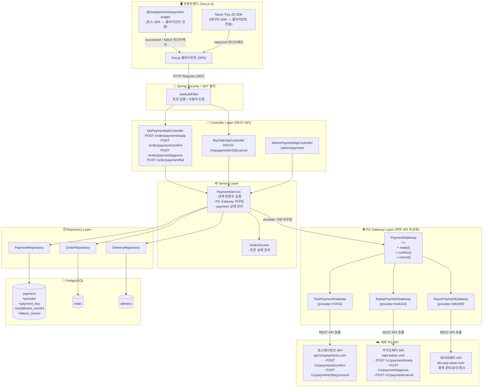

---

## 2. 도메인별 요청 처리 흐름

### 2-1. 회원 인증 흐름 (회원가입 / 로그인 / 로그아웃)

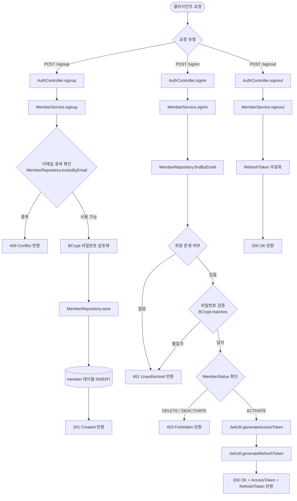

---

### 2-2. 상품 조회 흐름 (회원 / 관리자)

```mermaid
flowchart TD
    A([클라이언트 요청]) --> B{요청 주체}

    B -->|일반 회원| C{요청 유형}
    C -->|GET /products| D[ProductController.getProductList]
    C -->|GET /products/{id}| E[ProductController.getProductDetail]
    C -->|GET /products/search| F[ProductController.searchProducts]

    D --> G[ProductService.getProductList\nPageable + keyword]
    E --> H[ProductService.getProductDetail\n+ increaseViewCount]
    F --> I[ProductService.searchProducts]

    G --> J[ProductRepository.findAllByStatusAndKeyword]
    H --> K[ProductRepository.findByIdAndStatus]
    H --> L[ProductImageRepository.findByProductId]
    I --> J

    J --> M[(product 테이블 SELECT)]
    K --> M
    L --> N[(product_image 테이블 SELECT)]
    M --> O[ProductResponse 반환]
    N --> O
    O --> P[200 OK + 상품 데이터]

    B -->|관리자| Q{관리자 요청 유형}
    Q -->|GET /admin/product| R[AdminProductController.getProductList]
    Q -->|POST /admin/product| S[AdminProductController.createProduct]
    Q -->|PUT /admin/product/{id}| T[AdminProductController.updateProduct]
    Q -->|DELETE /admin/product/{id}| U[AdminProductController.deleteProduct]

    R --> G
    S --> V[ProductService.createProduct]
    T --> W[ProductService.updateProduct]
    U --> X[ProductService.deleteProduct\nsoft delete: deletedAt 설정]

    V --> Y[(product 테이블 INSERT)]
    W --> Z[(product 테이블 UPDATE)]
    X --> AA[(product.deleted_at = NOW UPDATE)]
```

---

### 2-3. 장바구니 흐름

```mermaid
flowchart TD
    A([인증된 회원 요청]) --> B{장바구니 요청 유형}

    B -->|GET /cart| C[CartController.getCart]
    B -->|POST /cart/item| D[CartController.addItem]
    B -->|PATCH /cart/item/{id}| E[CartController.updateQuantity]
    B -->|DELETE /cart/item/{id}| F[CartController.removeItem]

    C --> G[CartService.getCart\nLong memberId]
    D --> H[CartService.addItem\nCartItemRequest + memberId]
    E --> I[CartService.updateQuantity\nCartUpdateRequest + memberId]
    F --> J[CartService.removeItem\nitemId + memberId]

    G --> K[CartRepository.findByMemberId]
    G --> L[CartItemRepository.findByCartId]
    K --> M[(cart 테이블 SELECT)]
    L --> N[(cart_item 테이블 SELECT)]
    M --> O[CartResponse 반환]
    N --> O

    H --> P{상품 유효성 확인\nProductRepository.findByIdAndStatus}
    P -->|상품 없음/비활성| Q[404 Not Found]
    P -->|유효| R{중복 상품 확인}
    R -->|이미 담긴 상품| S[수량 증가 UPDATE]
    R -->|신규| T[CartItemRepository.save]
    S --> U[(cart_item 테이블 UPDATE)]
    T --> V[(cart_item 테이블 INSERT)]

    I --> W[CartItemRepository.save\n수량 업데이트]
    W --> X[(cart_item 테이블 UPDATE)]

    J --> Y[CartItemRepository.deleteAllByIdIn]
    Y --> Z[(cart_item 테이블 DELETE)]
```

---

### 2-4. 주문 생성 ~ 결제 흐름 (Mock PG 기준)

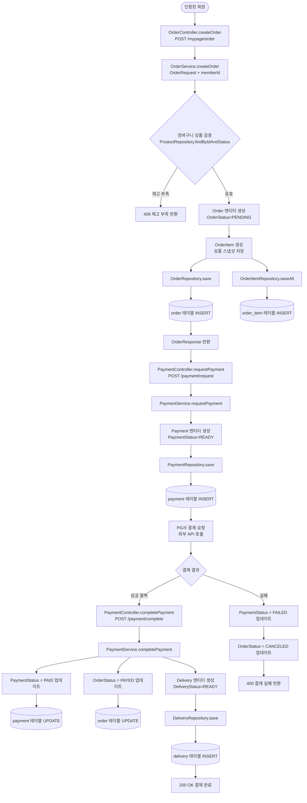

---

### 2-4-T. 토스페이먼츠 결제 흐름

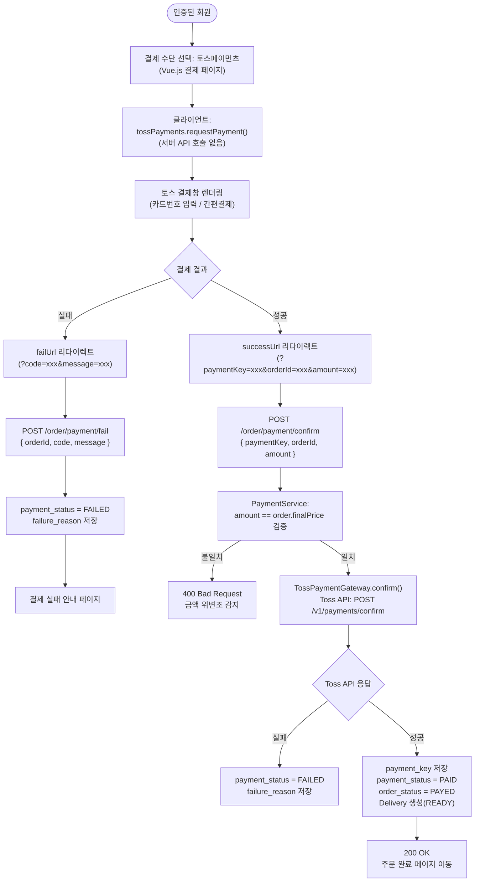

---

### 2-4-K. 카카오페이 결제 흐름

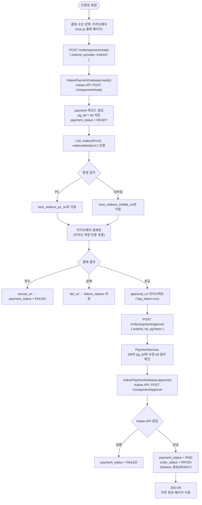

---

### 2-4-N. 네이버페이 결제 흐름

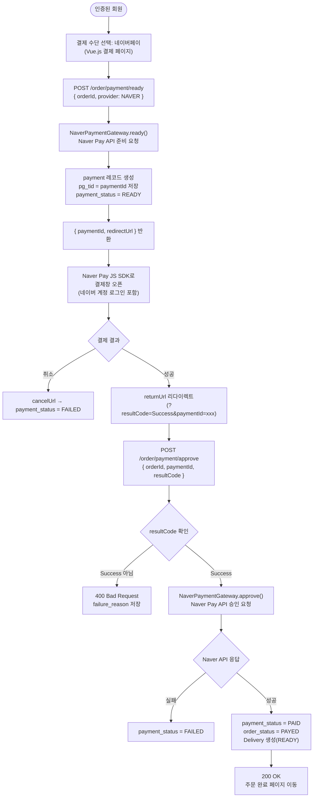

---

### 2-5. 주문 취소 ~ 환불 흐름

```mermaid
flowchart TD
    A([인증된 회원]) --> B[OrderController.cancelOrder\nPATCH /mypage/order/{id}/cancel]
    B --> C[OrderService.cancelOrder\norderId + memberId]

    C --> D[OrderService.validateOwnership\n본인 주문 여부 확인]
    D -->|타인 주문| E[403 Forbidden 반환]
    D -->|본인 주문| F{OrderStatus 확인}

    F -->|APPROVAL / 배송 이후| G[400 취소 불가 반환]
    F -->|PENDING / PAYED| H[OrderRepository 조회]

    H --> I[PaymentService.cancelPayment\nPG사 환불 요청]
    I --> J{환불 결과}
    J -->|실패| K[500 환불 실패 반환]
    J -->|성공| L[PaymentStatus = CANCELLED 업데이트]
    L --> M[(payment 테이블 UPDATE\ncancel_reason, cancelled_at)]
    M --> N[OrderStatus = CANCELED 업데이트]
    N --> O[(order 테이블 UPDATE\ncancelled_at = NOW)]
    O --> P[200 OK 취소 완료 반환]
```

---

### 2-5-PG. PG사별 결제 취소 / 환불 흐름

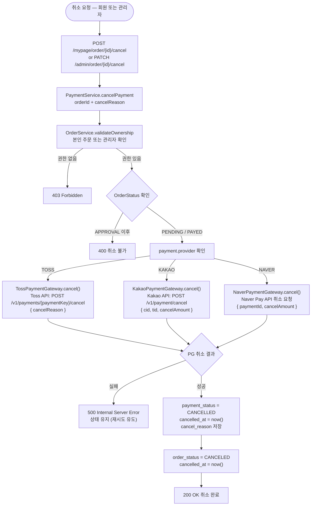

---

### 2-6. 배송 상태 변경 흐름 (관리자)

```mermaid
flowchart TD
    A([관리자]) --> B{배송 요청 유형}

    B -->|GET /admin/delivery| C[AdminDeliveryController.getDeliveryList]
    B -->|POST /admin/delivery/{id}/tracking| D[AdminDeliveryController.registerTracking]
    B -->|PATCH /admin/delivery/{id}/status| E[AdminDeliveryController.updateDeliveryStatus]

    C --> F[DeliveryService.getDeliveryList]
    F --> G[DeliveryRepository.findAllByStatus\n상태 필터 + 페이징]
    G --> H[(delivery 테이블 SELECT)]
    H --> I[배송 목록 반환]

    D --> J[DeliveryService.registerTracking\nTrackingRequest]
    J --> K[DeliveryRepository.save\ncourier + trackingNumber 업데이트]
    K --> L[(delivery 테이블 UPDATE\ndelivery_status = SHIPPED)]
    L --> M[200 OK 운송장 등록 완료]

    E --> N[DeliveryService.updateDeliveryStatus\nDeliveryStatus]
    N --> O{상태 유효성 검사}
    O -->|역방향 상태 변경| P[400 잘못된 상태 반환]
    O -->|유효| Q{변경 상태}
    Q -->|IN_TRANSIT| R[(delivery_status = IN_TRANSIT UPDATE)]
    Q -->|DELIVERED| S[(delivery_status = DELIVERED\ndelivered_at = NOW UPDATE)]
    Q -->|FAILED| T[(delivery_status = FAILED UPDATE)]
    R --> U[200 OK 상태 변경 완료]
    S --> U
    T --> U
```

---

### 2-7. 리뷰 작성 흐름

```mermaid
flowchart TD
    A([인증된 회원]) --> B[ReviewController.writeReview\nPOST /review]
    B --> C[ReviewService.writeReview\nReviewRequest + memberId]

    C --> D{구매 확정 여부 확인\nOrderItemRepository.findDeliveredItemByMemberAndProduct}
    D -->|구매 이력 없음| E[403 리뷰 작성 권한 없음]
    D -->|구매 확정 이력 있음| F{리뷰 중복 확인\nReviewRepository.existsByMemberIdAndProductId}
    F -->|이미 작성| G[409 중복 리뷰]
    F -->|미작성| H[Review 엔티티 생성\nrating + content]
    H --> I[ReviewRepository.save]
    I --> J[(review 테이블 INSERT)]

    J --> K{이미지 첨부 여부}
    K -->|이미지 있음| L[ReviewImageRepository.saveAll]
    L --> M[(review_image 테이블 INSERT)]
    K -->|없음| N

    M --> N[OrderItemRepository.updateIsReviewed\nis_reviewed = true]
    N --> O[(order_item 테이블 UPDATE)]
    O --> P[201 Created 리뷰 작성 완료]

    A --> Q[ReviewController.addReaction\nPOST /review/{id}/reaction]
    Q --> R[ReviewService.addReaction\nreviewId + reactionType + memberId]
    R --> S{기존 반응 확인\nReviewReactionRepository.findByReviewIdAndMemberId}
    S -->|있음| T[reactionType 토글 업데이트]
    S -->|없음| U[ReviewReactionRepository.save]
    T --> V[(review_reaction 테이블 UPDATE)]
    U --> W[(review_reaction 테이블 INSERT)]
    V --> X[200 OK]
    W --> X
```

---

### 2-8. QnA 문의 ~ 답변 흐름

```mermaid
flowchart TD
    A([인증된 회원]) --> B[QnaController.writeQuestion\nPOST /qna]
    B --> C[QnaService.writeQuestion\nQnaRequest + memberId]
    C --> D[QnaRepository.save\ndepth=0, status=WAITING]
    D --> E[(qna 테이블 INSERT)]
    E --> F[201 Created 문의 등록 완료]

    G([관리자]) --> H[AdminQnaController.getQnaList\nGET /admin/qna?status=WAITING]
    H --> I[QnaService 조회\nQnaRepository.findByStatus]
    I --> J[(qna 테이블 SELECT)]
    J --> K[대기 중 문의 목록 반환]

    G --> L[AdminQnaController.answerQna\nPOST /admin/qna/{id}/answer]
    L --> M[QnaService.answerQuestion\nAnswerRequest + adminId]
    M --> N[답변 Qna 생성\ndepth=1, status=COMPLETE]
    N --> O[QnaRepository.save\n부모 QnaId 연결]
    O --> P[(qna 테이블 INSERT\nparent_id = 원문의 id)]
    P --> Q[원문의 status = COMPLETE 업데이트]
    Q --> R[(qna 테이블 UPDATE\nstatus=COMPLETE, answered_at=NOW)]
    R --> S[201 Created 답변 등록 완료]
```

---

### 2-9. 관리자 대시보드 조회 흐름

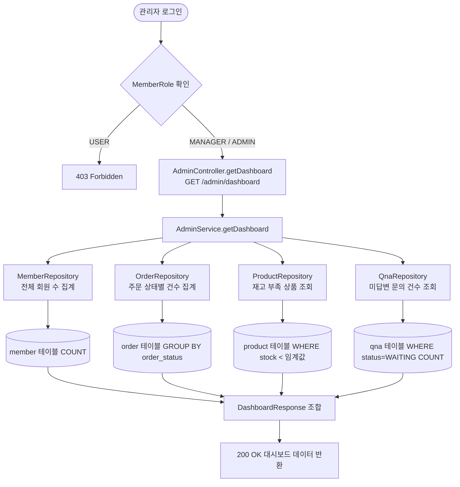

---

### 2-10. JWT 인증 미들웨어 흐름

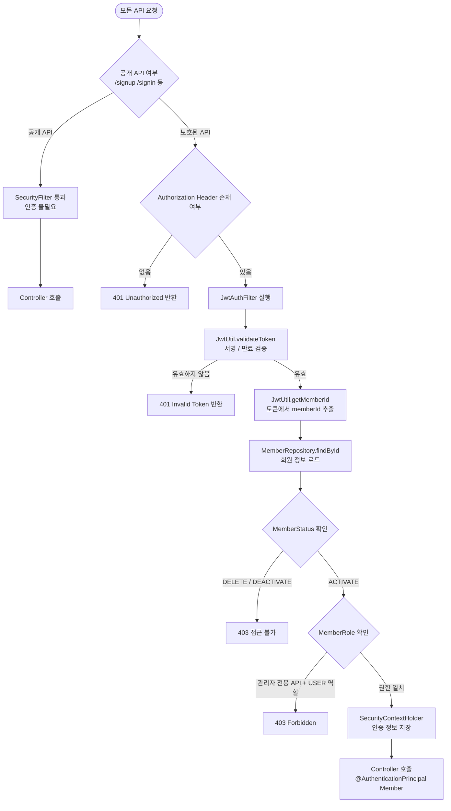

---

## 3. PaymentGateway 인터페이스 구조

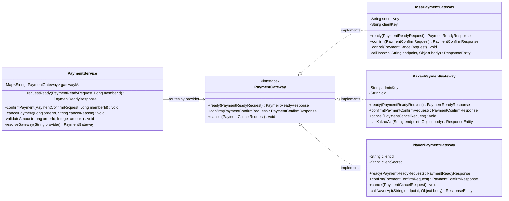

---

## 4. DB 테이블 연관 관계 흐름

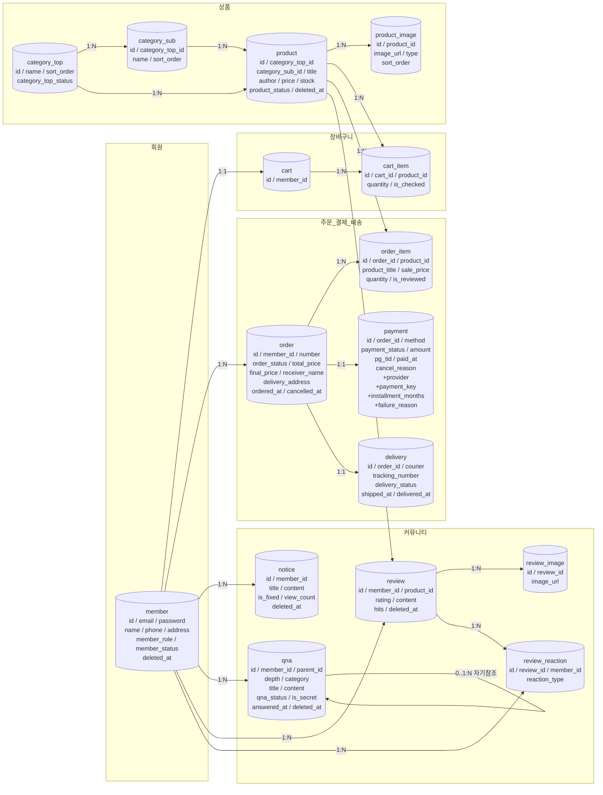

---

## 5. OrderStatus / DeliveryStatus / PaymentStatus 상태 전이 흐름

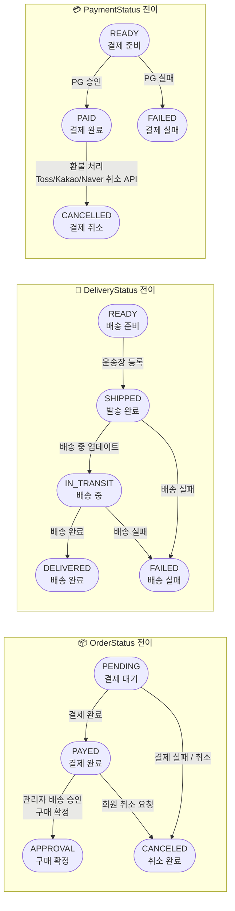

---

## 6. 환경변수 구성 (서버)

> 모든 PG 시크릿 키는 서버 환경변수로만 관리하며 코드·클라이언트에 노출 금지

```
# 토스페이먼츠
TOSS_SECRET_KEY=test_sk_xxxxxxxxxxxxxxxxxxxxxx
TOSS_CLIENT_KEY=test_ck_xxxxxxxxxxxxxxxxxxxxxx

# 카카오페이
KAKAO_ADMIN_KEY=KakaoAK_xxxxxxxxxxxxxxxxxxxxxx
KAKAO_CID=TC0ONETIME

# 네이버페이
NAVER_PAY_CLIENT_ID=xxxxxxxxxxxxxxxxxxxxxx
NAVER_PAY_CLIENT_SECRET=xxxxxxxxxxxxxxxxxxxxxx
NAVER_PAY_CHAIN_ID=xxxxxxxxxxxxxxxxxxxxxx
```
