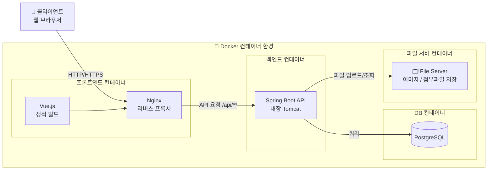

# 06_요구사항 정의서

**실제 본인이 작성할 웹 애플리케이션에 관한 모든 요구사항을 문서화하여야 합니다.**

## 📄 웹 애플리케이션 요구사항 정의서

> 프로젝트명: 쇼핑몰 웹 애플리케이션
> 
> 
> **개발환경:** Java 21, Spring Boot 3.x, PostgreSQL, Gradle, Vue.js, Docker
> 
> **작성일:** 2026.03.18
> 
> **작성자:** 백경서 ()
> 

### ✅ 1. 개요

| 항목 | 내용 |
| --- | --- |
| **프로젝트 명** | readme 웹 애플리케이션 개발 |
| **목적** | 사용자들이 온라인에서 책 상품을 검색, 구매, 결제할 수 있는 웹 서비스 제공 |
| **범위** | 회원가입, 로그인, 마이페이지, 상품목록, 장바구니, 주문 및 결제, QnA, 공지사항, 리뷰, 관리자 대시보드 기능 포함 |
| **주요 사용자** | 일반 사용자, 관리자, 비회원 |
| **플랫폼** | 웹 브라우저(PC, 모바일) 기반 |

### ✅ 2. 시스템 구성도

### ✅ 3. 사용자 역할 및 권한

| 역할 | 설명 | 주요 권한 |
| --- | --- | --- |
| USER | 일반 회원 | 상품 조회, 구매, 리뷰 작성, 마이페이지, QnA |
| MANAGER | 매니저 | 상품/주문/배송 관리, 공지사항 작성 |
| ADMIN | 최고 관리자 | 전체 기능 + 회원 관리, 권한 변경 |
| 비회원 | 미로그인 사용자 | 상품 조회, 검색만 허용 |

### ✅ 4. 기능 요구사항 상세

## 🔐 4.0 관리자 (Admin)

### 4.0.1 관리자 페이지

| 요구사항 ID | 기능명 | 설명 | 우선순위 | 관련 페이지 | 비고 |
| --- | --- | --- | --- | --- | --- |
|  | 신규 미승인 주문 현황 | 미승인 주문 목록 표시 | 🔴 높음 | /admin | 최신 5~10건, 빠른 승인 / 거부 구현 필요 |
|  | 신규 QnA 질문 현황 | 신규 질문 목록 표시 | 🔴 높음 | /admin | 최신 5~10건, 답변하기 구현 필요 |
|  | 재고 부족 상품 현황 | 재고 기준치 이하 상품 목록 표시 | 🔴 높음 | /admin | 기준치 설정 필요 (예: 10개 이하) |
|  | 최근 주문 목록 | 최근 접수된 주문 목록 요약 표시 | 🟠 중간 | /admin | 최신 5~10건, 주문 상세 링크 |
|  | 배송 처리 대기 현황 | READY 상태 배송 건수 및 목록 표시 | 🟢 낮음 | /admin | delivery_status = READY 기준 |
|  | 매출/주문 통계 요약 | 오늘/이번 달 주문 수, 매출 합계 표시 | 🟠 중간 | /admin | 집계 쿼리 기반 |
|  | 신규 회원 현황 | 오늘/이번 달 신규 가입 회원 수 표시 | 🟠 중간 | /admin | created_at 기준 집계 |

---

### 4.0.2 관리자 페이지 - 회원 관리

| 요구사항 ID | 기능명 | 설명 | 우선순위 | 관련 페이지 | 비고 |
| --- | --- | --- | --- | --- | --- |
|  | 회원 목록 조회 | 전체 회원 목록 조회 (페이징, 검색) | 🔴 높음 | /admin/member/list | 이름/이메일 검색 |
|  | 회원 상세 조회 | 특정 회원 정보 상세 조회 | 🔴 높음 | /admin/member/{id} | 가입일, 상태 포함 |
|  | 회원 강퇴 | ACTIVATE / DEACTIVATE / DELETE 상태 변경 | 🟠 중간 | /admin/member/{id} | memberStatus ENUM |
|  | 관리자 권한 변경 | USER / MANAGER / ADMIN 역할 변경 | 🟠 중간 | /admin/member/{id} | memberRole ENUM |
|  | 탈퇴 회원 관리 | deleted_at 기준 탈퇴 회원 목록 조회 | 🟢 낮음 | /admin/member/list | soft delete 기준 |

### 4.0.3 관리자 페이지 - 주문 관리

| 요구사항 ID | 기능명 | 설명 | 우선순위 | 관련 페이지 | 비고 |
| --- | --- | --- | --- | --- | --- |
|  | 주문 목록 조회 | 전체 주문 목록 조회 (페이징, 검색) | 🔴 높음 | /admin/order | 주문번호/회원 검색 |
|  | 주문 상세 조회 | 특정 주문 상세 정보 조회 | 🔴 높음 | /admin/order/{id} | 주문 상품, 결제, 배송 포함 |
|  | 주문 상태 변경 | PENDING / PAYED / APPROVAL / CANCELED 상태 변경 | 🟠 중간 | /admin/order/{id} | 상태 ENUM |
|  | 주문 취소 처리 | 관리자 측 주문 강제 취소 | 🟠 중간 | /admin/order/{id} | 결제 상태 연동 |

---

### 4.0.6 관리자 페이지 - 배송 관리

| 요구사항 ID | 기능명 | 설명 | 우선순위 | 관련 페이지 | 비고 |
| --- | --- | --- | --- | --- | --- |
|  | 배송 목록 조회 | 전체 배송 목록 조회 | 🔴 높음 | /admin/delivery | 상태별 필터 |
|  | 운송장 등록 | 택배사명 및 운송장 번호 입력 | 🟠 중간 | /admin/delivery/{id} | 관리자 직접 입력 |
|  | 배송 상태 변경 | READY / SHIPPED / IN_TRANSIT / DELIVERED / FAILED 변경 | 🔴 높음 | /admin/delivery/{id} | 단계별 상태 |

---

### 4.0.2 관리자 페이지 - 상품 관리

| 요구사항 ID | 기능명 | 설명 | 우선순위 | 관련 페이지 | 비고 |
| --- | --- | --- | --- | --- | --- |
|  | 상품 목록 | 상품 정보 및 이미지 목록 | 🟠 중간 | /admin/product/list | 썸네일 필수 |
|  | 상품 등록 | 상품 정보 및 이미지 업로드 | 🟠 중간 | /admin/product/insert | 썸네일 필수 |
|  | 상품 수정 | 상품 정보 수정 (재고, 가격 등) | 🟠 중간 | /admin/product/{id} | 재고/가격 변경 |
|  | 상품 삭제 | soft delete 방식 삭제 | 🟢 낮음 | - | deleted_at 사용 |

---

### 4.0.3 관리자 페이지 - 카테고리 관리

| 요구사항 ID | 기능명 | 설명 | 우선순위 | 관련 페이지 | 비고 |
| --- | --- | --- | --- | --- | --- |
|  | 카테고리 등록 | 상위/하위 카테고리 등록 | 🟠 중간 | /admin/category | 관리자 기능 |
|  | 카테고리 수정 | 카테고리 이름 및 정렬 순서 수정 | 🟠 중간 | /admin/category/{id} | 정렬 순서 포함 |
|  | 카테고리 삭제 | 활성/비활성/삭제 처리 | 🟢 낮음 | - | soft delete 개념 |

---

### 4.0.3 관리자 페이지 - 공지사항 관리

| 요구사항 ID | 기능명 | 설명 | 우선순위 | 관련 페이지 | 비고 |
| --- | --- | --- | --- | --- | --- |
|  | 공지사항 목록 | 중요 공지사항 및 신규 공지사항 | 🟠 중간 | /admin/notice/list | 중요 공지사항은 리스트 상단 고정 |
|  | 공지사항 등록 | 신규 공지사항 추가 | 🟠 중간 | /admin/notice/insert |  |
|  | 공지사항 수정 | 공지사항 수정 (제목, 내용) | 🟠 중간 | /admin/notice/{id} | |
|  | 공지사항 삭제 | soft delete 방식 삭제 | 🟢 낮음 | - | deleted_at 사용 |

---

### 4.0.4 관리자 페이지 - 리뷰 관리

| 요구사항 ID | 기능명 | 설명 | 우선순위 | 관련 페이지 | 비고 |
| --- | --- | --- | --- | --- | --- |
|  | 리뷰 목록 | 리뷰 및 해당 리뷰의 상품 목록 | 🟠 중간 | /admin/review/list | 상품의 이름 기재 |
|  | 리뷰 등록 | 특정 상품의 리뷰 등록 | 🟠 중간 | /admin/review/insert |  |
|  | 리뷰 삭제 | soft delete 방식 삭제 | 🟢 낮음 | - | deleted_at 사용 |

---

### 4.0.5 관리자 페이지 - QnA 관리

| 요구사항 ID | 기능명 | 설명 | 우선순위 | 관련 페이지 | 비고 |
| --- | --- | --- | --- | --- | --- |
|  | 질문 목록 | 리뷰 및 해당 리뷰의 상품 목록 | 🟠 중간 | /admin/qna/list | 상품의 이름 기재 |
|  | 질문 목록 | 리뷰 및 해당 리뷰의 상품 목록 | 🟠 중간 | /admin/qna/list | 상품의 이름 기재 |
|  | 답변 등록 | 특정 상품의 리뷰 등록 | 🟠 중간 | /admin/review/{id}/insert |  |
|  | 리뷰 수정 | 리뷰 수정(제목, 내용, 사진) | 🟠 중간 | /admin/review/{id} |  |
|  | 리뷰 삭제 | soft delete 방식 삭제 | 🟢 낮음 | - | deleted_at 사용 |

---

## 👤 4.1 회원 (Member)

### 4.1.1 회원가입 / 로그인

| 요구사항 ID | 기능명 | 설명 | 우선순위 | 관련 페이지 | 비고 |
| --- | --- | --- | --- | --- | --- |
|  | 회원가입 | 이메일, 비밀번호, 이름, 전화번호, 주소 입력 후 가입 | 🔴 높음 | /signup | email UNIQUE 체크 |
|  | 로그인 | 이메일 + 비밀번호 로그인, JWT 토큰 발급 | 🔴 높음 | /signin | Access/Refresh Token / 저장 시 BCrypt 암호화 적용 |
|  | 로그아웃 | 토큰 무효화 처리 | 🔴 높음 | - | 클라이언트 토큰 삭제 |

---

### 4.1.2 마이페이지

| 요구사항 ID | 기능명 | 설명 | 우선순위 | 관련 페이지 | 비고 |
| --- | --- | --- | --- | --- | --- |
|  | 주문 현황 | 주문한 상품의 현재 상태 조회 | 🔴 높음 | /mypage | 입금 대기 / 승인 대기 / 출고 대기 / 배송 대기 / 배송 중 / 배송 완료 |
|  | 주문 / 배송 조회 | 주문한 상품의 상태 목록 조회 | 🟠 중간 | /mypage | 최신 5~10건 |
|  | 리뷰 조회 | 작성한 리뷰 목록 조회 | 🟠 중간 | /mypage | 최신 5~10건 |
|  | QnA 조회 | 작성한 QnA 질문 조회 및 상태 확인 | 🟠 중간 | /mypage | 답변 여부 |
---

### 4.1.3 마이페이지 - 회원 정보

| 요구사항 ID | 기능명 | 설명 | 우선순위 | 관련 페이지 | 비고 |
| --- | --- | --- | --- | --- | --- |
|  | 회원 정보 수정 | 이름, 전화번호, 주소 수정 | 🔴 높음 | /mypage/edit | updated_at 갱신 |
|  | 비밀번호 변경 | 현재 비밀번호 확인 후 변경 | 🔴 높음 | /mypage/password | BCrypt 재암호화 |
|  | 회원 탈퇴 | soft delete 처리 (deleted_at, memberStatus → DELETE) | 🟠 중간 | - | 즉시 로그아웃 처리 |

---

### 4.1.4 마이페이지 - 주문 / 배송 조회

| 요구사항 ID | 기능명 | 설명 | 우선순위 | 관련 페이지 | 비고 |
| --- | --- | --- | --- | --- | --- |
|  | 주문 목록 조회 | 본인의 전체 주문 목록 조회 | 🔴 높음 | /mypage/order/list | 최신순 정렬, 상태별 필터 |
|  | 주문 상세 조회 | 주문 상품, 결제 금액, 배송지 정보 상세 조회 | 🔴 높음 | /mypage/order/{id} | 주문 상품 목록 포함 |
|  | 주문 취소 요청 | 결제 전 또는 결제 후 취소 요청 | 🟠 중간 | /mypage/order/{id} | 결제 상태 연동 |
|  | 배송 상태 조회 | 주문별 현재 배송 상태 확인 | 🔴 높음 | /mypage/order/{id} | READY~DELIVERED 단계 표시 |
|  | 운송장 번호 조회 | 택배사명 및 운송장 번호 확인 | 🟠 중간 | /mypage/order/{id} | 배송 상태 상세 조회 |

---

### 4.1.5 마이페이지 - 리뷰 조회

| 요구사항 ID | 기능명 | 설명 | 우선순위 | 관련 페이지 | 비고 |
| --- | --- | --- | --- | --- | --- |
|  | 작성 리뷰 목록 조회 | 본인이 작성한 리뷰 전체 목록 조회 | 🔴 높음 | /mypage/review/list | 최신순 정렬 |
|  | 작성 리뷰 상세 조회 | 리뷰 내용, 평점, 이미지 상세 확인 | 🟠 중간 | /mypage/review/{id} | 작성 상품 링크 포함 |
|  | 리뷰 수정 | 작성한 리뷰 내용 및 평점 수정 | 🟠 중간 | /mypage/review/{id} | updated_at 갱신 |
|  | 리뷰 삭제 | 작성한 리뷰 삭제 | 🟠 중간 | /mypage/review/{id} | soft delete (deleted_at) |
|  | 미작성 리뷰 목록 조회 | 구매 완료 후 리뷰 미작성 상품 목록 조회 | 🟠 중간 | /mypage/review | is_reviewed = false 기준 |

---

### 4.1.5 마이페이지 - QnA 조회

| 요구사항 ID | 기능명 | 설명 | 우선순위 | 관련 페이지 | 비고 |
| --- | --- | --- | --- | --- | --- |
|  | 작성 리뷰 목록 조회 | 본인이 작성한 리뷰 전체 목록 조회 | 🔴 높음 | /mypage/review/list | 최신순 정렬 |
|  | 작성 리뷰 상세 조회 | 리뷰 내용, 평점, 이미지 상세 확인 | 🟠 중간 | /mypage/review/{id} | 작성 상품 링크 포함 |
|  | 리뷰 수정 | 작성한 리뷰 내용 및 평점 수정 | 🟠 중간 | /mypage/review/{id} | updated_at 갱신 |
|  | 리뷰 삭제 | 작성한 리뷰 삭제 | 🟠 중간 | /mypage/review/{id} | soft delete (deleted_at) |
|  | 미작성 리뷰 목록 조회 | 구매 완료 후 리뷰 미작성 상품 목록 조회 | 🟠 중간 | /mypage/review | is_reviewed = false 기준 |

---

## 📂 4.2 카테고리

### 4.2.1 카테고리 조회 (사용자)

| 요구사항 ID | 기능명 | 설명 | 우선순위 | 관련 페이지 | 비고 |
| --- | --- | --- | --- | --- | --- |
|  | 상위 카테고리 조회 | 상위 카테고리 목록 조회 | 🔴 높음 | /category | 초기 화면 노출 |
|  | 하위 카테고리 조회 | 하위 카테고리 목록 조회 | 🔴 높음 | /category | 상품 필터링 사용 |

---

## 📚 4.3 상품 (Product)

### 4.3.1 상품 조회 (사용자)

| 요구사항 ID | 기능명 | 설명 | 우선순위 | 관련 페이지 | 비고 |
| --- | --- | --- | --- | --- | --- |
|  | 상품 목록 조회 | 등록된 상품 목록을 카테고리별로 조회 가능 | 🔴 높음 | /product/category/list | 페이징 처리 필요 |
|  | 상품 상세 조회 | 상품 이미지, 가격, 설명, 재고 표시 | 🔴 높음 | /product/category/detail | 관련상품 추천, 조회수 증가 |
|  | 상품 검색 | 키워드 기반 상품 검색 | 🔴 높음 | /product/category/search | 검색 인덱싱 고려 |
|  | 카테고리 필터 | 상위/하위 카테고리 필터링 | 🔴 높음 | /product/category/list | 다중 필터 기능 |

---

## 🛒 4.4 장바구니 (Cart)

### 4.4.1 장바구니 (사용자)

| 요구사항 ID | 기능명 | 설명 | 우선순위 | 관련 페이지 | 비고 |
| --- | --- | --- | --- | --- | --- |
|  | 장바구니 조회 | 사용자 장바구니 조회 | 🔴 높음 | /cart | 회원 1:1 |
|  | 장바구니 상품 담기 | 원하는 상품을 장바구니에 추가 | 🔴 높음 | /cart | 동일 상품 수량 증가 |
|  | 수량 변경 | 상품 수량 수정 | 🔴 높음 | /cart | 최소 1 이상 |
|  | 선택 여부 변경 | 주문 선택 체크 | 🟠 중간 | /cart | is_checked |
|  | 상품 삭제 | 장바구니 상품 삭제 | 🟠 중간 | /cart | 개별 삭제 |

---

## 📦 4.5 주문 (Order)

### 4.5.1 주문 (사용자)

| 요구사항 ID | 기능명 | 설명 | 우선순위 | 관련 페이지 | 비고 |
| --- | --- | --- | --- | --- | --- |
|  | 주문 생성 | 장바구니에서 넘어온 정보 기반 주문 생성 | 🔴 높음 | /order | 트랜잭션 처리 |
|  | 주문번호 생성 | UNIQUE 주문번호 생성 | 🔴 높음 | /order | 날짜 기반 생성 |
|  | 주문 정보 입력 | 배송지 및 수령인 정보 입력 | 🔴 높음 | /order | 필수 입력값 |
|  | 주문 내역 조회 | 본인 주문 목록 및 상세 조회 | 🔴 높음 | /mypage/order | 상태별 필터 |
|  | 주문 취소 | 주문 취소 요청 | 🟠 중간 | /mypage/order/{id} | 결제 상태 연동 |

---

## 🧾 4.6 주문 상품 (Order Item)

### 4.6.1 주문 상품 (사용자)

| 요구사항 ID | 기능명 | 설명 | 우선순위 | 관련 페이지 | 비고 |
| --- | --- | --- | --- | --- | --- |
|  | 주문 상품 저장 | 주문 시 상품 정보 저장 | 🔴 높음 | - | 스냅샷 |
|  | 금액 계산 | (가격 × 수량) - 할인율 계산 | 🔴 높음 | - | item_total |
|  | 리뷰 여부 관리 | 리뷰 작성 여부 관리 | 🟢 낮음 | - | is_reviewed |

---

## 💳 4.7 결제 (Payment)

### 4.7.1 결제 (사용자)

| 요구사항 ID | 기능명 | 설명 | 우선순위 | 관련 페이지 | 비고 |
| --- | --- | --- | --- | --- | --- |
|  | 결제 요청 | 주문에 대한 결제 요청 | 🔴 높음 | /order/payment | PG 연동 고려 |
|  | 결제 완료 | 결제 성공 처리 | 🔴 높음 | /order/payment | 주문 상태 변경 |
|  | 결제 실패 | 결제 실패 처리 | 🟠 중간 | /order/payment | 재시도 가능 |
|  | 결제 취소 | 결제 취소 처리 | 🟠 중간 | /mypage/order/{id} | 사유 저장 |

---

## 🚚 4.8 배송 (Delivery)

### 4.8.1 배송 조회 (사용자)

| 요구사항 ID | 기능명 | 설명 | 우선순위 | 관련 페이지 | 비고 |
| --- | --- | --- | --- | --- | --- |
|  | 배송 생성 | 주문 시 배송 자동 생성 | 🔴 높음 | - | 주문과 1:1 |
|  | 배송 조회 | 배송 상태 조회 | 🔴 높음 | /mypage/order/{id} | 사용자 확인 |

---

### ✅ 5. 비기능 요구사항

| ID | 항목 | 내용 |
| --- | --- | --- |
|  | 성능 | 100명 동시 접속에서도 안정적인 응답 시간 (2초 이내) |
|  | 보안 | HTTPS, JWT 인증, 비밀번호 암호화 저장 (BCrypt), CSRF 방어 |
|  | 데이터 무결성 | FK 제약 및 트랜잭션 보장 |
|  | 호환성 | Chrome, Edge, Safari 최신 버전 호환 보장 |
|  | 접근성 | 웹 접근성 수준 AAA 기준 준수 (스크린리더 호환) |
|  | 유지보수성 | Spring Boot 구조에 따른 Layered Architecture 준수 |

### ✅ 6. UI/UX 참고

- 간단한 와이어프레임 첨부 가능 (Figma 링크 또는 Notion 이미지)
- 모바일 반응형 대응 (Bootstrap 5.3 사용 기준)
- 상품 목록 / 상세 / 장바구니 UX chlwjrghk
- 직관적인 주문 및 결제 흐름 제공

### ✅ 7. 기타

- 주문 / 결제는 트랜잭션 처리 필수
- 요구사항 변경 시 반드시 변경 이력에 기록
- 기능 목록은 JIRA 또는 Notion Task 관리 DB와 연동하여 관리 가능