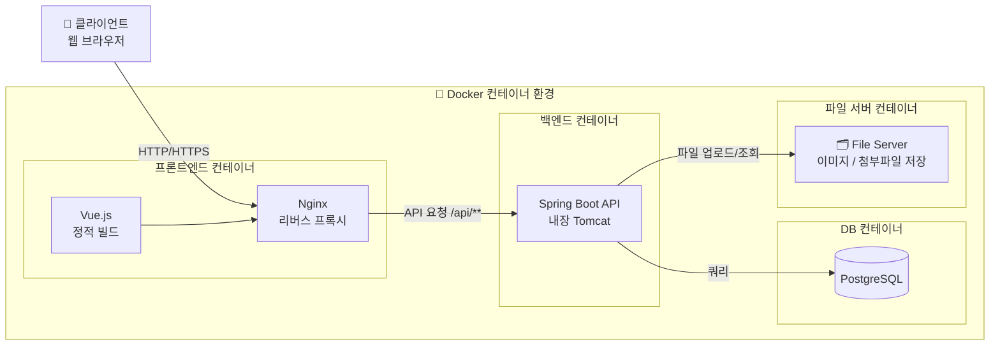

# 06_요구사항 정의서 (최종)

## 📄 문서 개요

| 항목 | 내용 |
| --- | --- |
| 프로젝트명 | 교보문고 쇼핑몰 시스템 (README) |
| 개발환경 | Java 21, Spring Boot 3.5.11, Vue.js 3, PostgreSQL, Docker, Gradle |
| 작성일 | 2026.03.23 |
| 버전 | v1.0 |
| 작성자 | 박주환 (PM), 유환희, 백경서 |

---

## 📋 변경 이력

| 버전 | 변경일 | 변경자 | 변경 내용 |
| --- | --- | --- | --- |
| v0.1 | 2026.03.18 | 백경서 | 상품/회원 요구사항 초안 작성 |
| v0.2 | 2026.03.20 | 박주환 | 공지사항/QnA/리뷰 요구사항 초안 작성 |
| v0.3 | 2026.03.22 | 유환희 | 회원 요구사항 보완 |
| v1.0 | 2026.03.23 | 전체 | 3개 문서 통합 및 요구사항 ID 부여, 최종 정리 |
| v1.1 | 2026.03.23 | 전체 | 합본(product+member) 수정 사항 반영 — URL 7건 변경, 신규 3건 추가, 우선순위 1건 변경 |
| v1.2 | 2026.03.28 | - | 토스페이먼츠 / 카카오페이 / 네이버페이 요구사항 신규 추가 (REQ-PAY-005~019) / 비기능 요구사항 결제 항목 3건 추가 |

---

## ✅ 1. 개요

| 항목 | 내용 |
| --- | --- |
| **프로젝트명** | README 웹 애플리케이션 개발 |
| **목적** | 사용자들이 온라인에서 도서 상품을 검색, 구매, 결제할 수 있는 웹 서비스 제공 |
| **범위** | 회원가입, 로그인, 마이페이지, 상품 목록, 장바구니, 주문 및 결제, QnA, 공지사항, 리뷰, 관리자 기능 전반 |
| **주요 사용자** | 일반 회원, 관리자(MANAGER/ADMIN), 비회원 |
| **플랫폼** | 웹 브라우저(PC, 모바일) 기반 |

---

## ✅ 2. 시스템 구성도

---

## ✅ 3. 사용자 역할 및 권한

| 역할 | 설명 | 주요 권한 |
| --- | --- | --- |
| **USER** | 일반 회원 | 상품 조회·구매, 리뷰 작성, 마이페이지, QnA 등록 |
| **MANAGER** | 매니저 | 상품·주문·배송 관리, 공지사항 작성 |
| **ADMIN** | 최고 관리자 | 전체 기능 + 회원 상태·권한 변경, 강제 삭제 |
| **비회원** | 미로그인 사용자 | 상품 목록·상세·검색만 허용, 구매 시 회원가입 유도 |

---

## ✅ 4. 기능 요구사항 상세

---

## 🔐 4.0 관리자 (Admin)

### 4.0.1 관리자 대시보드

| 요구사항 ID | 기능명 | 설명 | 우선순위 | 관련 페이지 | 비고 |
| --- | --- | --- | --- | --- | --- |
| REQ-A-001 | 신규 미승인 주문 현황 | 미승인 주문 목록 표시 | 🔴 높음 | /admin | 최신 5~10건, 빠른 승인/거부 구현 필요 |
| REQ-A-002 | 신규 QnA 질문 현황 | 미답변 신규 질문 목록 표시 | 🔴 높음 | /admin | 최신 5~10건, 답변하기 링크 포함 |
| REQ-A-003 | 재고 부족 상품 현황 | 재고 기준치 이하 상품 목록 표시 | 🔴 높음 | /admin | 기준치 10개 이하 |
| REQ-A-004 | 최근 주문 목록 | 최근 접수된 주문 목록 요약 표시 | 🟠 중간 | /admin | 최신 5~10건, 주문 상세 링크 |
| REQ-A-005 | 배송 처리 대기 현황 | READY 상태 배송 건수 및 목록 표시 | 🟢 낮음 | /admin | delivery_status = READY 기준 |
| REQ-A-006 | 매출/주문 통계 요약 | 오늘/이번 달 주문 수, 매출 합계 표시 | 🟠 중간 | /admin | 집계 쿼리 기반 |
| REQ-A-007 | 신규 회원 현황 | 오늘/이번 달 신규 가입 회원 수 표시 | 🟠 중간 | /admin | created_at 기준 집계 |

---

### 4.0.2 관리자 - 회원 관리

| 요구사항 ID | 기능명 | 설명 | 우선순위 | 관련 페이지 | 비고 |
| --- | --- | --- | --- | --- | --- |
| REQ-A-008 | 회원 목록 조회 | 전체 회원 목록 조회 (페이징, 검색) | 🔴 높음 | /admin/member/list | 이름/이메일 검색 |
| REQ-A-009 | 회원 상세 조회 | 특정 회원 정보 상세 조회 | 🔴 높음 | /admin/member/detail/{id} | 가입일, 상태 포함 |
| REQ-A-010 | 회원 강퇴 | ACTIVATE / DEACTIVATE / DELETE 상태 변경 | 🟠 중간 | /admin/member/{id} | memberStatus ENUM 변경 |
| REQ-A-011 | 관리자 권한 변경 | USER / MANAGER / ADMIN 역할 변경 | 🟠 중간 | /admin/member/{id} | ADMIN만 가능, memberRole ENUM |
| REQ-A-012 | 탈퇴 회원 관리 | deleted_at 기준 탈퇴 회원 목록 조회 | 🟢 낮음 | /admin/member/list | soft delete 기준 필터 |

---

### 4.0.3 관리자 - 주문 관리

| 요구사항 ID | 기능명 | 설명 | 우선순위 | 관련 페이지 | 비고 |
| --- | --- | --- | --- | --- | --- |
| REQ-A-013 | 주문 목록 조회 | 전체 주문 목록 조회 (페이징, 검색) | 🔴 높음 | /admin/order/list | 주문번호/회원 검색 |
| REQ-A-014 | 주문 상세 조회 | 특정 주문 상세 정보 조회 | 🔴 높음 | /admin/order/detail/{id} | 주문 상품, 결제, 배송 정보 포함 |
| REQ-A-015 | 주문 상태 변경 | PENDING / PAYED / APPROVAL / CANCELED 상태 변경 | 🟠 중간 | /admin/order/{id} | 상태 ENUM |
| REQ-A-016 | 주문 취소 처리 | 관리자 측 주문 강제 취소 | 🟠 중간 | /admin/order/{id} | 결제 상태 연동 |

---

### 4.0.4 관리자 - 배송 관리

| 요구사항 ID | 기능명 | 설명 | 우선순위 | 관련 페이지 | 비고 |
| --- | --- | --- | --- | --- | --- |
| REQ-A-017 | 배송 목록 조회 | 전체 배송 목록 조회 | 🔴 높음 | /admin/delivery/list | 상태별 필터 |
| REQ-A-018 | 배송 상세 조회 | 특정 배송 상세 정보 조회 | 🔴 높음 | /admin/delivery/detail/{id} | 운송장·상태 포함 |
| REQ-A-019 | 운송장 등록 | 택배사명 및 운송장 번호 입력 | 🟠 중간 | /admin/delivery/{id} | 관리자 직접 입력 |
| REQ-A-020 | 배송 상태 변경 | READY / SHIPPED / IN_TRANSIT / DELIVERED / FAILED 변경 | 🔴 높음 | /admin/delivery/{id} | 단계별 상태 순서 준수 |

---

### 4.0.5 관리자 - 상품·카테고리 관리

| 요구사항 ID | 기능명 | 설명 | 우선순위 | 관련 페이지 | 비고 |
| --- | --- | --- | --- | --- | --- |
| REQ-A-021 | 상품 목록 조회 | 상품 정보 및 이미지 목록 | 🟠 중간 | /admin/product/list | 썸네일 필수 |
| REQ-A-022 | 상품 상세 정보 조회 | 특정 상품 정보 및 이미지 상세 조회 | 🟠 중간 | /admin/product/detail/{id} | 썸네일 포함 |
| REQ-A-023 | 상품 등록 | 상품 정보 및 이미지 업로드 | 🟠 중간 | /admin/product/insert | 썸네일 필수 |
| REQ-A-024 | 상품 수정 | 상품 정보 수정 (재고, 가격 등) | 🟠 중간 | /admin/product/update/{id} | 재고/가격 변경 포함 |
| REQ-A-025 | 상품 삭제 | soft delete 방식 삭제 | 🟢 낮음 | /admin/product/{id} | ADMIN만 가능, deleted_at 사용 |
| REQ-A-026 | 카테고리 목록 조회 | 카테고리 목록 및 분류 수준 조회 | 🔴 높음 | /admin/category/list | 대분류/소분류 구분 |
| REQ-A-027 | 카테고리 등록 | 상위/하위 카테고리 등록 | 🟠 중간 | /admin/category/insert | 관리자 기능 |
| REQ-A-028 | 카테고리 수정 | 카테고리 이름 및 정렬 순서 수정 | 🟠 중간 | /admin/category/update/{id} | 정렬 순서 포함 |
| REQ-A-029 | 카테고리 삭제 | 활성/비활성/삭제 처리 | 🟢 낮음 | /admin/category/{id} | soft delete 개념 |

---

### 4.0.6 관리자 - 공지사항 관리

| 요구사항 ID | 기능명 | 설명 | 우선순위 | 관련 페이지 | 비고 |
| --- | --- | --- | --- | --- | --- |
| REQ-A-030 | 공지사항 목록 조회 | 전체 공지사항 목록 조회 | 🔴 높음 | /admin/notice/list | is_fixed 상단 고정 공지 우선 표시 |
| REQ-A-031 | 공지사항 상세 조회 | 특정 공지사항 상세 조회 | 🔴 높음 | /admin/notice/detail/{id} | is_fixed 포함 상세 확인 |
| REQ-A-032 | 공지사항 등록 | 신규 공지사항 작성 및 고정 여부 설정 | 🟠 중간 | /admin/notice/insert | is_fixed 설정 가능 |
| REQ-A-033 | 공지사항 수정 | 공지사항 제목·내용·고정 여부 수정 | 🟠 중간 | /admin/notice/update/{id} | MANAGER 이상 가능 |
| REQ-A-034 | 공지사항 삭제 | soft delete 방식 삭제 | 🟢 낮음 | /admin/notice/{id} | deleted_at 사용 |

---

### 4.0.7 관리자 - 리뷰 관리

| 요구사항 ID | 기능명 | 설명 | 우선순위 | 관련 페이지 | 비고 |
| --- | --- | --- | --- | --- | --- |
| REQ-A-035 | 리뷰 목록 조회 | 전체 리뷰 및 연관 상품명 목록 조회 | 🔴 높음 | /admin/review/list | 상품명 기재 |
| REQ-A-036 | 리뷰 상세 조회 | 특정 리뷰 및 연관 상품 상세 조회 | 🟠 중간 | /admin/review/detail/{id} | 부적절 이미지 처리 |
| REQ-A-037 | 리뷰 삭제 | soft delete 방식 삭제 | 🟢 낮음 | /admin/review/{id} | deleted_at 사용 |

---

### 4.0.8 관리자 - QnA 관리

| 요구사항 ID | 기능명 | 설명 | 우선순위 | 관련 페이지 | 비고 |
| --- | --- | --- | --- | --- | --- |
| REQ-A-038 | QnA 목록 조회 | 전체 QnA 목록 조회 (상품명 포함) | 🟠 중간 | /admin/qna/list | qna_status 필터 |
| REQ-A-039 | QnA 질문 상세 조회 | 질문 내용 및 답변 현황 상세 조회 | 🟠 중간 | /admin/qna/detail/{id} | depth 구조 표시 |
| REQ-A-040 | QnA 상태 변경 | WAITING → PROCESSING → COMPLETE 상태 변경 | 🔴 높음 | /admin/qna/{id} | answered_at 기록 |
| REQ-A-041 | 답변 등록 | 질문에 대한 관리자 공식 답변 등록 | 🔴 높음 | /admin/qna/{id}/insert | parent_id 기반 계층 구조 |
| REQ-A-042 | 답변 수정 | 등록된 답변 내용 수정 | 🟠 중간 | /admin/qna/update/{id} | updated_at 갱신 |
| REQ-A-043 | 답변 삭제 | soft delete 방식 삭제 | 🟢 낮음 | /admin/qna/{id} | deleted_at 사용 |

---

## 👤 4.1 회원 (Member)

### 4.1.1 회원가입 / 로그인

| 요구사항 ID | 기능명 | 설명 | 우선순위 | 관련 페이지 | 비고 |
| --- | --- | --- | --- | --- | --- |
| REQ-M-001 | 회원가입 | 이메일, 비밀번호, 이름, 전화번호, 주소 입력 후 가입 | 🔴 높음 | /signup | email UNIQUE 체크 |
| REQ-M-002 | 로그인 | 이메일 + 비밀번호 로그인, JWT 토큰 발급 | 🔴 높음 | /signin | Access/Refresh Token 발급, BCrypt 암호화 |
| REQ-M-003 | 로그아웃 | 클라이언트 토큰 삭제 및 무효화 처리 | 🔴 높음 | /signout | 즉시 세션 만료 |

---

### 4.1.2 마이페이지 (요약)

| 요구사항 ID | 기능명 | 설명 | 우선순위 | 관련 페이지 | 비고 |
| --- | --- | --- | --- | --- | --- |
| REQ-M-004 | 주문 현황 조회 | 주문한 상품의 현재 상태 요약 조회 | 🔴 높음 | /mypage | 입금 대기 / 승인 대기 / 출고 대기 / 배송 중 / 배송 완료 |
| REQ-M-005 | 주문/배송 목록 조회 | 주문한 상품의 상태 목록 조회 | 🟠 중간 | /mypage | 최신 5~10건 요약 |
| REQ-M-006 | 리뷰 목록 조회 (요약) | 작성한 리뷰 목록 요약 조회 | 🟠 중간 | /mypage | 최신 5~10건 |
| REQ-M-007 | QnA 목록 조회 (요약) | 작성한 QnA 질문 조회 및 답변 상태 확인 | 🟠 중간 | /mypage | 답변 여부(WAITING/COMPLETE) 표시 |

---

### 4.1.3 마이페이지 - 회원 정보 관리

| 요구사항 ID | 기능명 | 설명 | 우선순위 | 관련 페이지 | 비고 |
| --- | --- | --- | --- | --- | --- |
| REQ-M-008 | 회원 정보 수정 | 이름, 전화번호, 주소 수정 | 🔴 높음 | /mypage/edit | updated_at 갱신 |
| REQ-M-009 | 비밀번호 변경 | 현재 비밀번호 확인 후 신규 비밀번호로 변경 | 🔴 높음 | /mypage/password | BCrypt 재암호화 |
| REQ-M-010 | 회원 탈퇴 | soft delete 처리 (deleted_at 기록, memberStatus → DELETE) | 🟠 중간 | /mypage | 즉시 로그아웃 처리 |

---

### 4.1.4 마이페이지 - 주문/배송 조회

| 요구사항 ID | 기능명 | 설명 | 우선순위 | 관련 페이지 | 비고 |
| --- | --- | --- | --- | --- | --- |
| REQ-M-011 | 주문 목록 조회 | 본인의 전체 주문 목록 조회 | 🔴 높음 | /mypage/order/list | 최신순 정렬, 상태별 필터 |
| REQ-M-012 | 주문 상세 조회 | 주문 상품, 결제 금액, 배송지 정보 상세 조회 | 🔴 높음 | /mypage/order/detail/{id} | 주문 상품 목록 포함 |
| REQ-M-013 | 주문 취소 요청 | 결제 전 또는 결제 후 취소 요청 | 🟠 중간 | /mypage/order/{id} | 결제 상태 연동 |
| REQ-M-014 | 배송 상태 조회 | 주문별 현재 배송 상태 확인 | 🔴 높음 | /mypage/order/{id} | READY ~ DELIVERED 단계 표시 |
| REQ-M-015 | 운송장 번호 조회 | 택배사명 및 운송장 번호 확인 | 🟠 중간 | /mypage/order/{id} | 배송 상세 조회 내 포함 |

---

### 4.1.5 마이페이지 - 리뷰 관리

| 요구사항 ID | 기능명 | 설명 | 우선순위 | 관련 페이지 | 비고 |
| --- | --- | --- | --- | --- | --- |
| REQ-M-016 | 작성 리뷰 목록 조회 | 본인이 작성한 리뷰 전체 목록 조회 | 🔴 높음 | /mypage/review/list | 최신순 정렬 |
| REQ-M-017 | 작성 리뷰 상세 조회 | 리뷰 내용, 평점, 이미지 상세 확인 | 🟠 중간 | /mypage/review/detail/{id} | 작성 상품 링크 포함 |
| REQ-M-018 | 리뷰 수정 | 작성한 리뷰 내용 및 평점 수정 | 🟠 중간 | /mypage/review/update/{id} | updated_at 갱신 |
| REQ-M-019 | 리뷰 삭제 | 작성한 리뷰 삭제 | 🟠 중간 | /mypage/review/{id} | soft delete (deleted_at) |
| REQ-M-020 | 미작성 리뷰 목록 조회 | 구매 완료 후 리뷰 미작성 상품 목록 조회 | 🟠 중간 | /mypage/review/list | is_reviewed = false 기준 |

---

### 4.1.6 마이페이지 - QnA 관리

| 요구사항 ID | 기능명 | 설명 | 우선순위 | 관련 페이지 | 비고 |
| --- | --- | --- | --- | --- | --- |
| REQ-M-021 | 작성한 질문 목록 조회 | 본인이 작성한 질문 목록 조회 | 🔴 높음 | /mypage/qna/list | 최신순 정렬 |
| REQ-M-022 | 작성한 질문 상세 조회 | 질문 내용 및 답변 여부 상세 조회 | 🟠 중간 | /mypage/qna/detail/{id} | WAITING/COMPLETE 상태 표시 |
| REQ-M-023 | 질문 수정 | 작성한 질문 내용 수정 | 🟠 중간 | /mypage/qna/update/{id} | 답변 완료 후 수정 불가 |
| REQ-M-024 | 질문 삭제 | 작성한 질문 삭제 | 🟠 중간 | /mypage/qna/{id} | soft delete (deleted_at) |

---

## 📂 4.2 카테고리 (Category)

### 4.2.1 카테고리 조회 (사용자)

| 요구사항 ID | 기능명 | 설명 | 우선순위 | 관련 페이지 | 비고 |
| --- | --- | --- | --- | --- | --- |
| REQ-CAT-001 | 상위 카테고리 조회 | 상위 카테고리 목록 조회 (국내/해외/일본) | 🔴 높음 | /category | 초기 화면 노출 |
| REQ-CAT-002 | 하위 카테고리 조회 | 상위 카테고리 기준 하위 카테고리 목록 조회 | 🔴 높음 | /category | 상품 필터링에 사용 |

---

## 📚 4.3 상품 (Product)

### 4.3.1 상품 조회 (사용자)

| 요구사항 ID | 기능명 | 설명 | 우선순위 | 관련 페이지 | 비고 |
| --- | --- | --- | --- | --- | --- |
| REQ-P-001 | 상품 목록 조회 | 등록된 상품 목록을 카테고리별로 조회 | 🔴 높음 | /product/category/list | 페이징 처리, 신상품/베스트/추천 섹션 |
| REQ-P-002 | 상품 상세 조회 | 상품 이미지, 가격, 설명, 재고 표시 | 🔴 높음 | /product/category/detail/{id} | 관련 상품 추천, 조회수(view_count) 증가 |
| REQ-P-003 | 상품 검색 | 키워드 기반 상품 검색 | 🔴 높음 | /product/category/search | 제목·저자·출판사 검색 |
| REQ-P-004 | 카테고리 필터 | 상위/하위 카테고리 기반 필터링 | 🔴 높음 | /product/category/list | 다중 필터 기능 |

---

## 🛒 4.4 장바구니 (Cart)

### 4.4.1 장바구니 기능 (사용자)

| 요구사항 ID | 기능명 | 설명 | 우선순위 | 관련 페이지 | 비고 |
| --- | --- | --- | --- | --- | --- |
| REQ-C-001 | 장바구니 조회 | 사용자 장바구니 전체 조회 | 🔴 높음 | /cart | 회원 1:1 |
| REQ-C-002 | 상품 담기 | 원하는 상품을 장바구니에 추가 | 🔴 높음 | /cart | 동일 상품 재추가 시 수량 증가 |
| REQ-C-003 | 수량 변경 | 장바구니 내 상품 수량 수정 | 🔴 높음 | /cart | 최소 수량 1 이상 |
| REQ-C-004 | 선택 여부 변경 | 주문 포함/제외 체크 처리 | 🟠 중간 | /cart | is_checked 컬럼 |
| REQ-C-005 | 상품 삭제 | 장바구니 내 특정 상품 삭제 | 🟠 중간 | /cart | 개별 삭제 |

---

## 📦 4.5 주문 (Order)

### 4.5.1 주문 기능 (사용자)

| 요구사항 ID | 기능명 | 설명 | 우선순위 | 관련 페이지 | 비고 |
| --- | --- | --- | --- | --- | --- |
| REQ-O-001 | 주문 생성 | 장바구니 선택 상품 기반 주문 생성 | 🔴 높음 | /order | 트랜잭션 처리 필수 |
| REQ-O-002 | 주문번호 생성 | UNIQUE 주문번호 자동 생성 | 🔴 높음 | /order | 날짜 기반 생성 |
| REQ-O-003 | 주문 정보 입력 | 배송지 및 수령인 정보 입력 | 🔴 높음 | /order | 필수 입력값 검증 |
| REQ-O-004 | 주문 내역 조회 | 본인 주문 목록 및 상세 조회 | 🔴 높음 | /mypage/order/list | 상태별 필터 |
| REQ-O-005 | 주문 취소 | 주문 취소 요청 | 🟠 중간 | /mypage/order/{id} | 결제 상태 연동 |

---

## 🧾 4.6 주문 상품 (Order Item)

### 4.6.1 주문 상품 기능

| 요구사항 ID | 기능명 | 설명 | 우선순위 | 관련 페이지 | 비고 |
| --- | --- | --- | --- | --- | --- |
| REQ-OI-001 | 주문 상품 저장 | 주문 시 상품 정보 스냅샷 저장 | 🔴 높음 | - | 가격·수량 스냅샷 |
| REQ-OI-002 | 금액 계산 | (가격 × 수량) - 할인율 계산 | 🔴 높음 | - | item_total 컬럼 |
| REQ-OI-003 | 리뷰 여부 관리 | 리뷰 작성 여부 관리 | 🟢 낮음 | - | is_reviewed 컬럼 |

---

## 💳 4.7 결제 (Payment)

### 4.7.1 결제 기능 (사용자)

| 요구사항 ID | 기능명 | 설명 | 우선순위 | 관련 페이지 | 비고 |
| --- | --- | --- | --- | --- | --- |
| REQ-PAY-001 | 결제 요청 | 주문에 대한 결제 요청 | 🔴 높음 | /order/payment | PG 연동 고려 |
| REQ-PAY-002 | 결제 완료 처리 | 결제 성공 시 주문 상태 PAYED로 변경 | 🔴 높음 | /order/payment | 주문 상태 자동 변경 |
| REQ-PAY-003 | 결제 실패 처리 | 결제 실패 시 안내 및 재시도 | 🟠 중간 | /order/payment | 재시도 가능 |
| REQ-PAY-004 | 결제 취소 처리 | 결제 취소 및 사유 저장 | 🟠 중간 | /mypage/order/{id} | 취소 사유 저장 |

---

### 4.7.2 토스페이먼츠 연동 (v1.2 신규)

| 요구사항 ID | 기능명 | 설명 | 우선순위 | 관련 페이지 | 비고 |
| --- | --- | --- | --- | --- | --- |
| REQ-PAY-005 | 토스페이먼츠 SDK 결제창 호출 | 클라이언트에서 @tosspayments/payment-widget SDK로 결제창 렌더링 | 🔴 높음 | /order/payment | 서버 API 호출 없이 클라이언트 단독 처리 |
| REQ-PAY-006 | 토스페이먼츠 결제 승인 (서버 confirm) | successUrl 리다이렉트 수신 후 서버에서 Toss API `/v1/payments/confirm` 호출 | 🔴 높음 | /order/payment/confirm | paymentKey + orderId + amount 3중 검증 필수 |
| REQ-PAY-007 | 토스페이먼츠 결제 실패 처리 | failUrl 리다이렉트 수신 후 결제 실패 처리 및 안내 | 🟠 중간 | /order/payment/fail | 오류 코드·메시지 failure_reason에 저장 |
| REQ-PAY-008 | 토스페이먼츠 결제 취소 / 환불 | 서버에서 Toss API `POST /v1/payments/{paymentKey}/cancel` 호출 | 🟠 중간 | /mypage/order/{id} | 취소 사유 필수, payment_status → CANCELLED |

---

### 4.7.3 카카오페이 연동 (v1.2 신규)

| 요구사항 ID | 기능명 | 설명 | 우선순위 | 관련 페이지 | 비고 |
| --- | --- | --- | --- | --- | --- |
| REQ-PAY-009 | 카카오페이 결제 준비 요청 | 서버에서 Kakao API `POST /v1/payment/ready` 호출 후 tid·redirect_url 반환 | 🔴 높음 | /order/payment/ready | payment.pg_tid에 tid 저장 |
| REQ-PAY-010 | 카카오페이 결제창 리다이렉트 | 클라이언트가 next_redirect_pc_url(PC) 또는 next_redirect_mobile_url(모바일)로 이동 | 🔴 높음 | /order/payment/ready | PC/모바일 URL 분기 처리 |
| REQ-PAY-011 | 카카오페이 결제 승인 | approval_url 콜백(pg_token) 수신 후 서버에서 `POST /v1/payment/approve` 호출 | 🔴 높음 | /order/payment/approve | cid + tid + pg_token으로 승인 |
| REQ-PAY-012 | 카카오페이 결제 취소 / 환불 | 서버에서 Kakao API `POST /v1/payment/cancel` 호출 | 🟠 중간 | /mypage/order/{id} | cancel_amount + cancel_tax_free_amount 필수 |

---

### 4.7.4 네이버페이 연동 (v1.2 신규)

| 요구사항 ID | 기능명 | 설명 | 우선순위 | 관련 페이지 | 비고 |
| --- | --- | --- | --- | --- | --- |
| REQ-PAY-013 | 네이버페이 결제 준비 요청 | 서버에서 Naver Pay API 준비 요청 후 paymentId·redirect_url 반환 | 🔴 높음 | /order/payment/ready | payment.pg_tid에 paymentId 저장 |
| REQ-PAY-014 | 네이버페이 결제창 호출 | 클라이언트에서 Naver Pay JS SDK로 결제창 오픈 (네이버 계정 로그인 포함) | 🔴 높음 | /order/payment | 네이버 계정 인증 필수 |
| REQ-PAY-015 | 네이버페이 결제 승인 | returnUrl 콜백(resultCode + paymentId) 수신 후 서버에서 승인 API 호출 | 🔴 높음 | /order/payment/approve | resultCode = Success 확인 후 승인 |
| REQ-PAY-016 | 네이버페이 결제 취소 / 환불 | 서버에서 Naver Pay 취소 API 호출 | 🟠 중간 | /mypage/order/{id} | 전액/부분 취소 분기 처리 |

---

### 4.7.5 공통 — PG 연동 보안 / 위변조 방지 (v1.2 신규)

| 요구사항 ID | 기능명 | 설명 | 우선순위 | 관련 페이지 | 비고 |
| --- | --- | --- | --- | --- | --- |
| REQ-PAY-017 | 결제 금액 위변조 방지 | 결제 승인 직전 서버에서 DB의 finalPrice와 요청 amount 일치 여부 재검증 | 🔴 높음 | - | 모든 PG 공통 적용 필수 |
| REQ-PAY-018 | PG 시크릿 키 서버 보관 | 토스 secretKey, 카카오 adminKey, 네이버 clientSecret을 서버 환경변수로만 보관 | 🔴 높음 | - | 클라이언트 코드에 키 노출 금지 |
| REQ-PAY-019 | 결제 수단별 라우팅 | payment.provider 기반으로 PG사별 게이트웨이(TossGateway / KakaoGateway / NaverGateway) 라우팅 처리 | 🔴 높음 | - | PaymentGateway 인터페이스 구현 필수 |

---

## 🚚 4.8 배송 (Delivery)

### 4.8.1 배송 기능

| 요구사항 ID | 기능명 | 설명 | 우선순위 | 관련 페이지 | 비고 |
| --- | --- | --- | --- | --- | --- |
| REQ-D-001 | 배송 자동 생성 | 결제 완료 시 배송 레코드 자동 생성 | 🔴 높음 | - | 주문과 1:1 매핑 |
| REQ-D-002 | 배송 상태 조회 | 사용자의 배송 상태 조회 | 🔴 높음 | /mypage/order/{id} | READY~DELIVERED 단계 표시 |

---

## 📢 4.9 공지사항 (Notice)

### 4.9.1 공지사항 조회 (사용자)

| 요구사항 ID | 기능명 | 설명 | 우선순위 | 관련 페이지 | 비고 |
| --- | --- | --- | --- | --- | --- |
| REQ-N-001 | 공지사항 목록 조회 | 전체 공지사항 목록 조회 | 🔴 높음 | /notice/list | is_fixed = true인 항목 리스트 최상단 고정 |
| REQ-N-002 | 공지사항 상세 조회 | 공지사항 제목·내용·작성일 상세 조회 | 🔴 높음 | /notice/detail/{id} | view_count 자동 증가 |

---

## 💬 4.10 QnA

### 4.10.1 QnA 기능 (사용자)

| 요구사항 ID | 기능명 | 설명 | 우선순위 | 관련 페이지 | 비고 |
| --- | --- | --- | --- | --- | --- |
| REQ-Q-001 | QnA 목록 조회 | 전체 QnA 목록 조회 | 🔴 높음 | /qna/list | qna_status, 비밀글 여부 표시 |
| REQ-Q-002 | QnA 질문 등록 | 카테고리 선택 후 신규 문의 작성 | 🔴 높음 | /qna/write | parent_id 생성, 카테고리 선택(배송·환불 등) |
| REQ-Q-003 | 비밀글 설정 | 작성자·관리자만 내용 열람 가능 | 🟠 중간 | /qna/write | is_secret = true 설정 |
| REQ-Q-004 | n차 재문의 작성 | 답변에 대한 추가 문의 등록 (최대 4단계) | 🟠 중간 | /qna/{id} | depth 최대 4 |
| REQ-Q-005 | 답변 상태 실시간 확인 | WAITING → PROCESSING → COMPLETE 상태 확인 | 🔴 높음 | /qna/list | qna_status 기반 |
| REQ-Q-006 | QnA 상세 조회 | 질문 내용 및 답변 계층 구조 조회 | 🔴 높음 | /qna/detail/{id} | depth 구조 표시 |

---

## ⭐ 4.11 리뷰 (Review)

### 4.11.1 리뷰 기능 (사용자)

| 요구사항 ID | 기능명 | 설명 | 우선순위 | 관련 페이지 | 비고 |
| --- | --- | --- | --- | --- | --- |
| REQ-R-001 | 리뷰 목록 조회 | 상품별 리뷰 목록 조회 | 🔴 높음 | /product/{id} | 평점 평균, 최신순 정렬 |
| REQ-R-002 | 리뷰 작성 | 구매 확정 후 평점(1~5) 및 내용 작성 | 🔴 높음 | /review/write | 구매자만 작성 가능, 상품당 1회 |
| REQ-R-003 | 리뷰 이미지 첨부 | 리뷰 작성 시 다중 이미지 첨부 | 🟠 중간 | /review/write | review_image 테이블, 최대 5장 |
| REQ-R-004 | 리뷰 반응 (좋아요/싫어요) | 타인의 리뷰에 LIKE / DISLIKE 반응 | 🟢 낮음 | /review/list | review_reaction 테이블, reaction_type ENUM |
| REQ-R-005 | 조회수 카운트 | 리뷰 상세 조회 시 view_count 자동 증가 | 🟢 낮음 | /review/detail/{id} | view_count 컬럼 |

---

## ✅ 5. 비기능 요구사항

| 요구사항 ID | 항목 | 내용 |
| --- | --- | --- |
| NFR-001 | 성능 | 100명 동시 접속에서 응답 시간 2초 이내 |
| NFR-002 | 보안 | HTTPS, JWT 인증, BCrypt 비밀번호 암호화, CSRF 방어 |
| NFR-003 | 데이터 무결성 | FK 제약 조건 및 트랜잭션 처리 보장 |
| NFR-004 | 호환성 | Chrome, Edge, Safari 최신 버전 호환 |
| NFR-005 | 접근성 | 웹 접근성 기준 준수 (스크린리더 호환 목표) |
| NFR-006 | 유지보수성 | Spring Boot Layered Architecture 준수 |
| NFR-007 | 파일 업로드 | 이미지 단일 최대 10MB, 요청당 최대 20MB |
| REQ-NFR-PAY-001 | 결제 API 타임아웃 | PG사 외부 API 호출 타임아웃 30초 이내 처리, 초과 시 FAILED 처리 |
| REQ-NFR-PAY-002 | 중복 결제 방지 | 동일 orderId로 중복 결제 요청 시 409 Conflict 반환 |
| REQ-NFR-PAY-003 | 결제 로그 보관 | 모든 PG 요청/응답 로그를 서버 로그에 기록 (개인정보 마스킹 적용) |

---

## ✅ 6. UI/UX 참고

- 모바일 반응형 대응 (Tailwind CSS 사용 기준)
- 상품 목록 / 상세 / 장바구니 UX 흐름은 교보문고 레퍼런스 기준
- 직관적인 주문 및 결제 흐름 제공
- 관리자 페이지는 일반 사용자 페이지와 완전히 분리

---

## ✅ 7. 기타 사항

- 주문/결제는 트랜잭션 처리 필수
- 요구사항 변경 시 반드시 변경 이력에 기록
- soft delete 일관 적용 대상: member, product, order, notice, qna, review
