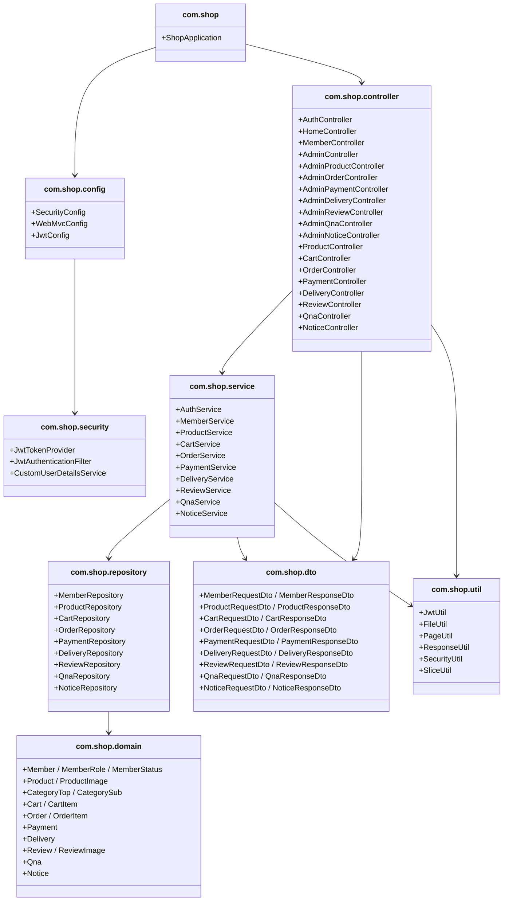

# 프로젝트 구조도 최종

# 13_프로젝트 구조도

---

# 프로젝트 구조도 - MVC 처리 패턴



---

# 프로젝트 디렉터리 및 파일 구조도

## 📦 backend (Spring Boot 3)

```
shop-backend/
├── src/
│   ├── main/
│   │   ├── java/com/shop/
│   │   │   ├── config/          ← 보안·설정
│   │   │   ├── controller/      ← REST API 엔드포인트
│   │   │   ├── service/         ← 비즈니스 로직
│   │   │   ├── repository/      ← JPA DB 접근
│   │   │   ├── domain/          ← Entity & Enum
│   │   │   ├── dto/             ← 요청/응답 객체
│   │   │   ├── security/        ← JWT 인증 처리
│   │   │   ├── util/            ← 공통 유틸리티
│   │   │   └── ShopApplication.java
│   │   └── resources/
│   │       ├── application.yml  ← DB·포트 설정
│   │       └── schema.sql       ← PostgreSQL 초기화
│   └── test/
│       └── java/...             ← 단위·통합 테스트
├── build.gradle
├── settings.gradle
└── README.md
```

## 📦 frontend (Vue.js 3)

```
shop-frontend/
├── public/
│   └── index.html
├── src/
│   ├── api/                 ← Axios API 호출 모듈
│   │   ├── auth.js
│   │   ├── product.js
│   │   └── order.js
│   ├── assets/              ← 이미지·전역 CSS
│   ├── components/          ← 재사용 컴포넌트
│   │   ├── common/
│   │   └── layout/
│   ├── router/              ← Vue Router 설정
│   │   └── index.js
│   ├── store/               ← Pinia 상태 관리
│   │   ├── auth.js
│   │   └── cart.js
│   ├── views/               ← 페이지 컴포넌트
│   │   ├── admin/
│   │   ├── member/
│   │   ├── product/
│   │   ├── cart/
│   │   ├── order/
│   │   ├── payment/
│   │   ├── delivery/
│   │   ├── review/
│   │   ├── qna/
│   │   └── notice/
│   ├── App.vue
│   └── main.js
├── .env
├── vite.config.js
└── package.json
```

---

## 📌 계층별 구성 설명

| 계층/폴더 | 역할 설명 |
| --- | --- |
| `controller` | Vue.js 프론트에서 오는 REST 요청을 받아 서비스로 전달하고 JSON 응답을 반환합니다. 일반 회원용(`XxxController`)과 관리자용(`AdminXxxController`)으로 분리하여 관리합니다. |
| `service` | 실제 비즈니스 로직을 담당합니다. 트랜잭션 처리, 재고 차감, 결제 연동 등 핵심 로직이 위치합니다. |
| `repository` | Spring Data JPA를 통한 PostgreSQL DB 접근 계층입니다. (예: `JpaRepository`) |
| `domain` | DB 테이블에 매핑되는 Entity 클래스 및 Enum 타입이 위치합니다. |
| `dto` | Controller ↔︎ Service 간 요청/응답 데이터 전달 객체입니다. (예: `LoginRequestDto`) |
| `config` | Spring Security, Swagger, JWT, CORS 등 프로젝트 전반 설정 클래스가 위치합니다. |
| `security` | JWT 토큰 발급·검증, Spring Security 인증 필터, UserDetails 구현체가 위치합니다. |
| `util` | 프로젝트 전반에서 공통으로 사용하는 유틸 클래스 모음입니다. `JwtUtil`(토큰 파싱), `FileUtil`(이미지 업로드·삭제), `PageUtil`(페이징 헬퍼), `ResponseUtil`(API 응답 형식 통일), `SecurityUtil`(현재 로그인 사용자 조회), `SliceUtil`(메인 페이지 상품 슬라이싱) |
| `views/admin/` | 관리자 대시보드, 회원·상품·주문·배송·QnA·공지사항 관리 Vue 페이지 모음입니다. |
| `store/` | Pinia 기반 전역 상태 관리 (장바구니·인증 토큰 등) |
| `api/` | Axios 인스턴스 + JWT 토큰 헤더 인터셉터, 도메인별 API 호출 함수 분리 |

---

## 🎯 파일 배치

### 📁 controller

```java
@RestController
@RequestMapping("/api/product")
public class ProductController {

    @GetMapping("/category/list")
    public ResponseEntity<?> getProductList(@RequestParam Long categoryId,
                                            @RequestParam(defaultValue = "0") int page) {
        // 상품 목록 조회 → ProductService 위임
    }

    @GetMapping("/category/detail/{id}")
    public ResponseEntity<?> getProductDetail(@PathVariable Long id) {
        // 상품 상세 조회 + 조회수 증가
    }
}
```

### 📁 views/product/ProductDetail.vue

```
<template>
  <div class="product-detail">
    
    <h2>{{ product.title }}</h2>
    <p>{{ product.price }}원</p>
    <button @click="addToCart">장바구니 담기</button>
    <button @click="orderNow">바로 구매</button>
  </div>
</template>

<script setup>
import { ref, onMounted } from 'vue'
import { getProductDetail } from '@/api/product.js'

const product = ref({})
onMounted(async () => {
  product.value = await getProductDetail(route.params.id)
})
</script>
```

---

## 📄 application.yml

```yaml
server:
port:8202

spring:
application:
name: readme

datasource:
url: jdbc:postgresql://localhost:5420/readme
username: postgres
password:1004
driver-class-name: org.postgresql.Driver   # 추가

jpa:
hibernate:
ddl-auto: update
show-sql:true
database-platform: org.hibernate.dialect.PostgreSQLDialect  # 추가
properties:
hibernate:
format_sql:true                        # 추가

servlet:
multipart:
max-file-size: 10MB
max-request-size: 20MB

jwt:
secret: bookstoreSecretKey2026ProjectPortfolio
expiration:3600000

file:
upload-dir: /uploads/
```